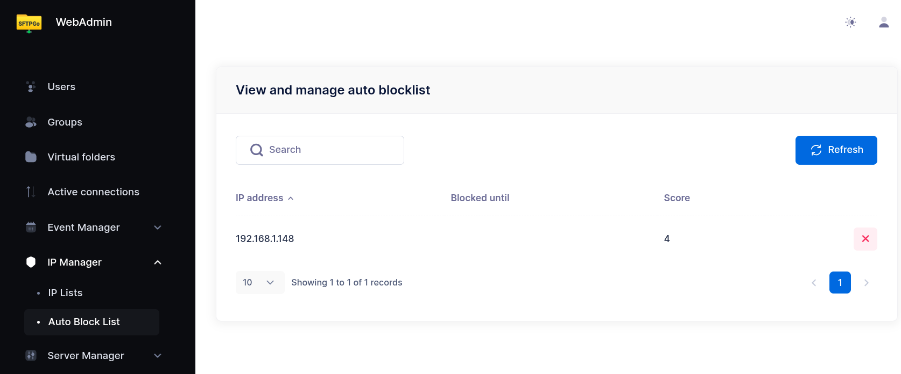

# Defender

The built-in `defender` allows you to configure an auto-blocking policy for SFTPGo and thus helps to prevent DoS (Denial of Service) and brute force password guessing.

If enabled it will protect SFTP, HTTP, FTP and WebDAV services and it will automatically block hosts (IP addresses) that continually fail to log in or attempt to connect.

You can configure a score for the following events:

- `score_valid`, defines the score for valid login attempts, eg. user accounts that exist. Default `1`.
- `score_invalid`, defines the score for invalid login attempts, eg. non-existent user accounts. Default `2`.
- `score_no_auth`, defines the score for clients disconnected without any authentication attempt. Default `0`.
- `score_limit_exceeded`, defines the score for hosts that exceeded the configured rate limits or the configured max connections per host. Default `3`.

You can set the score to `0` to not penalize some events.

And then you can configure:

- `observation_time`, defines the time window, in minutes, for tracking client errors.
- `threshold`, defines the threshold value before banning a host.
- `ban_time`, defines the time to ban a client, as minutes

:warning: All time values (`ban_time`, `observation_time`) are **integers in minutes** — fractional values such as `0.5` are not accepted. The minimum usable value is `1`. For example, to ban for one day set `ban_time=1440`.

So a host is banned, for `ban_time` minutes, if the sum of the scores has exceeded the defined threshold during the last observation time minutes.

By defining the scores, each type of event can be weighted. Let's see an example: if `score_invalid` is 3 and `threshold` is 8, a host will be banned after 3 login attempts with an non-existent user within the configured `observation_time`.

A banned IP has no score, it makes no sense to accumulate host events in memory for an already banned IP address.

If an already banned client tries to log in again, its ban time will be incremented according the `ban_time_increment` configuration.

The `ban_time_increment` is calculated as percentage of `ban_time`, so if `ban_time` is 30 minutes and `ban_time_increment` is 50 the host will be banned for additionally 15 minutes. You can also specify values greater than 100 for `ban_time_increment` if you want to increase the penalty for already banned hosts.

SFTPGo can store host scores and banned hosts in memory or within the configured data provider according to the `driver` set in the `defender` configuration section. The available drivers are `memory` and `provider`.

The `provider` driver persists scores and bans in the database, so the auto-blocklist survives restarts. Supported data providers: `SQLite`, `MySQL`, `PostgreSQL`, `CockroachDB`. Use `SQLite` for a single instance that needs persistence across restarts; use `MySQL`, `PostgreSQL`, or `CockroachDB` to share defender state across multiple SFTPGo instances.

The `provider` driver issues a database query at least every time a new client connects (to check if the IP is banned). The `memory` driver is the fastest option and is the right choice when persistence across restarts is not required.

The `provider` driver will periodically clean up expired hosts and events.

## Memory limits (`entries_soft_limit`, `entries_hard_limit`)

These two keys apply only to the `memory` driver and cap how many host scores and banned IPs SFTPGo keeps in RAM. When the number of tracked entries exceeds `entries_hard_limit`, the oldest entries are evicted until the count drops back to `entries_soft_limit`. Defaults are `100` / `150` — reasonable for most deployments. Raise them if you run a large public-facing instance that receives many distinct attacker IPs and you want longer history; lower them on memory-constrained hosts. They do not affect the security of the defender, only how much history it keeps.

The `provider` driver ignores `entries_soft_limit` (state is stored in the database); `entries_hard_limit` is used only to cap list-all API responses.

## Login delay

The defender can also impose a **login delay** — a configurable pause before reporting an authentication outcome. This slows down password-guessing bots and can mask the difference between valid and invalid usernames.

- `login_delay.password_failed` — milliseconds to wait before returning the error on a failed password/interactive login. Default `1000` (1 second). Set to `0` to disable.
- `login_delay.success` — milliseconds to wait before granting a successful login. Default `0` (disabled). Set a non-zero value to neutralize timing attacks that try to distinguish valid from invalid usernames by response time.

See the `login_delay` settings in the [configuration reference](config-file.md) for the full schema.

## Managing the defender from the WebAdmin

Defender parameters (scores, threshold, `ban_time`, `observation_time`, `login_delay`, memory limits) are configured via the configuration file or environment variables. The WebAdmin is used to view and manage the IP lists under the **IP Manager** section:

- **Auto Block List** — appears once the defender is enabled. Lists dynamically banned IPs with their ban expiration. Click the **X** icon on a row to lift the ban (useful for false positives).
- **IP Lists** — always available (independent of the defender). Permanent entries you maintain by hand, each with a **mode**: `Deny` (always block), `Allow` (always permit). Entries can be a single IP or a CIDR network. When an address is covered by several entries, the most specific one (longest network prefix) wins, so a narrow allow entry overrides a broader deny and vice versa.

{data-gallery="defender-auto-block-list"}

The same operations are available via REST API — see `/defender/hosts` and `/ip-lists` in the OpenAPI specification.

## Configuration example

A reasonable starting configuration using environment variables:

```shell
SFTPGO_COMMON__DEFENDER__ENABLED=true
SFTPGO_COMMON__DEFENDER__BAN_TIME=30
SFTPGO_COMMON__DEFENDER__BAN_TIME_INCREMENT=50
SFTPGO_COMMON__DEFENDER__THRESHOLD=8
SFTPGO_COMMON__DEFENDER__OBSERVATION_TIME=15
SFTPGO_COMMON__DEFENDER__SCORE_VALID=1
SFTPGO_COMMON__DEFENDER__SCORE_INVALID=3
SFTPGO_COMMON__DEFENDER__SCORE_NO_AUTH=0
SFTPGO_COMMON__DEFENDER__SCORE_LIMIT_EXCEEDED=3
```

With this configuration:

- A host is banned for **30 minutes** if its score exceeds **8** within a **15-minute** window.
- Three login attempts with a non-existent user (score 3 each = 9) will trigger a ban.
- Eight login attempts with a valid username but wrong password (score 1 each = 8) will also trigger a ban.
- If the banned host tries again, the ban is extended by 50% (15 additional minutes).

To persist defender state across restarts, or to share it across all nodes in a multi-instance deployment, switch to the `provider` driver (requires a SQL-based data provider):

```shell
SFTPGO_COMMON__DEFENDER__DRIVER=provider
```
