# Getting Started

This guide walks you through the initial setup and introduces the main capabilities of SFTPGo. We assume you have already [installed](installation.md) SFTPGo and it is running.

## Create an admin account

Open [http://127.0.0.1:8080/web/admin](http://127.0.0.1:8080/web){:target="_blank"} in your browser (replace `127.0.0.1` with the appropriate address if SFTPGo is not running on localhost).

{data-gallery="setup"}
{data-gallery="setup"}

After creating the admin account you are automatically logged in and redirected to the two-factor authentication setup page. Two-factor authentication is optional and can be configured later.

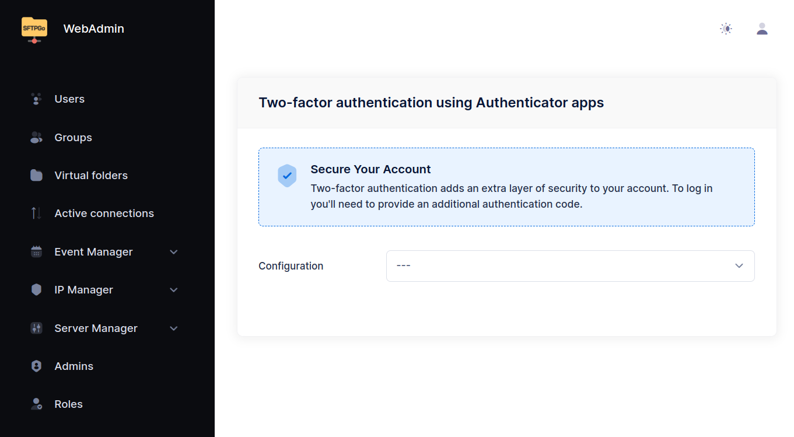{data-gallery="initial screen"}

From the **Status** page you can see the active services and their configuration. The default configuration enables the SFTP service on port `2022` and uses an embedded data provider (`SQLite` or `bolt` based on the target OS and architecture).

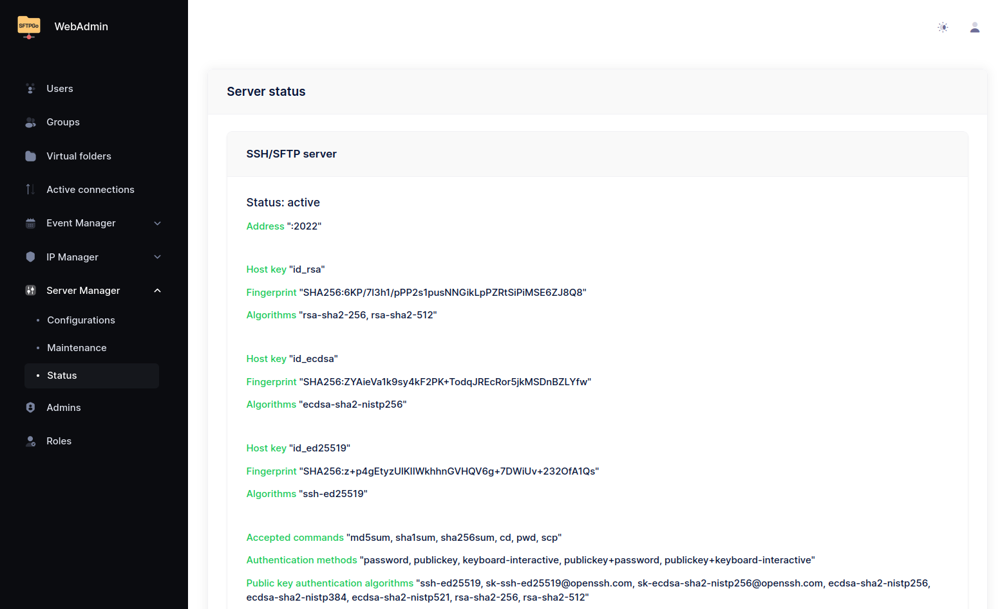{data-gallery="status"}

## Create your first user

Navigate to **Users** and click the `+` icon to add a new user.

The minimum required fields are **Username** and a **Password** or **Public key** (at least one).

If you installed SFTPGo from the official packages on Linux, the default `users_base_dir` is `/srv/sftpgo/data`, so the home directory is automatically set to `/srv/sftpgo/data/<username>`. If you installed manually or on Windows and no `users_base_dir` is configured, you must also specify the **Home Dir** as an absolute path (e.g., `/srv/sftpgo/data/username` or `C:\sftpgo\data\username`).

SFTPGo automatically creates the home directory when the user logs in for the first time.

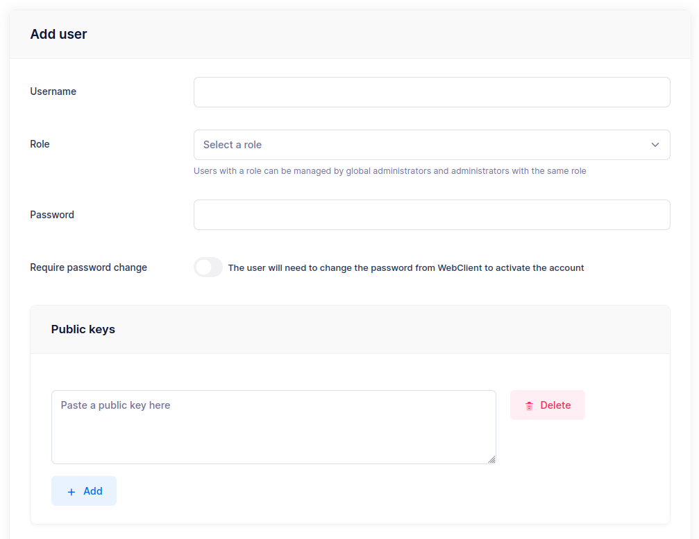{data-gallery="add-user"}

:warning: On Linux, SFTPGo runs as a dedicated `sftpgo` system user for security. To use directories outside `/srv/sftpgo`, you must set the appropriate system-level permissions. Parent directories must also be readable by the `sftpgo` user.

### Test the connection

Connect with any SFTP client. Here we use the `sftp` CLI:

```shell
$ sftp -P 2022 nicola@127.0.0.1
nicola@127.0.0.1's password:
Connected to 127.0.0.1.
sftp> put file.txt
Uploading file.txt to /file.txt
file.txt                                      100% 4034     3.9MB/s   00:00
sftp> ls
file.txt
sftp> mkdir adir
sftp> cd adir/
sftp> put file.txt
Uploading file.txt to /adir/file.txt
file.txt                                      100% 4034     4.0MB/s   00:00
```

## WebClient

Users can log in to the WebClient at [http://127.0.0.1:8080/web/client](http://127.0.0.1:8080/web/client){:target="_blank"} to manage their files directly in the browser.

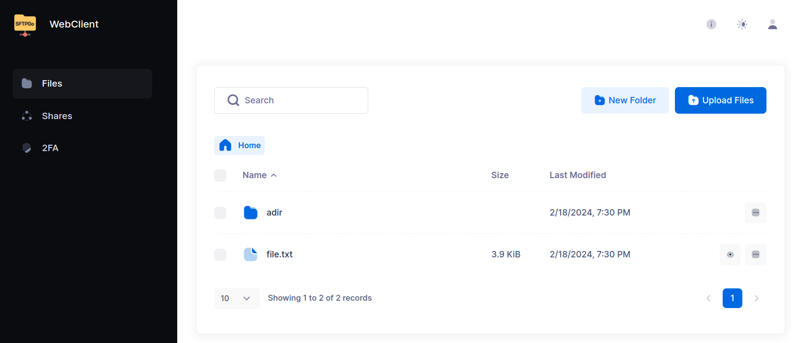{data-gallery="client-files"}

From the WebClient, users can:

- **Upload and download** files via drag & drop or the upload button, create/rename/delete folders, move/copy, search, and preview files.
- **Share files and folders** via secure HTTP/S links — with configurable access scope (read/write), password protection, email-based authentication, IP restrictions, and expiration dates.
- **Update credentials** and configure [two-factor authentication](tutorials/two-factor-authentication.md).

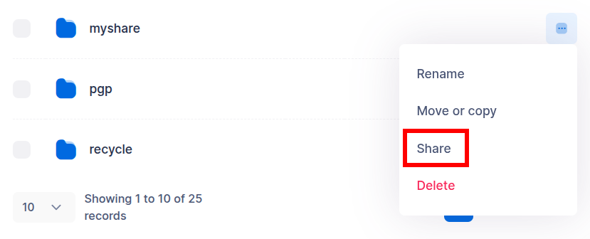{data-gallery="webclient-share"}
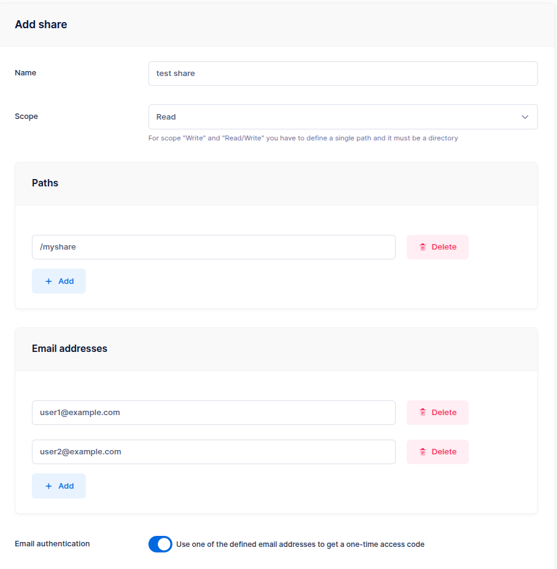{data-gallery="webclient-config-share"}

External users authenticate with their email address and receive a one-time code to access the shared content.

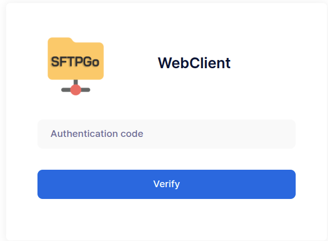{data-gallery="webclient-share-auth"}

For advanced sharing options (group-based delegation, governance policies, path and scope restrictions), see the [Shares tutorial](tutorials/shares.md).

## Explore SFTPGo's capabilities

Now that you have a working setup, here is an overview of the key features that make SFTPGo a complete file transfer solution.

### Storage backends

SFTPGo supports multiple storage backends — you can mix them within the same installation, even for the same user via virtual folders.

- **[AWS S3](s3.md)** (and S3-compatible services like MinIO, Wasabi, Backblaze B2)
- **[Google Cloud Storage](google-cloud-storage.md)** — with Hierarchical Namespace support
- **[Azure Blob Storage](azure-blob-storage.md)**
- **[Remote SFTP](sftpfs.md)** and **[FTP](ftpfs.md)** servers as storage
- **[Data At Rest Encryption](dare.md)** — transparent AES-256-GCM encryption on local storage
- **[Custom HTTP backends](httpfs.md)** for integration with arbitrary storage systems

Setting a **Key Prefix** restricts a user to a specific path within a bucket, allowing multiple users to share the same bucket securely.

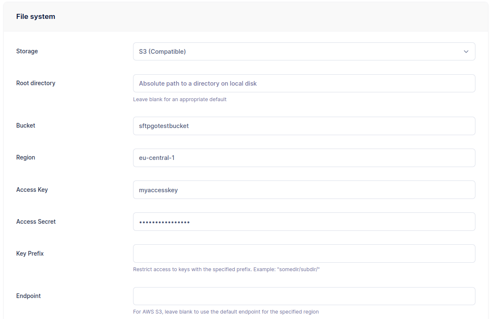{data-gallery="s3-user"}
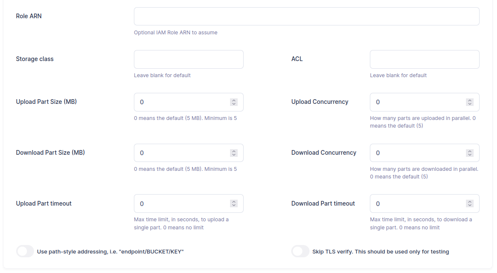{data-gallery="s3-user"}

Data At Rest Encryption is configured the same way — select the encrypted local filesystem backend and set a passphrase:

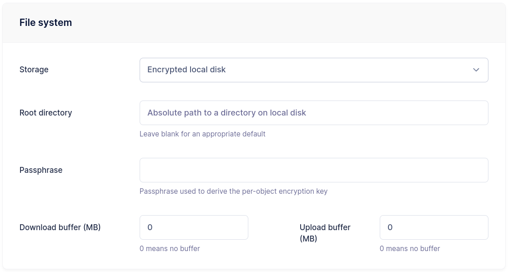{data-gallery="cryptfs-user"}

### Virtual folders and permissions

[Virtual folders](virtual-folders.md) map paths in a user's namespace to directories outside their home or on different storage backends. This allows combining local storage, S3 buckets, and remote SFTP servers under a single user, each with independent quota limits.

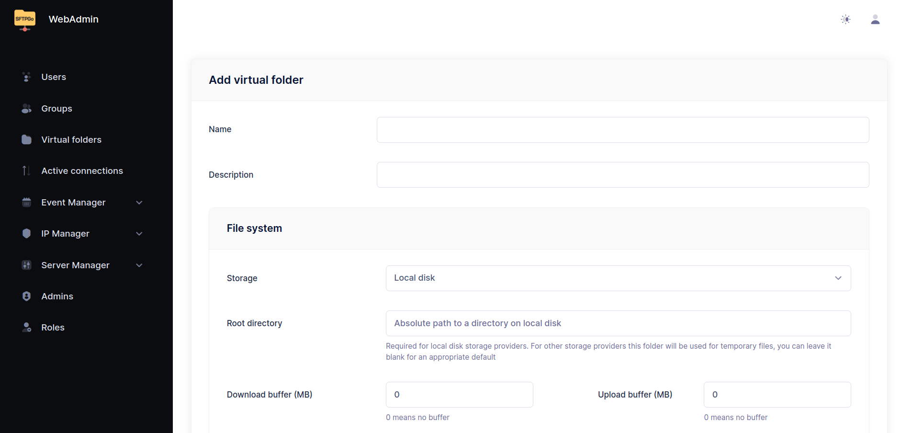{data-gallery="add-folder"}
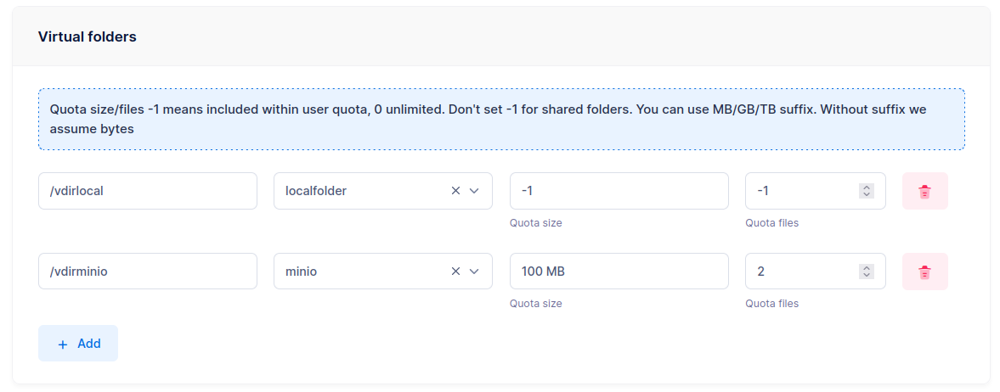{data-gallery="virtual-folders"}

SFTPGo also supports [per-directory permissions](virtual-folders.md). Each user has global permissions that can be overridden on specific paths — for example, full access by default but read-only on `/reports`.

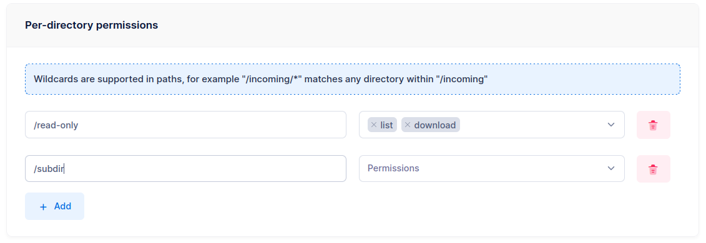{data-gallery="virtual-perms"}

### Groups and roles

[Groups](groups.md) simplify administration by defining settings once (home directory, storage backend, quotas, permissions, virtual folders) and applying them to multiple users. SFTPGo supports primary, secondary, and membership groups, each with different inheritance rules.

[Roles](roles.md) enable delegated administration — restricted administrators who can only manage users within their scope.

For a complete walkthrough, see the [Groups tutorial](tutorials/groups-example.md).

### Event Manager

The [Event Manager](eventmanager.md) is SFTPGo's automation engine. It lets you define rules that react to events (file uploads, user creation, schedules, and more) and execute actions automatically.

Common use cases:

- **Upload notifications** — send an email or call a webhook whenever a file is uploaded.
- **Antivirus scanning** — scan files with ICAP before they become visible to other users.
- **Data retention** — automatically delete or archive files older than a configurable threshold.
- **Auto provisioning** — create user accounts automatically when they log in through an Identity Provider.
- **Cross-backend transfers** — copy uploaded files to a different S3 bucket, archive to an external SFTP server, or compress files into ZIP archives.
- **Recycle bin** — move files to a recycle folder instead of deleting them.
- **PGP encryption/decryption** — automatically encrypt or decrypt files after upload.

All actions support [placeholders and templates](placeholders.md) with full Go template syntax — conditions, loops, and helper functions.

See the [Event Manager tutorials](tutorials/eventmanager.md) for step-by-step guides.

### Security

SFTPGo provides multiple layers of security:

- **[Brute force protection](defender.md)** — the built-in Defender automatically blocks IP addresses after repeated failed login attempts, with configurable scoring and ban policies.
- **[Rate limiting](rate-limiting.md)** — per-protocol, per-IP and global rate limiters.
- **Geo-IP filtering** — allow or deny access by country.
- **IP allow/deny lists** — per-user and global, with a trusted list that bypasses blocking.
- **[Two-factor authentication](tutorials/two-factor-authentication.md)** — TOTP-based, compatible with Microsoft Authenticator, Google Authenticator, Authy, and similar apps.
- **Access time restrictions** — limit when users can connect.
- **Configurable SSH algorithms** — ciphers, KEX, MACs, host keys, with per-user enforcement of secure algorithms.
- **TLS certificates** — configurable from the WebAdmin UI or via the built-in Let's Encrypt/ACME integration.

### Single Sign-On with OpenID Connect

SFTPGo supports [OpenID Connect](oidc.md) for Single Sign-On with external Identity Providers such as Microsoft Entra ID, Google, Okta, Keycloak, Auth0, and others. Users and administrators can log in to the WebAdmin and WebClient using their existing corporate credentials.

Combined with the Event Manager's [auto provisioning](tutorials/eventmanager-idp.md), user accounts can be created automatically on first login — no manual setup required.

### REST API

The [REST API](rest-api.md) provides full programmatic control over SFTPGo — manage users, groups, folders, event rules, and server configuration. End users can also use the API for file operations (upload, download, directory listing, sharing).

The API supports JWT and [API key](rest-api.md#api-key-authentication) authentication. An [OpenAPI specification](https://sftpgo.com/rest-api){:target="_blank"} is available for client generation in any language.

Infrastructure as Code is supported via the [Terraform provider](https://registry.terraform.io/providers/drakkan/sftpgo/latest){:target="_blank"}.

### Document editing and collaboration

With the WOPI add-on and a compatible document server (e.g., [Collabora Online](https://www.collaboraonline.com/){:target="_blank"}), users can edit Office documents directly in the WebClient with real-time collaboration — multiple users can work on the same document simultaneously.

### Additional protocols

Beyond SFTP, SFTPGo supports **[FTP/FTPS](ftp.md)** and **[WebDAV](webdav.md)**. These protocols are disabled by default and can be enabled via configuration. The same users, permissions, storage backends, and event rules apply across all protocols.

See [Configuration examples](configuration-examples.md) for setup instructions.

## Custom branding

From **Server Manager > Configurations > Branding**, you can customize the name, logo, favicon, and add a disclaimer (e.g., a link to your Privacy Policy) to the login page of both the WebAdmin and WebClient.

## Configuration

SFTPGo can be configured via environment variables or a configuration file. We recommend environment variables — they are stable across versions and easy to manage.

See the [Configuration reference](config-file.md) for all parameters and [Configuration examples](configuration-examples.md) for common setups (PostgreSQL, MySQL, FTP, WebDAV).
