# Feature overview

We assume that you have installed SFTPGo and it is up and running, so let's explore the main features and concepts.

## Initial configuration

Before you can use SFTPGo you need to create an admin account, so open [http://127.0.0.1:8080/web/admin](http://127.0.0.1:8080/web){:target="_blank"} in your web browser, replacing `127.0.0.1` with the appropriate IP address if SFTPGo is not running on localhost.

{data-gallery="setup"}

After creating the admin account you will be automatically logged in and redirected to the page to set up two-factor authentication. Setting up two-factor authentication is optional.

{data-gallery="initial screen"}

The web admin is now available at the following URL:

[http://127.0.0.1:8080/web/admin](http://127.0.0.1:8080/web/admin){:target="_blank"}

From the `Status` page you see the active services.

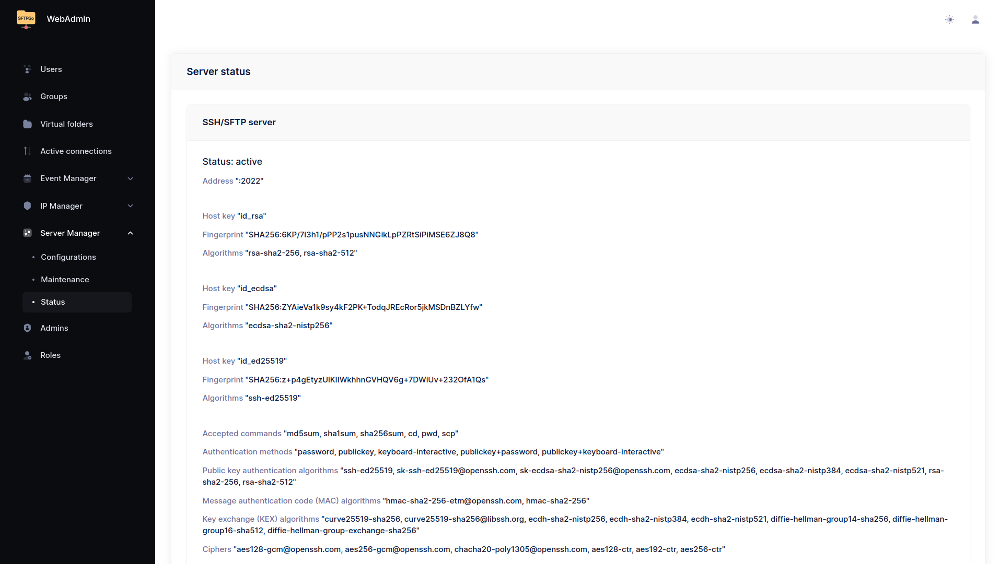{data-gallery="status"}

The default configuration enables the SFTP service on port `2022` and uses an embedded data provider (`SQLite` or `bolt` based on the target OS and architecture).

## Adding a license key

Without a valid license, the application will operate under the [Starter license tier](https://sftpgo.com/on-premises){:target="_blank"}, with the following additional limitations:

- Concurrent transfers are limited to 2.
- Plugin support is disabled.

You can view your license status and add a new license key from the WebAdmin UI by navigating to Server Manager => License.

{data-gallery="license"}

For unattended or CLI-based setups, the license key can also be activated by setting the `SFTPGO_LICENSE_KEY` environment variable.

```shell
SFTPGO_LICENSE_KEY=XXXX-XXXX-XXXX-XXXX
```

## Creating users

Let's create our first local user:

- from the `Users` page click the `+` icon to open the `Add user page`
- the only required fields are the `Username` and a `Password` or a `Public key`
- if you are on Windows or you installed SFTPGo manually and no `users_base_dir` is defined in your configuration file you also have to set a `Home Dir`. It must be an absolute path, for example `/srv/sftpgo/data/username` on Linux or `C:\sftpgo\data\username` on Windows. SFTPGo will try to automatically create the home directory, if missing, when the user logs in. Each user can only access files and folders inside its home directory.
- click `Save`

{data-gallery="add-user"}

:warning: Please note that, on Linux, SFTPGo runs using a dedicated system user and group called `sftpgo`, for added security. If you want to be able to use directories outside the `/srv/sftpgo` path you need to set the appropriate system level permissions. For example if you define `/home/username/test` as home dir you have to create this directory yourself, if it doesn't exist, and set the appropriate system-level permissions:

```shell
sudo mkdir /home/username/test
sudo chown sftpgo:sftpgo /home/username/test
```

You also need to make sure that the `sftpgo` system user has at least the read permission for any parent directory, so in the example above `/home/username` and `/home` must not have `0700` permissions.

Now test the new user, we use the `sftp` CLI here, you can use any SFTP client.

```shell
$ sftp -P 2022 nicola@127.0.0.1
nicola@127.0.0.1's password:
Connected to 127.0.0.1.
sftp> ls
sftp> put file.txt
Uploading file.txt to /file.txt
file.txt                                      100% 4034     3.9MB/s   00:00
sftp> ls
file.txt
sftp> mkdir adir
sftp> cd adir/
sftp> put file.txt
Uploading file.txt to /adir/file.txt
file.txt                                      100% 4034     4.0MB/s   00:00
sftp> ls
file.txt
sftp> get file.txt
Fetching /adir/file.txt to file.txt
/adir/file.txt                                100% 4034     1.9MB/s   00:00
```

It worked! We can upload/download files and create directories.

### Creating users with a Cloud Storage backend

The procedure is similar to the one described for local users, you have only specify the Cloud Storage backend and its credentials.

The screenshot below shows an example configuration for an S3 backend.

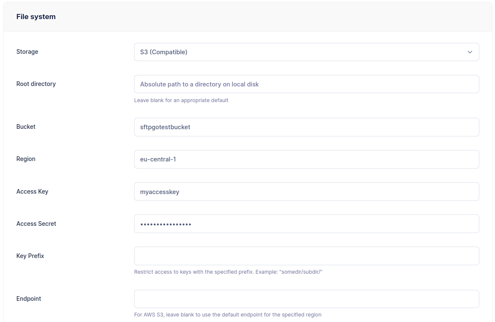{data-gallery="s3-user"}
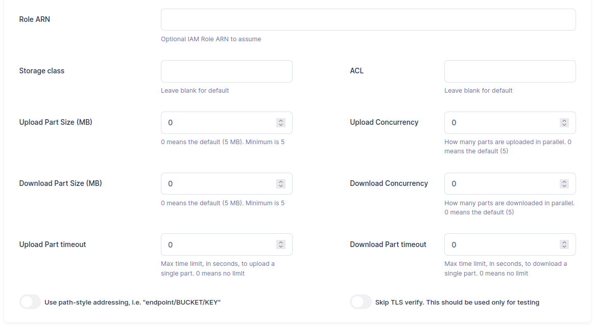{data-gallery="s3-user"}

The screenshot below shows an example configuration for an Azure Blob Storage backend.

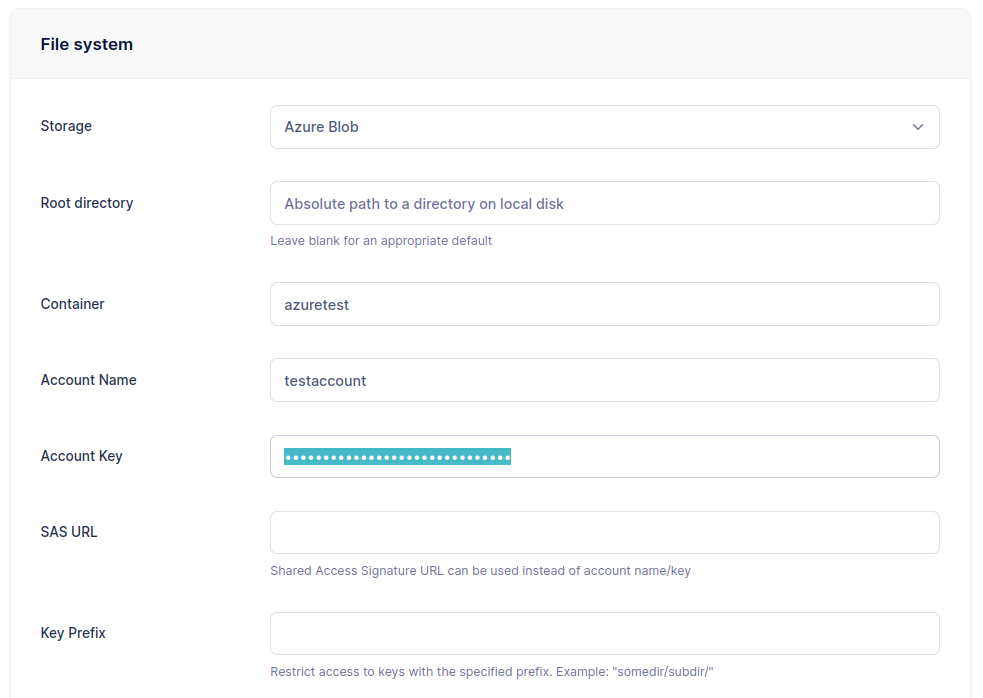{data-gallery="az-user"}
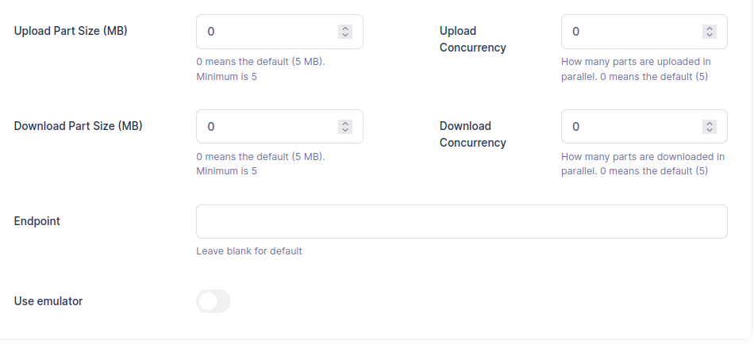{data-gallery="az-user"}

The screenshot below shows an example configuration for a Google Cloud Storage backend.

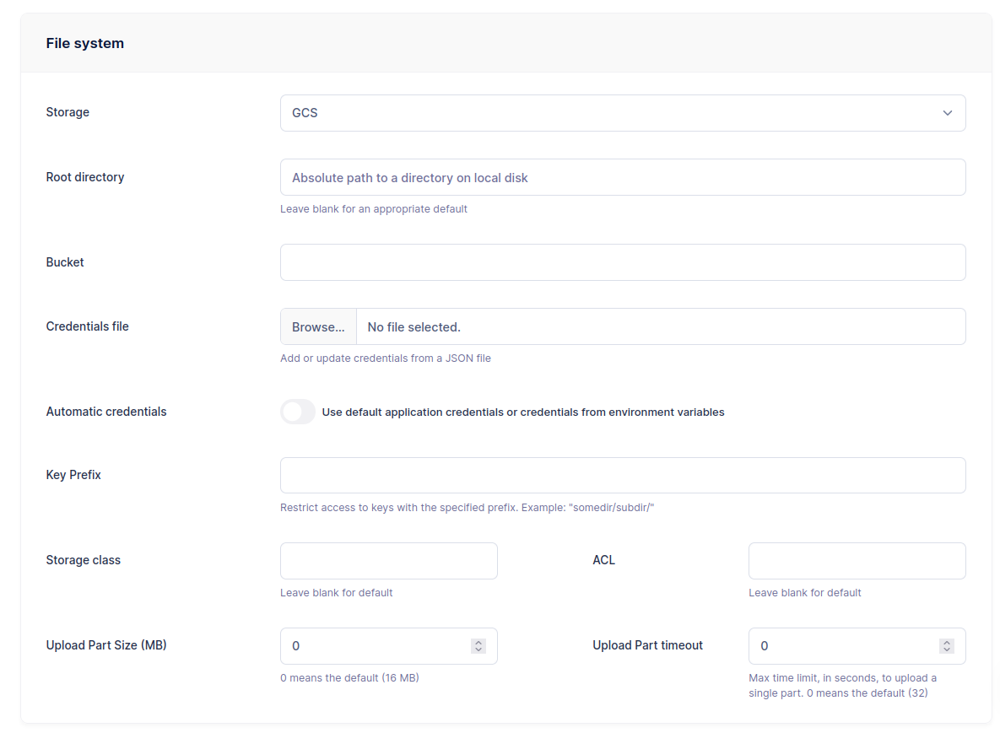{data-gallery="gcs-user"}

The screenshot below shows an example configuration for an SFTP server as storage backend.

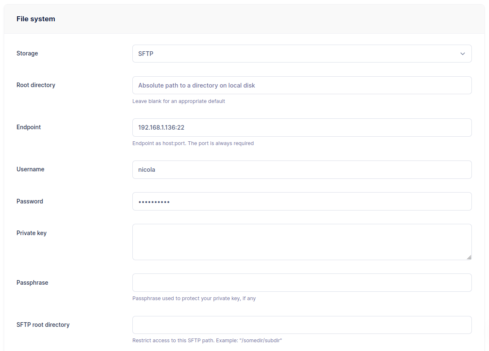{data-gallery="sftp-user"}

Setting a `Key Prefix` you restrict the user to a specific "sub-folder" in the bucket, so that the same bucket can be shared among different users.

### Creating users with a local encrypted backend (Data At Rest Encryption)

The procedure is similar to the one described for local users, you have only specify the encryption passphrase.
The screenshot below shows an example configuration.

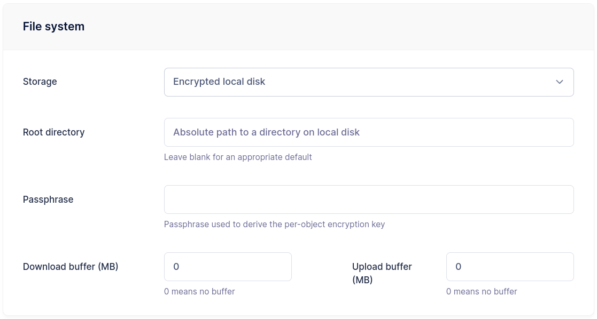{data-gallery="cryptfs-user"}

More details about [Data At Rest Encryption](dare.md).

## WebClient

Users created via the WebAdmin UI can also log in to the WebClient UI to browse and manage their files directly in the browser. They can update their credentials and enable two-factor authentication, which is compatible with Microsoft Authenticator, Google Authenticator, Authy, and other apps that support standard TOTP.

From the WebClient, authorized users can securely share files and folders via HTTP/S links. Sharing options include setting download/upload limits, password protection, email-based authentication, IP address restrictions, and automatic expiration dates.

The WebClient interface is available at the following URL:

[http://127.0.0.1:8080/web/client](http://127.0.0.1:8080/web/client){:target="_blank"}

### File and Folder Management

The WebClient allows users to easily manage files and folders within their SFTPGo storage from the "Files" section.

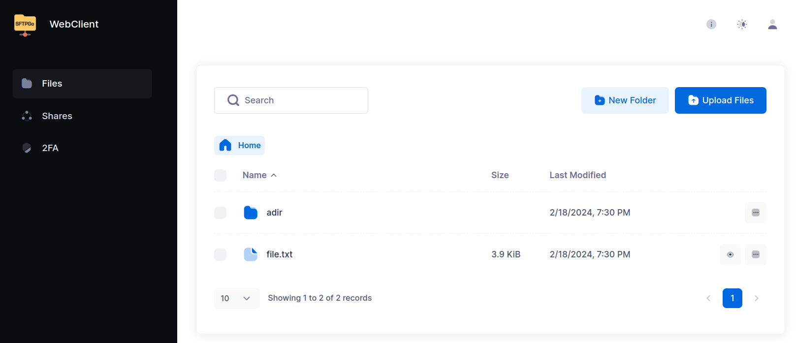{data-gallery="client-files"}

Key functionalities:

- Upload: Drag & drop or use the upload button to add single or multiple files.
- Download: Download individual files or multiple items as a zipped archive.
- Folders: Create, rename, and delete folders to organize your content.
- Rename/Delete: Rename or delete files and folders via the context menu.
- Move/Copy: Move or copy files and folders.
- Search: Quickly find files and folders using the search bar.
- Preview: Preview supported file types directly in the browser.

### Document Editing & Collaboration

Document Editing & Collaboration can be added as a separate add-on to any license.

This feature enables seamless document editing, and real-time collaboration directly within the SFTPGo WebClient. Multiple users can work on the same document simultaneously, with live updates visible to everyone as changes are made.

To use this feature, you will need to deploy a compatible WOPI document server in your environment, such as [Collabora Online](https://www.collaboraonline.com/){:target="_blank"}, the open-source office suite based on LibreOffice. We are an official partner of Collabora and offer first-class support for integrating with it.

Virtual folders can be created for sharing among multiple users, enabling collaboration on the documents stored within them.

To start editing and collaborating on a .docx, .xlsx, or .pptx files (or their open formats), simply click the 'eye' icon next to the file in the list.

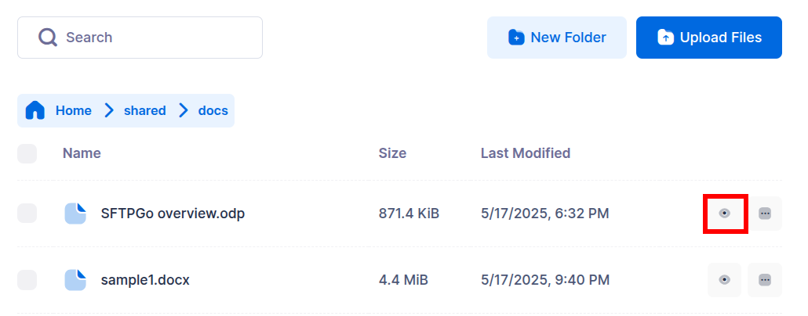{data-gallery="view-doc"}

The Collabora Online editor will open directly in your browser.

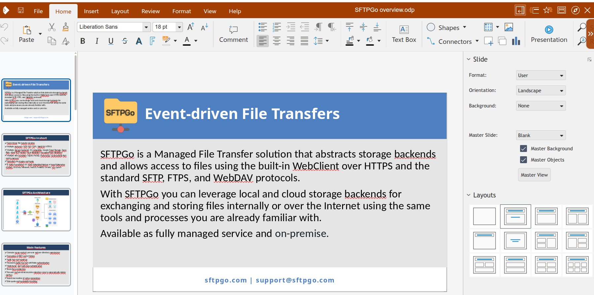{data-gallery="doc-editor"}

This powerful, web-based office suite allows you to view, edit, and collaborate on documents in real time, without needing to download or install anything. It supports rich editing features for text documents, spreadsheets and presentations, ensuring full compatibility with Microsoft Office formats.

The licensing model is per-user. When a user opens a document, one of the available licenses is automatically assigned to them. If no document is opened for three consecutive days, the license is automatically released and available for a different users.

If you've purchased the add-on for fewer users than the total number of users in your installation, you can restrict access by disabling WOPI for specific users or groups in the "ACLs" section.


### Two factor authentication

For detailed, step-by-step instructions, please refer to the dedicated [Two-Factor Authentication tutorial](./tutorials/two-factor-authentication.md#enable-2fa-for-users).

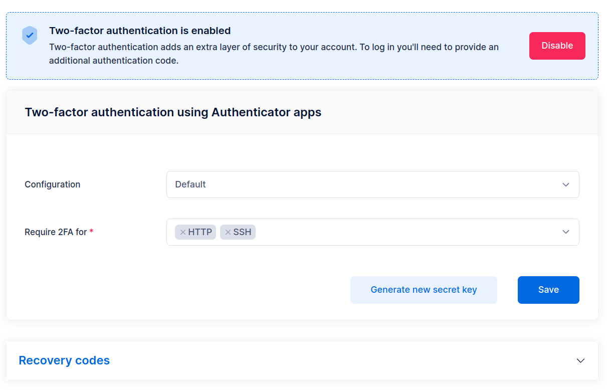{data-gallery="webclient-2fa"}

### Sharing

The WebClient allows users to securely share files and folders via HTTP/S links. Each share can be customized with advanced options to control access and improve security.

To share a file or folder, select the desired item and click the three-dot menu on the left. Then choose the 'Share' option from the menu.

{data-gallery="webclient-share"}

Configure the sharing options, such as the access scope—read, write, or read/write—to define what actions recipients are allowed to perform. You can also enable email-based authentication to restrict access to specific recipients.

{data-gallery="webclient-config-share"}

Share the link with external users.

Bonus: Configure an EventManager rule to automatically send email notifications to recipients whenever a new share is created.

External users will be prompted to enter their email address and will receive a one-time authentication code, valid for a limited time, to access the shared content.

{data-gallery="webclient-share-auth"}

## Virtual permissions

SFTPGo supports per directory virtual permissions. For each user you have to specify global permissions and then override them on a per-directory basis.

Take a look at the following screens.

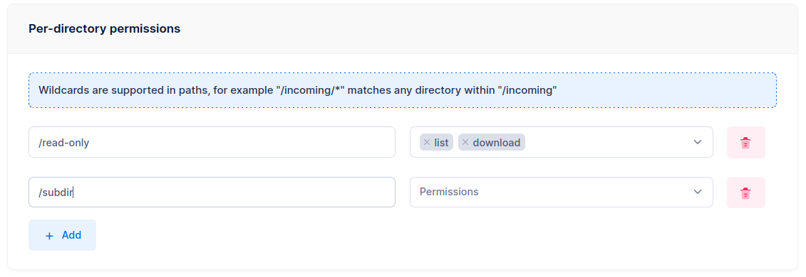{data-gallery="virtual-perms"}

This user has full access as default (`*`), can only list and download from `/read-only` path and has no permissions at all for the `/subdir` path.

Let's test it. We use the `sftp` CLI here, you can use any SFTP client.

```shell
$ sftp -P 2022 nicola@127.0.0.1
Connected to 127.0.0.1.
sftp> ls
adir        file.txt    read-only   subdir
sftp> put file.txt
Uploading file.txt to /file.txt
file.txt                                                                  100% 4034    19.4MB/s   00:00
sftp> rm file.txt
Removing /file.txt
sftp> ls
adir        read-only   subdir
sftp> cd read-only/
sftp> ls
file.txt
sftp> put file1.txt
Uploading file1.txt to /read-only/file1.txt
remote open("/read-only/file1.txt"): Permission denied
sftp> get file.txt
Fetching /read-only/file.txt to file.txt
/read-only/file.txt                                                       100% 4034     2.2MB/s   00:00
sftp> cd ..
sftp> ls
adir        read-only   subdir
sftp> cd /subdir
sftp> ls
remote readdir("/subdir"): Permission denied
```

as you can see it worked as expected.

## Virtual folders

A virtual folder is a mapping between a SFTPGo virtual path and a filesystem path outside the user home directory or on a different storage provider.
Therefore, there is no need to create virtual folders for the users home directory or for directories within the users home directory.

From the web admin interface click `Folders` and then the `+` icon.

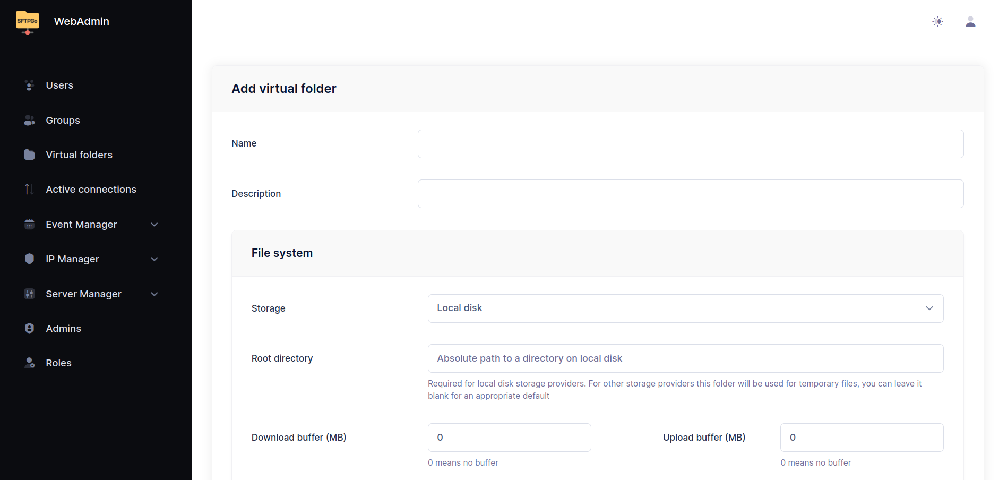{data-gallery="add-folder"}

To create a local folder you need to specify a `Name` and an `Absolute path`. For other backends you have to specify the backend type and its credentials, this is the same procedure already detailed for creating users with cloud backends.

Suppose we created two virtual folders name `localfolder` and `minio` as you can see in the following screen.

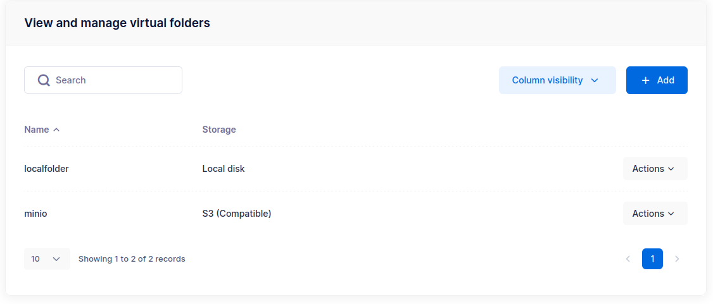{data-gallery="folders"}

- `localfolder` uses the local filesystem as storage backend
- `minio` uses MinIO (S3 compatible) as storage backend

Now, click `Users`, on the left menu, select a user and click the `Edit` icon, to update the user and associate the virtual folders.

Virtual folders must be referenced using their unique name and you can map them on a configurable virtual path. Take a look at the following screenshot.

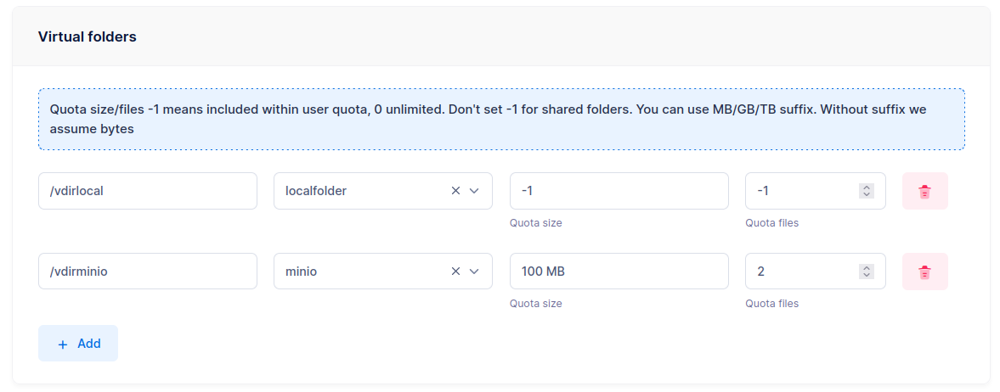{data-gallery="virtual-folders"}

We mapped the folder named `localfolder` on the path `/vdirlocal` (this must be an absolute UNIX path on Windows too) and the folder named `minio` on the path `/vdirminio`. For `localfolder` the quota usage is included within the user quota, while for the `minio` folder we defined separate quota limits: at most 2 files and at most 100MB, whichever is reached first.

The folder `minio` can be shared with other users and we can define different quota limits on a per-user basis. The folder `localfolder` is considered private since we have included its quota limits within those of the user, if we share them with other users we will break quota calculation.

Let's test these virtual folders. We use the `sftp` CLI here, you can use any SFTP client.

```shell
$ sftp -P 2022 nicola@127.0.0.1
nicola@127.0.0.1's password:
Connected to 127.0.0.1.
sftp> ls
adir        read-only   subdir      vdirlocal   vdirminio
sftp> cd vdirlocal
sftp> put file.txt
Uploading file.txt to /vdirlocal/file.txt
file.txt                                                                  100% 4034    17.3MB/s   00:00
sftp> ls
file.txt
sftp> cd ..
sftp> cd vdirminio/
sftp> put file.txt
Uploading file.txt to /vdirminio/file.txt
file.txt                                                                  100% 4034     4.8MB/s   00:00
sftp> ls
file.txt
sftp> put file.txt file1.txt
Uploading file.txt to /vdirminio/file1.txt
file.txt                                                                  100% 4034     2.8MB/s   00:00
sftp> put file.txt file2.txt
Uploading file.txt to /vdirminio/file2.txt
remote open("/vdirminio/file2.txt"): Failure
sftp> quit
```

The last upload failed since we exceeded the number of files quota limit.

## Groups

Using groups simplifies the administration of multiple SFTPGo users: you can assign settings once to a group, instead of multiple times to each individual user.

SFTPGo supports the following types of groups:

- primary groups
- secondary groups
- membership groups

A user can be a member of a primary group and many secondary and membership groups. Depending on the group type, the settings are inherited differently, [more details](groups.md).

:warning: SFTPGo groups are completely unrelated to system groups. Therefore, it is not necessary to add Linux/Windows groups to use SFTPGo groups.

### Usage example

Suppose you have the following requirements:

- each user must be restricted to a local home directory containing the username as last element of the path, for example `/srv/sftpgo/data/<username>`
- for each user, the maximum upload size for a single file must be limited to 1GB
- each user must have an S3 virtual folder available in the path `/s3<username>` and each user can only access a specified "prefix" of the S3 bucket. It must not be able to access other users' files
- each user must have an S3 virtual folder available in the path `/shared`. This is a folder shared with other users
- a group of users can only download and list contents in the `/shared` path while another group of users have full access

We can easily meet these requirements by defining two groups.

From the SFTPGo WebAdmin UI, click on `Folders` and then on the `+` icon.

Create a folder named `S3private`.
Set the storage to `AWS S3 (Compatible)` and fill the required parameters:

- bucket name
- region
- credentials: access key and access secret

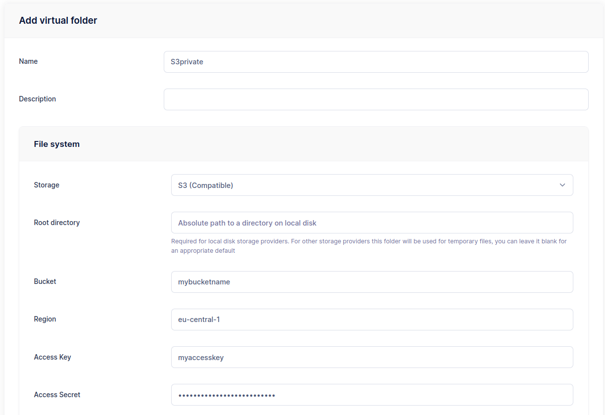{data-gallery="s3-private-folder"}

The important part is the `Key Prefix`, set it to `users/%username%/`

{data-gallery="s3-key-prefix"}

The placeholder `%username%` will be replaced with the associated username.

Create another folder named `S3shared` with the same settings as `S3private` but this time set the `Key Prefix` to `shared/`.
The `Key Prefix` has no placeholder, so the folder will operate on a static path that won't change based on the associated user.

Now click on `Groups` and then on the `+` icon and add a group named `Primary`.

Set the `Home Dir` to `/srv/sftpgo/data/%username%`.

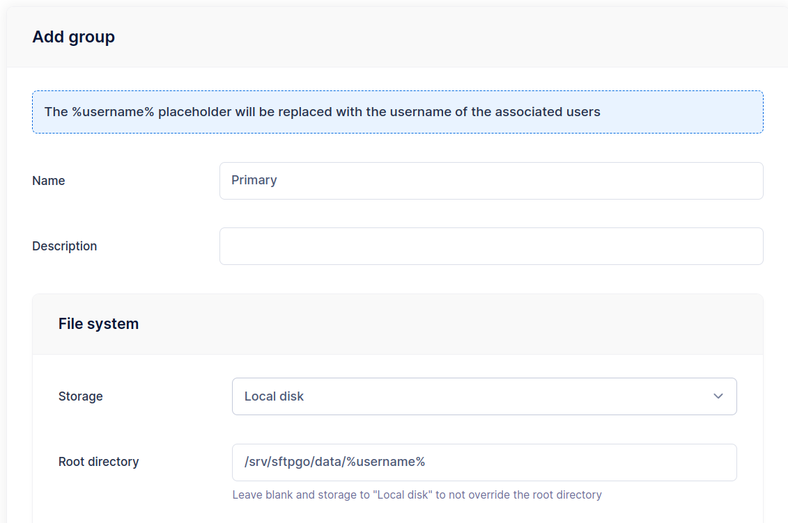{data-gallery="add-group"}

As before, the placeholder `%username%` will be replaced with the associated username.

Add the two virtual folders to this group and set the `Max file upload size` to 1GB.

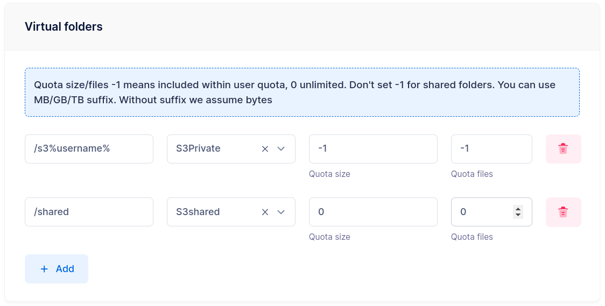{data-gallery="primary-group-settings"}

Add a new group and name it `SharedReadOnly`, in the ACLs section set the permission on the `/shared` path so that read only access is granted.

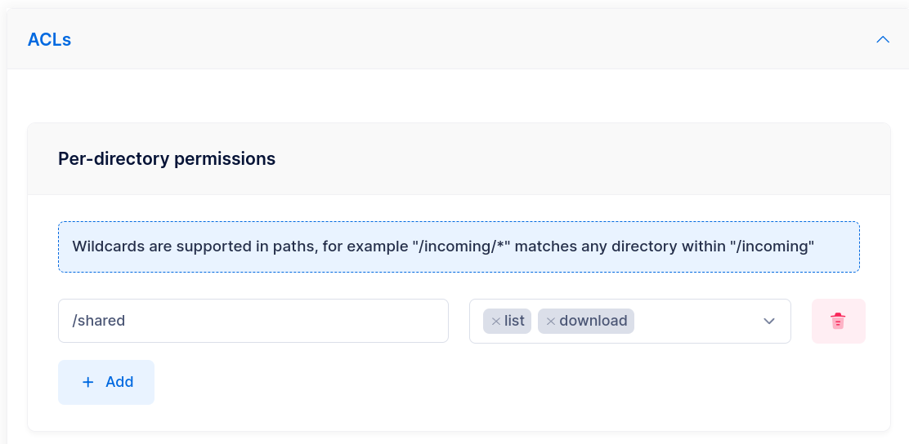{data-gallery="read-only-share"}

The group setup is now complete. We can now create our users and set the primary group to `Primary`.
For the users who need read-only access to the `/shared` path we also have to set `SharedReadOnly` as a secondary group.

You can now login with any SFTP client like FileZilla, WinSCP etc. and verify that the requirements are met.

### Simplify user page

The add/update user page has many configuration options and can be intimidating for some administrators. We can hide most of the settings and automatically add groups to newly created users. This way the hidden settings are inherited from the automatically assigned groups and therefore administrators can add new users simply by setting the username and credentials.

Click on `Admins` and then on the `+` icon and add an admin named `simply`.
In the `Groups for users` section set `Primary` as primary group and `SharedReadOnly` as `seconday` group.
In the `User page preferences` section hide all the sections.

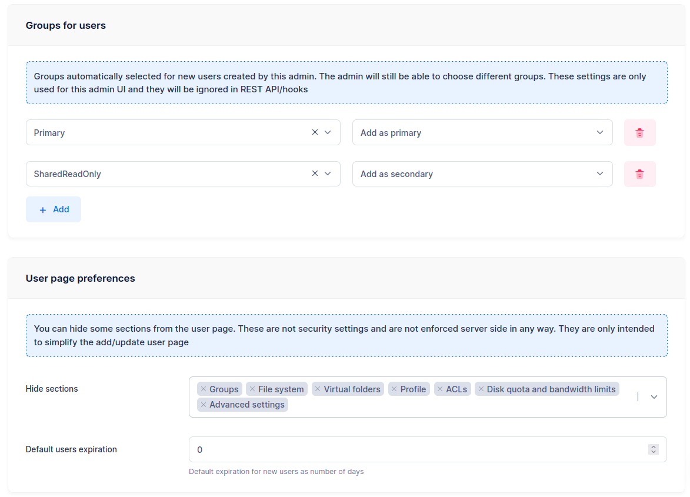{data-gallery="simplified-admin"}

Log in using the newly created administrator and try to add a new user. The user page is simplified as you can see in the following screen.

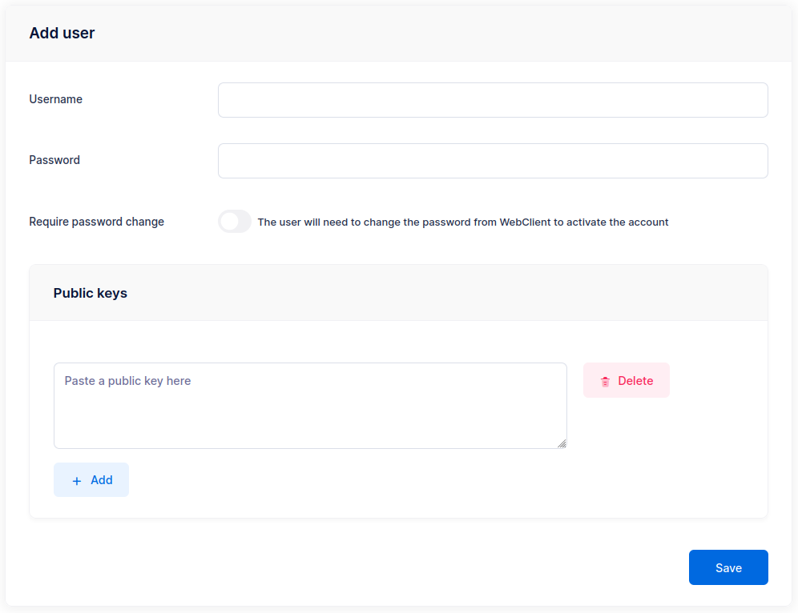{data-gallery="simplified-user"}

## Custom branding

From the "Server Manager" section, select "Configurations" and then "Branding". You can change the name, logo, favicon and add a disclaimer in the login section for both WebAdmin and WebClient. The disclaimer might be a URL to your Privacy Policy or something like that.

## Configuration parameters

Until now we used the default configuration, to change the global service parameters you have to edit the configuration file, or set appropriate environment variables, and restart SFTPGo to apply the changes.

A full explanation of all configuration parameters is available in the dedicated [configuration file section](config-file.md). Below, we’ll explore some common use cases.

Keep in mind that SFTPGo can also be configured using environment variables — a convenient option, especially when running it in Docker.

The default configuration file is `sftpgo.json` and it can be found within the `/etc/sftpgo` directory if you installed from Linux distro packages. On Windows the configuration file can be found within the `{commonappdata}\SFTPGo` directory where `{commonappdata}` is typically `C:\ProgramData`. SFTPGo also supports reading from TOML and YAML configuration files.

The configuration file can change between different versions and merging your custom settings with the default configuration file, after updating SFTPGo, may be time-consuming. For this reason we suggest to set your custom settings using environment variables.
If you install SFTPGo on Linux using the official deb/rpm packages you can set your custom environment variables in the file `/etc/sftpgo/sftpgo.env`.
SFTPGo also reads files inside the `env.d` directory relative to config dir (`/etc/sftpgo/env.d` on Linux and `{commonappdata}\SFTPGo\env.d` on Windows) and then exports the valid variables into environment variables if they are not already set.
Of course you can also set environment variables with the method provided by the operating system of your choice.

The following snippets assume your are running SFTPGo on Linux but they can be easily adapted for other operating systems.

### Use PostgreSQL data provider

Create a PostgreSQL database named `sftpgo` and a PostgreSQL user with the correct permissions, for example using the `psql` CLI.

```shell
sudo -i -u postgres psql
CREATE DATABASE "sftpgo" WITH ENCODING='UTF8' CONNECTION LIMIT=-1;
create user "sftpgo" with encrypted password 'your password here';
grant all privileges on database "sftpgo" to "sftpgo";
\q
```

You can open the SFTPGo configuration file, search for the `data_provider` section and change it as follow.

```json
  "data_provider": {
    "driver": "postgresql",
    "name": "sftpgo",
    "host": "127.0.0.1",
    "port": 5432,
    "username": "sftpgo",
    "password": "your password here",
    ...
}
```

Alternatively (recommended), you can use environment variables by creating the file `/etc/sftpgo/env.d/postgresql.env` with the following content.

```shell
SFTPGO_DATA_PROVIDER__DRIVER=postgresql
SFTPGO_DATA_PROVIDER__NAME=sftpgo
SFTPGO_DATA_PROVIDER__HOST=127.0.0.1
SFTPGO_DATA_PROVIDER__PORT=5432
SFTPGO_DATA_PROVIDER__USERNAME=sftpgo
SFTPGO_DATA_PROVIDER__PASSWORD=your password here
```

Confirm that the database connection works by initializing the data provider.

```shell
$ sudo su - sftpgo -s /bin/bash -c 'sftpgo initprovider -c /etc/sftpgo'
2021-05-19T22:21:54.000 INF Initializing provider: "postgresql" config file: "/etc/sftpgo/sftpgo.json"
2021-05-19T22:21:54.000 INF updating database schema version: 8 -> 9
2021-05-19T22:21:54.000 INF Data provider successfully initialized/updated
```

Ensure that SFTPGo starts after the database service.

```shell
sudo systemctl edit sftpgo.service
```

And override the unit definition with the following snippet.

```shell
[Unit]
After=postgresql.service
```

Restart SFTPGo to apply the changes.

### Use MySQL/MariaDB data provider

Create a MySQL database named `sftpgo` and a MySQL user with the correct permissions, for example using the `mysql` CLI.

```shell
$ mysql -u root
MariaDB [(none)]> CREATE DATABASE sftpgo CHARACTER SET utf8mb4 COLLATE utf8mb4_unicode_ci;
Query OK, 1 row affected (0.000 sec)

MariaDB [(none)]> grant all privileges on sftpgo.* to sftpgo@localhost identified by 'your password here';
Query OK, 0 rows affected (0.027 sec)

MariaDB [(none)]> quit
Bye
```

You can open the SFTPGo configuration file, search for the `data_provider` section and change it as follow.

```json
  "data_provider": {
    "driver": "mysql",
    "name": "sftpgo",
    "host": "127.0.0.1",
    "port": 3306,
    "username": "sftpgo",
    "password": "your password here",
    ...
}
```

Alternatively (recommended), you can use environment variables by creating the file `/etc/sftpgo/env.d/mysql.env` with the following content.

```shell
SFTPGO_DATA_PROVIDER__DRIVER=mysql
SFTPGO_DATA_PROVIDER__NAME=sftpgo
SFTPGO_DATA_PROVIDER__HOST=127.0.0.1
SFTPGO_DATA_PROVIDER__PORT=3306
SFTPGO_DATA_PROVIDER__USERNAME=sftpgo
SFTPGO_DATA_PROVIDER__PASSWORD=your password here
```

Confirm that the database connection works by initializing the data provider.

```shell
$ sudo su - sftpgo -s /bin/bash -c 'sftpgo initprovider -c /etc/sftpgo'
2021-05-19T22:29:30.000 INF Initializing provider: "mysql" config file: "/etc/sftpgo/sftpgo.json"
2021-05-19T22:29:30.000 INF updating database schema version: 8 -> 9
2021-05-19T22:29:30.000 INF Data provider successfully initialized/updated
```

Ensure that SFTPGo starts after the database service.

```shell
sudo systemctl edit sftpgo.service
```

And override the unit definition with the following snippet.

```shell
[Unit]
After=mariadb.service
```

Restart SFTPGo to apply the changes.

### Use CockroachDB data provider

We suppose you have installed CockroachDB this way:

```shell
sudo su
export CRDB_VERSION=22.1.8 # set the latest available version here
wget -qO- https://binaries.cockroachdb.com/cockroach-v${CRDB_VERSION}.linux-amd64.tgz | tar xvz
cp -i cockroach-v${CRDB_VERSION}.linux-amd64/cockroach /usr/local/bin/
mkdir -p /usr/local/lib/cockroach
cp -i cockroach-v${CRDB_VERSION}.linux-amd64/lib/libgeos.so /usr/local/lib/cockroach/
cp -i cockroach-v${CRDB_VERSION}.linux-amd64/lib/libgeos_c.so /usr/local/lib/cockroach/
mkdir /var/lib/cockroach
chown sftpgo:sftpgo /var/lib/cockroach
mkdir -p /etc/cockroach/{certs,ca}
chmod 700 /etc/cockroach/ca
/usr/local/bin/cockroach cert create-ca --certs-dir=/etc/cockroach/certs --ca-key=/etc/cockroach/ca/ca.key
/usr/local/bin/cockroach cert create-node localhost $(hostname) --certs-dir=/etc/cockroach/certs --ca-key=/etc/cockroach/ca/ca.key
/usr/local/bin/cockroach cert create-client root --certs-dir=/etc/cockroach/certs --ca-key=/etc/cockroach/ca/ca.key
chown -R sftpgo:sftpgo /etc/cockroach/certs
exit
```

and you are running it using a systemd unit like this one:

```shell
[Unit]
Description=Cockroach Database single node
Requires=network.target
[Service]
Type=notify
WorkingDirectory=/var/lib/cockroach
ExecStart=/usr/local/bin/cockroach start-single-node --certs-dir=/etc/cockroach/certs --http-addr 127.0.0.1:8888 --listen-addr 127.0.0.1:26257 --cache=.25 --max-sql-memory=.25 --store=path=/var/lib/cockroach
TimeoutStopSec=60
Restart=always
RestartSec=10
StandardOutput=journal
StandardError=journal
User=sftpgo
[Install]
WantedBy=default.target
```

Create a CockroachDB database named `sftpgo`.

```shell
$ sudo /usr/local/bin/cockroach sql --certs-dir=/etc/cockroach/certs -e 'create database "sftpgo"'
CREATE DATABASE

Time: 13ms
```

You can open the SFTPGo configuration file, search for the `data_provider` section and change it as follow.

```json
  "data_provider": {
    "driver": "cockroachdb",
    "name": "sftpgo",
    "host": "localhost",
    "port": 26257,
    "username": "root",
    "password": "",
    "sslmode": 3,
    "root_cert": "/etc/cockroach/certs/ca.crt",
    "client_cert": "/etc/cockroach/certs/client.root.crt",
    "client_key": "/etc/cockroach/certs/client.root.key",
    ...
}
```

Alternatively (recommended), you can use environment variables by creating the file `/etc/sftpgo/env.d/cockroachdb.env` with the following content.

```shell
SFTPGO_DATA_PROVIDER__DRIVER=cockroachdb
SFTPGO_DATA_PROVIDER__NAME=sftpgo
SFTPGO_DATA_PROVIDER__HOST=localhost
SFTPGO_DATA_PROVIDER__PORT=26257
SFTPGO_DATA_PROVIDER__USERNAME=root
SFTPGO_DATA_PROVIDER__SSLMODE=3
SFTPGO_DATA_PROVIDER__ROOT_CERT="/etc/cockroach/certs/ca.crt"
SFTPGO_DATA_PROVIDER__CLIENT_CERT="/etc/cockroach/certs/client.root.crt"
SFTPGO_DATA_PROVIDER__CLIENT_KEY="/etc/cockroach/certs/client.root.key"
```

Confirm that the database connection works by initializing the data provider.

```shell
$ sudo su - sftpgo -s /bin/bash -c 'sftpgo initprovider -c /etc/sftpgo'
2022-06-02T14:54:04.510 INF Initializing provider: "cockroachdb" config file: "/etc/sftpgo/sftpgo.json"
2022-06-02T14:54:04.554 INF creating initial database schema, version 15
2022-06-02T14:54:04.698 INF updating database schema version: 15 -> 16
2022-06-02T14:54:07.093 INF updating database schema version: 16 -> 17
2022-06-02T14:54:07.672 INF updating database schema version: 17 -> 18
2022-06-02T14:54:07.699 INF updating database schema version: 18 -> 19
2022-06-02T14:54:07.721 INF Data provider successfully initialized/updated
```

Ensure that SFTPGo starts after the database service.

```shell
sudo systemctl edit sftpgo.service
```

And override the unit definition with the following snippet.

```shell
[Unit]
After=cockroachdb.service
```

Restart SFTPGo to apply the changes.

### Enable FTP service

You can set the configuration options to enable the FTP service by opening the SFTPGo configuration file, looking for the `ftpd` section and editing it as follows.

```json
  "ftpd": {
    "bindings": [
      {
        "port": 2121,
        "address": "",
        "apply_proxy_config": true,
        "tls_mode": 0,
        "certificate_file": "",
        "certificate_key_file": "",
        "min_tls_version": 12,
        "force_passive_ip": "",
        "passive_ip_overrides": [],
        "client_auth_type": 0,
        "tls_cipher_suites": [],
        "passive_connections_security": 0,
        "active_connections_security": 0,
        "debug": false
      }
    ],
    "banner": "",
    "banner_file": "",
    "active_transfers_port_non_20": true,
    "passive_port_range": {
      "start": 50000,
      "end": 50100
    },
    ...
  }
```

Alternatively (recommended), you can use environment variables by creating the file `/etc/sftpgo/env.d/ftpd.env` with the following content.

```shell
SFTPGO_FTPD__BINDINGS__0__PORT=2121
```

Restart SFTPGo to apply the changes. The FTP service is now available on port `2121`.

You can also configure the passive ports range (`50000-50100` by default), these ports must be reachable for passive FTP to work. If your FTP server is on the private network side of a NAT configuration you have to set `force_passive_ip` to your external IP address. You may also need to open the passive port range on your firewall.

It is recommended that you provide a certificate and key file to allow FTP over TLS. You should prefer SFTP to FTP even if you configure TLS, please don't blindly enable the old FTP protocol.

### Enable WebDAV service

You can set the configuration options to enable the FTP service by opening the SFTPGo configuration file, looking for the `webdavd` section and editing it as follows.

```json
  "webdavd": {
    "bindings": [
      {
        "port": 10080,
        "address": "",
        "enable_https": false,
        "certificate_file": "",
        "certificate_key_file": "",
        "min_tls_version": 12,
        "client_auth_type": 0,
        "tls_cipher_suites": [],
        "prefix": "",
        "proxy_allowed": [],
        "client_ip_proxy_header": "",
        "client_ip_header_depth": 0,
        "disable_www_auth_header": false
      }
    ],
    ...
  }
```

Alternatively (recommended), you can use environment variables by creating the file `/etc/sftpgo/env.d/webdavd.env` with the following content.

```shell
SFTPGO_WEBDAVD__BINDINGS__0__PORT=10080
```

Restart SFTPGo to apply the changes. The WebDAV service is now available on port `10080`. It is recommended that you provide a certificate and key file to allow WebDAV over https.
