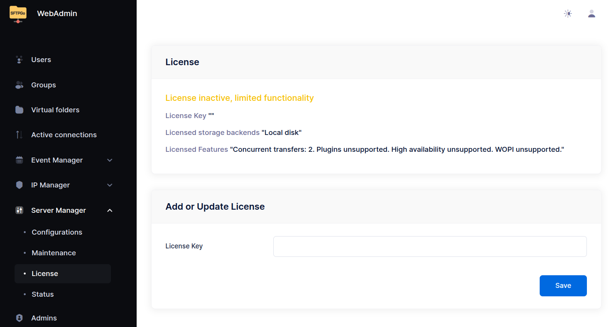

# Installation

SFTPGo is compatible with Linux, Windows, macOS, and FreeBSD. Other BSD variants are likely to work as well, and the software can run on a wide range of systems—from small embedded devices to large-scale Kubernetes clusters.

The **Enterprise edition** is officially distributed and supported for Linux and Windows platforms, and is also available as a Docker image or through a Helm chart.

If you'd prefer to focus on your core business without worrying about the maintenance and security of your file transfer solution, consider opting for our fully managed [SaaS offerings](https://sftpgo.com/saas){:target="_blank"}. With a dedicated installation tailored specifically to your needs, you'll receive a secure, high-performance solution fully managed by us. We handle everything from security patches to upgrades, ensuring your service runs smoothly at all times.

:warning: **Note:** Only the installation methods explicitly documented here provide access to **SFTPGo Enterprise**.
Community distributions, including unofficial Docker images and pre-packaged solutions from third-party platforms, even if offered as paid services, provide the open-source edition of SFTPGo.
These versions **do not include Enterprise features** and are **not supported** by the SFTPGo team.

## Requirements

The only (optional) requirement is a suitable SQL server to use as data provider:

- upstream supported versions of PostgreSQL, MySQL and MariaDB.
- CockroachDB stable.

You can remove this requirement by using an embedded SQLite, bolt or in memory data provider.

## Commercial Marketplaces

SFTPGo Enterprise is available on major cloud marketplaces, allowing you to quickly deploy pre-configured instances in your preferred environment. These offerings simplify installation and come with default settings, which can be easily adjusted to match your specific requirements.

Marketplace offerings are available in plans that correspond to our Starter and Premium [on-premises](https://sftpgo.com/on-premises){:target="_blank"} tiers. For advanced requirements, a private offer can be arranged to provide the full capabilities of the Ultimate tier.

### AWS

SFTPGo Enterprise offerings on AWS Marketplace:

- [SFTPGo Enterprise - Starter](https://aws.amazon.com/marketplace/pp/prodview-6pasgeptfjjf6){:target="_blank"}
- [SFTPGo Enterprise - Premium](https://aws.amazon.com/marketplace/pp/prodview-ocwppyuudgbz2){:target="_blank"}
- [SFTPGo Enterprise - Starter (arm64)](https://aws.amazon.com/marketplace/pp/prodview-ukjjbuggrxrlw){:target="_blank"}
- [SFTPGo Enterprise - Premium (arm64)](https://aws.amazon.com/marketplace/pp/prodview-6fcfsxgzfx3yu){:target="_blank"}
- [SFTPGo Enterprise - Container](https://aws.amazon.com/marketplace/pp/prodview-y2aqp5bjdjdvu){:target="_blank"}

Prior to the general availability of SFTPGo Enterprise, we released some offerings based on the open-source version of SFTPGo. While these remain fully supported, we recommend migrating to the Enterprise edition for improved performance and more advanced features. You can view all of our supported offerings using [this link](https://aws.amazon.com/marketplace/seller-profile?id=6e849ab8-70a6-47de-9a43-13c3fa849335){:target="_blank"}.

### Azure

SFTPGo Enterprise offerings on Azure Marketplace:

- [SFTPGo Enterprise for Linux](https://marketplace.microsoft.com/product/virtual-machines/eliamarzia1667381463185.sftpgo_enterprise_linux){:target="_blank"}
- [SFTPGo Enterprise for Windows](https://marketplace.microsoft.com/product/virtual-machines/eliamarzia1667381463185.sftpgo_enterprise_windows){:target="_blank"}
- [SFTPGo Enterprise for AKS](https://marketplace.microsoft.com/product/container/eliamarzia1667381463185.sftpgo_enterprise_aks){:target="_blank"}

Prior to the general availability of SFTPGo Enterprise, we released some offerings based on the open-source version of SFTPGo. While these remain fully supported, we recommend migrating to the Enterprise edition for improved performance and more advanced features. Here is the list of additional supported offer:

- [SFTPGo Open Source for Linux](https://marketplace.microsoft.com/product/virtual-machines/eliamarzia1667381463185.sftpgo_linux){:target="_blank"}
- [SFTPGo Open Source for Windows](https://marketplace.microsoft.com/product/virtual-machines/eliamarzia1667381463185.sftpgo_windows){:target="_blank"}
- [SFTPGo Open Source for AKS](https://marketplace.microsoft.com/product/containers/eliamarzia1667381463185.sftpgo_aks){:target="_blank"}

### Google Cloud

SFTPGo Enterprise offerings on Google Cloud Marketplace:

- [SFTPGo Enterprise - Starter](https://console.cloud.google.com/marketplace/product/sunlit-theory-450708-g7/sftpgo-enterprise-starter){:target="_blank"}
- [SFTPGo Enterprise - Premium](https://console.cloud.google.com/marketplace/product/sunlit-theory-450708-g7/sftpgo-enterprise-premium){:target="_blank"}

Prior to the general availability of SFTPGo Enterprise, we released some offerings based on the open-source version of SFTPGo. While these remain fully supported, we recommend migrating to the Enterprise edition for improved performance and more advanced features. You can view all of our supported offerings using [this link](https://console.cloud.google.com/marketplace/browse?filter=partner:SFTPGo%20Authors){:target="_blank"}.

## Linux, Windows, Docker

SFTPGo Enterprise can be installed on Linux, Windows, and in containerized environments using Docker.

- APT and YUM repositories are available for Debian-based and RHEL-based distributions.
- Windows installers are provided for direct setup on Windows systems.
- A Docker registry is available.

A license key is required to unlock advanced features and to access our Docker repository.
Licenses can be purchased or a free trial activated directly from our [website](https://sftpgo.com/on-premises){:target="_blank"}.

Without a valid license, the application will operate under the [Starter license tier](https://sftpgo.com/on-premises), with the following additional limitations:

- Concurrent transfers are limited to 2.
- Plugin support is disabled.

### APT repo

Supported distributions:

- Debian 11 "bullseye"
- Debian 12 "bookworm"
- Debian 13 "trixie"
- Ubuntu 20.04 "focal"
- Ubuntu 22.04 "jammy"
- Ubuntu 24.04 "noble"

Import the public key used by the package management system:

```shell
curl -sS https://download.sftpgo.com/apt/gpg.key | sudo gpg --dearmor -o /usr/share/keyrings/sftpgo-archive-keyring.gpg
```

If you receive an error indicating that `gnupg` is not installed, you can install it using the following command:

```shell
sudo apt install gnupg
```

Create the SFTPGo source list file:

```shell
CODENAME=`lsb_release -c -s`
echo "deb [signed-by=/usr/share/keyrings/sftpgo-archive-keyring.gpg] https://download.sftpgo.com/apt ${CODENAME} main" | sudo tee /etc/apt/sources.list.d/sftpgo.list
```

Reload the package database and install SFTPGo:

```shell
sudo apt update
sudo apt install sftpgo
```

### Yum repo

The YUM repository can be used on generic Red Hat based distributions as well as on Suse/OpenSuse.

#### Red Hat based distributions

Create the SFTPGo repository:

```shell
ARCH=`uname -m`
curl -sS https://download.sftpgo.com/yum/${ARCH}/sftpgo.repo | sudo tee /etc/yum.repos.d/sftpgo.repo
```

Reload the package database and install SFTPGo:

```shell
sudo yum update
sudo yum install sftpgo
```

Start the SFTPGo service and enable it to start at system boot:

```shell
sudo systemctl start sftpgo
sudo systemctl enable sftpgo
```

#### Suse/OpenSUSE

Import the public key used by the package management system:

```shell
sudo rpm --import https://download.sftpgo.com/yum/gpg.key
```

Add the SFTPGo repository:

```shell
ARCH=`uname -m`
sudo zypper addrepo -f "https://download.sftpgo.com/yum/${ARCH}" sftpgo
```

Reload the package database and install SFTPGo:

```shell
sudo zypper refresh
sudo zypper install sftpgo
```

Start the SFTPGo service and enable it to start at system boot:

```shell
sudo systemctl start sftpgo
sudo systemctl enable sftpgo
```

### Windows

You can download the latest Windows installer using [this link](https://download.sftpgo.com/windows/sftpgo_windows_x86_64.exe){:target="_blank"}. The installer includes the plugins and will automatically register SFTPGo as a Windows service, starting it immediately after installation. Alternatively, SFTPGo can also be installed using **winget** with the following command: `winget install -e --id drakkan.SFTPGoEnterprise`.

By default, the service runs under the Local System account. However, you can configure it to run under a different user account either through the built-in Windows Services UI or via the command line, as shown below:

```shell
C:\Program Files\SFTPGo>sftpgo.exe service uninstall
C:\Program Files\SFTPGo>sftpgo.exe service install -c "C:\ProgramData\SFTPGo Enterprise" -l "logs\sftpgo.log" --service-user "DOMAIN\username" --service-password password
```

The installer registers SFTPGo as a Windows service only during the initial installation. Future updates will not modify the existing service configuration.

To install on systems without a GUI (e.g., Windows Server Core), run the installer with the following flag:

```shell
sftpgo_windows_x86_64.exe /VERYSILENT
```

No progress or confirmation will be shown during installation. To confirm it completed successfully, check that the Windows service was registered:

```shell
Get-Service -Name "sftpgo"
```

The installer is built with Inno Setup. For a full list of supported command-line options, see the [official documentation](https://jrsoftware.org/ishelp/index.php?topic=setupcmdline){:target="_blank"}.

### Docker

For setup instructions, image details, and access to our Docker registry, please refer to the dedicated [Docker page](docker.md).

### Adding a license key

Without a valid license, the application will operate under the [Starter license tier](https://sftpgo.com/on-premises){:target="_blank"}, with the following additional limitations:

- Concurrent transfers are limited to 2.
- Plugin support is disabled.

You can view your license status and add a new license key from the WebAdmin UI by navigating to Server Manager => License.

{data-gallery="license"}

For unattended or CLI-based setups, the license key can also be activated by setting the `SFTPGO_LICENSE_KEY` environment variable.

```shell
SFTPGO_LICENSE_KEY=XXXX-XXXX-XXXX-XXXX
```
