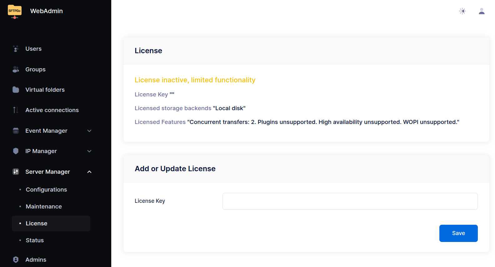

# Installation

SFTPGo is compatible with Linux, Windows, macOS, and FreeBSD. Other BSD variants are likely to work as well, and the software can run on a wide range of systems—from small embedded devices to large-scale Kubernetes clusters.

The **Enterprise edition** is officially distributed and supported for Linux and Windows platforms, and is also available as a Docker image or through a Helm chart.

A fully managed [SaaS offering](https://sftpgo.com/saas){:target="_blank"} is also available for organizations that prefer not to manage their own infrastructure.

:warning: **Note:** Only the installation methods explicitly documented here provide access to **SFTPGo Enterprise**.
Community distributions, including unofficial Docker images and pre-packaged solutions from third-party platforms, even if offered as paid services, provide the open-source edition of SFTPGo.
These versions **do not include Enterprise features** and are **not supported** by the SFTPGo team.

## Requirements

The only (optional) requirement is a suitable SQL server to use as data provider:

- upstream supported versions of PostgreSQL, MySQL and MariaDB.
- CockroachDB stable.

You can remove this requirement by using an embedded SQLite, bolt or in memory data provider.

## Commercial Marketplaces

SFTPGo Enterprise is available on the main cloud marketplaces as pre-configured instances. The instances ship with default settings that can be adjusted to match your requirements.

Marketplace offerings are available in plans that correspond to our Starter and Premium [on-premises](https://sftpgo.com/on-premises){:target="_blank"} tiers. For advanced requirements, a private offer can be arranged to provide the full capabilities of the Ultimate tier.

**Pricing and licensing.** All marketplace listings — both Enterprise and open-source-based — are billed entirely through the cloud provider; there is no separate fee from SFTPGo on top of the marketplace charge. The **Enterprise** listings include an activated SFTPGo Enterprise license: nothing else to purchase or activate. The **open-source-based** listings ship the SFTPGo Open Source edition (AGPLv3) and do not enable Enterprise features — to access those, switch to one of the Enterprise listings.

### AWS

SFTPGo Enterprise offerings on AWS Marketplace:

- [SFTPGo Enterprise - Starter](https://aws.amazon.com/marketplace/pp/prodview-6pasgeptfjjf6){:target="_blank"}
- [SFTPGo Enterprise - Premium](https://aws.amazon.com/marketplace/pp/prodview-ocwppyuudgbz2){:target="_blank"}
- [SFTPGo Enterprise - Starter (arm64)](https://aws.amazon.com/marketplace/pp/prodview-ukjjbuggrxrlw){:target="_blank"}
- [SFTPGo Enterprise - Premium (arm64)](https://aws.amazon.com/marketplace/pp/prodview-6fcfsxgzfx3yu){:target="_blank"}
- [SFTPGo Enterprise - Container](https://aws.amazon.com/marketplace/pp/prodview-y2aqp5bjdjdvu){:target="_blank"}

We also offer open-source-based marketplace listings that remain fully supported. We recommend migrating to the Enterprise edition for improved performance and additional features. You can view all supported offerings using the links below.

[All AWS offerings](https://aws.amazon.com/marketplace/seller-profile?id=6e849ab8-70a6-47de-9a43-13c3fa849335){:target="_blank"}

### Azure

SFTPGo Enterprise offerings on Azure Marketplace:

- [SFTPGo Enterprise for Linux](https://marketplace.microsoft.com/product/virtual-machines/eliamarzia1667381463185.sftpgo_enterprise_linux){:target="_blank"}
- [SFTPGo Enterprise for Windows](https://marketplace.microsoft.com/product/virtual-machines/eliamarzia1667381463185.sftpgo_enterprise_windows){:target="_blank"}
- [SFTPGo Enterprise for AKS](https://marketplace.microsoft.com/product/container/eliamarzia1667381463185.sftpgo_enterprise_aks){:target="_blank"}

Open-source-based listings are also available:

- [SFTPGo Open Source for Linux](https://marketplace.microsoft.com/product/virtual-machines/eliamarzia1667381463185.sftpgo_linux){:target="_blank"}
- [SFTPGo Open Source for Windows](https://marketplace.microsoft.com/product/virtual-machines/eliamarzia1667381463185.sftpgo_windows){:target="_blank"}
- [SFTPGo Open Source for AKS](https://marketplace.microsoft.com/product/containers/eliamarzia1667381463185.sftpgo_aks){:target="_blank"}

### Google Cloud

SFTPGo Enterprise offerings on Google Cloud Marketplace:

- [SFTPGo Enterprise - Starter](https://console.cloud.google.com/marketplace/product/sunlit-theory-450708-g7/sftpgo-enterprise-starter){:target="_blank"}
- [SFTPGo Enterprise - Premium](https://console.cloud.google.com/marketplace/product/sunlit-theory-450708-g7/sftpgo-enterprise-premium){:target="_blank"}

[All Google Cloud offerings](https://console.cloud.google.com/marketplace/browse?filter=partner:SFTPGo%20Authors){:target="_blank"}

### What is preconfigured on marketplace offerings

Marketplace instances are ready to use. They ship with:

- **License key already activated.** The license is tied to your marketplace subscription — no separate activation step is required.
- **Audit logs plugin enabled by default**, on both the Starter and the Premium tiers. The audit plugin records every administrative and user action; events are browsable from the WebAdmin under **Maintenance => Audit Logs** and queryable via the REST API.
- **In-memory transfer pipes enabled** (`SFTPGO_HOOK__MEMORY_PIPES__ENABLED=1`). This lets cloud-backend users (S3, GCS, Azure Blob) upload without needing a writable local scratch area, which matters on minimal VM images and container runtimes.
- **Data provider preconfigured** for standalone use. The storage layer and the plugin event databases are supported and initialized on first boot — you do not need to stand up a separate database service. If you require high availability, point the data provider at a managed or clustered database of your choice.

**Operating system.** AWS AMIs (both x86_64 and arm64) are based on **Amazon Linux 2023** (RHEL-based; package manager `dnf`). Azure and Google Cloud Linux VM images are based on **Debian 13** (`apt`-based).

**Plugin slots by tier.** The Starter tier is limited to **2 active plugins** in total. The audit logs feature is implemented as two plugins (`eventstore` + `eventsearcher`) wired together — both must be loaded for it to work — so on Starter the audit-logs feature already fills both slots, and there is no spare slot for an additional plugin without disabling audit logs. Adding more plugins on Starter requires either upgrading to Premium (unlimited plugins) or disabling the audit plugins to free their slots. Premium and higher tiers have no plugin limit.

**Making changes.** All marketplace defaults are standard SFTPGo settings and can be overridden with the usual mechanisms — WebAdmin configuration pages, environment variables (see [Environment variables](env-vars.md)), or drop-in env files under the config directory.

### Updating marketplace instances

Marketplace VM offerings stay current through the distribution's standard package manager — both the operating system and SFTPGo are updated through that channel. No bespoke update procedure is required.

**Amazon Linux (AWS AMIs):**

```shell
sudo dnf update
```

**Debian (Azure / Google Cloud VMs):**

```shell
sudo apt update && sudo apt upgrade
```

The SFTPGo service is restarted automatically by the package's post-install scriptlet when the `sftpgo` package is upgraded.

To verify that the SFTPGo OS package matches the latest available:

```shell
sudo dnf check-update sftpgo                # AWS
apt list --upgradable 2>/dev/null | grep sftpgo   # Azure / GCP
```

Marketplace offerings hide the SFTPGo version in the WebAdmin by default. To check it, use `sftpgo --version` from the CLI, or read the `starting SFTPGo v2.7.x ...` line written to the log at service startup (`journalctl -u sftpgo` or the configured log file).

For container-based marketplace listings the update procedure depends on the offering: the AWS Container listing distributes its images through the AWS marketplace registry and is updated by deploying the new image version published by the listing; the Azure AKS listing is a CNAB bundle and is upgraded through its CNAB mechanism. Follow the procedure documented on the relevant marketplace listing page.

## Linux, Windows, Docker

SFTPGo Enterprise can be installed on Linux, Windows, and in containerized environments using Docker.

- APT and YUM repositories are available for Debian-based and RHEL-based distributions.
- Windows installers are provided for direct setup on Windows systems.
- A Docker registry is available.

A license key is required to enable advanced features and to access our Docker repository.
Licenses can be purchased or a free trial activated directly from our [website](https://sftpgo.com/on-premises){:target="_blank"}.

Without a valid license, the application runs in **limited mode** with the following restrictions:

- Concurrent transfers capped at 2.
- Storage limited to the local filesystem.
- Plugins disabled.

### APT repo

Supported distributions:

- Debian 11 "bullseye"
- Debian 12 "bookworm"
- Debian 13 "trixie"
- Ubuntu 20.04 "focal"
- Ubuntu 22.04 "jammy"
- Ubuntu 24.04 "noble"
- Ubuntu 26.04 "resolute"

Import the public key used by the package management system:

```shell
curl -sS https://download.sftpgo.com/apt/gpg.key | sudo gpg --dearmor -o /usr/share/keyrings/sftpgo-archive-keyring.gpg
```

If you receive an error indicating that `gnupg` is not installed, you can install it using the following command:

```shell
sudo apt install gnupg
```

Create the SFTPGo source list file:

```shell
CODENAME=`lsb_release -c -s`
echo "deb [signed-by=/usr/share/keyrings/sftpgo-archive-keyring.gpg] https://download.sftpgo.com/apt ${CODENAME} main" | sudo tee /etc/apt/sources.list.d/sftpgo.list
```

Reload the package database and install SFTPGo:

```shell
sudo apt update
sudo apt install sftpgo
```

For a [FIPS 140-3](fips.md) build, install the `sftpgo-fips` package instead, and `sftpgo-plugins-fips` for the bundled plugins:

```shell
sudo apt install sftpgo-fips sftpgo-plugins-fips
```

### Yum repo

The YUM repository can be used on generic Red Hat based distributions as well as on SUSE/openSUSE.

#### Red Hat based distributions

Create the SFTPGo repository:

```shell
ARCH=`uname -m`
curl -sS https://download.sftpgo.com/yum/${ARCH}/sftpgo.repo | sudo tee /etc/yum.repos.d/sftpgo.repo
```

Reload the package database and install SFTPGo:

```shell
sudo yum update
sudo yum install sftpgo
```

For a [FIPS 140-3](fips.md) build, install `sftpgo-fips` (and `sftpgo-plugins-fips` for the bundled plugins) instead of `sftpgo`.

Start the SFTPGo service and enable it to start at system boot:

```shell
sudo systemctl start sftpgo
sudo systemctl enable sftpgo
```

#### Suse/OpenSUSE

Import the public key used by the package management system:

```shell
sudo rpm --import https://download.sftpgo.com/yum/gpg.key
```

Add the SFTPGo repository:

```shell
ARCH=`uname -m`
sudo zypper addrepo -f "https://download.sftpgo.com/yum/${ARCH}" sftpgo
```

Reload the package database and install SFTPGo:

```shell
sudo zypper refresh
sudo zypper install sftpgo
```

Start the SFTPGo service and enable it to start at system boot:

```shell
sudo systemctl start sftpgo
sudo systemctl enable sftpgo
```

### Windows

You can download the latest Windows installer using [this link](https://download.sftpgo.com/windows/sftpgo_windows_x86_64.exe){:target="_blank"}. The installer includes the plugins and will automatically register SFTPGo as a Windows service, starting it immediately after installation. Alternatively, SFTPGo can also be installed using **winget** with the following command: `winget install -e --id drakkan.SFTPGoEnterprise`.

For a [FIPS 140-3](fips.md) build, download the [FIPS installer](https://download.sftpgo.com/windows/sftpgo_windows_fips_x86_64.exe){:target="_blank"} instead.

By default, the service runs under the Local System account. However, you can configure it to run under a different user account either through the built-in Windows Services UI or via the command line, as shown below:

```shell
C:\Program Files\SFTPGo>sftpgo.exe service uninstall
C:\Program Files\SFTPGo>sftpgo.exe service install -c "C:\ProgramData\SFTPGo Enterprise" -l "logs\sftpgo.log" --service-user "DOMAIN\username" --service-password password
```

A dedicated account needs modify access to the data directory, `C:\ProgramData\SFTPGo Enterprise` by default, which holds the configuration, the SQLite database, the logs, the backups and the certificates, in addition to access to the configured home directories. Grant it with inheritance so that files created by future updates are covered too:

```shell
icacls "C:\ProgramData\SFTPGo Enterprise" /grant "DOMAIN\username:(OI)(CI)M"
```

The installer registers SFTPGo as a Windows service only during the initial installation. Future updates will not modify the existing service configuration or the permissions set on the data directory.

To install on systems without a GUI (e.g., Windows Server Core), run the installer with the following flag:

```shell
sftpgo_windows_x86_64.exe /VERYSILENT
```

No progress or confirmation will be shown during installation. To confirm it completed successfully, check that the Windows service was registered:

```shell
Get-Service -Name "sftpgo"
```

The installer is built with Inno Setup. For a full list of supported command-line options, see the [official documentation](https://jrsoftware.org/ishelp/index.php?topic=setupcmdline){:target="_blank"}.

### Docker

For setup instructions, image details, and access to our Docker registry, please refer to the dedicated [Docker page](docker.md).

### Service account

Run the service with the least privileges it needs: access to the configured home directories and to its own data, and nothing else.

The Linux packages register SFTPGo as a systemd service running under the dedicated, unprivileged `sftpgo` account, which owns the packaged data directories; on Windows the service runs as `LOCAL SYSTEM` unless a different identity is set, as described [above](#windows).

Running SFTPGo under a privileged account is supported and a few deployments need it, for example to set per-user ownership on uploaded files on Unix-like systems. File operations, hooks, command actions and plugins then run with the privileges of that account.

:warning: SFTPGo is a single process and does not switch to an operating system user per connection: the permissions granted to the SFTPGo user are the boundary between clients, and the operating system enforces no boundary of its own. A privileged service account widens what the service can reach and leaves that boundary as the only one, so provision the home directories and the paths leading to them as described in [Local filesystem](localfs.md#symbolic-links).

The `chmod` and `chown` permissions, both part of the default `*` set, need attention in this setup. On Unix-like systems a client holding them can set any mode, `setuid` included, and any owner on the files of its own tree: where those clients can also execute files, this amounts to acting as the service account. Under an unprivileged account the chown fails and a setuid bit confers no more than that account. On Windows the mode maps to the read-only attribute and ownership is left untouched.

Where a privileged account is required, apply one of these mitigations:

- remove `chmod` and `chown` from the permissions of the users: the requests are refused
- set `setstat_mode` to `1` in the `common` section of the configuration: requests to change mode, owner and times are accepted and ignored, which suits clients that send them on every upload
- on Unix-like systems, mount the filesystem that holds the home directories with `nosuid`: a setuid bit on a file grants nothing when the file is executed, however the bit was set

SFTPGo logs a warning at startup when it runs as root.

### Adding a license key

You can view your license status and add a new license key from the WebAdmin UI by navigating to Server Manager => License.

{data-gallery="license"}

For unattended or CLI-based setups, the license key can also be activated by setting the `SFTPGO_LICENSE_KEY` environment variable.

```shell
SFTPGO_LICENSE_KEY=XXXX-XXXX-XXXX-XXXX
```
