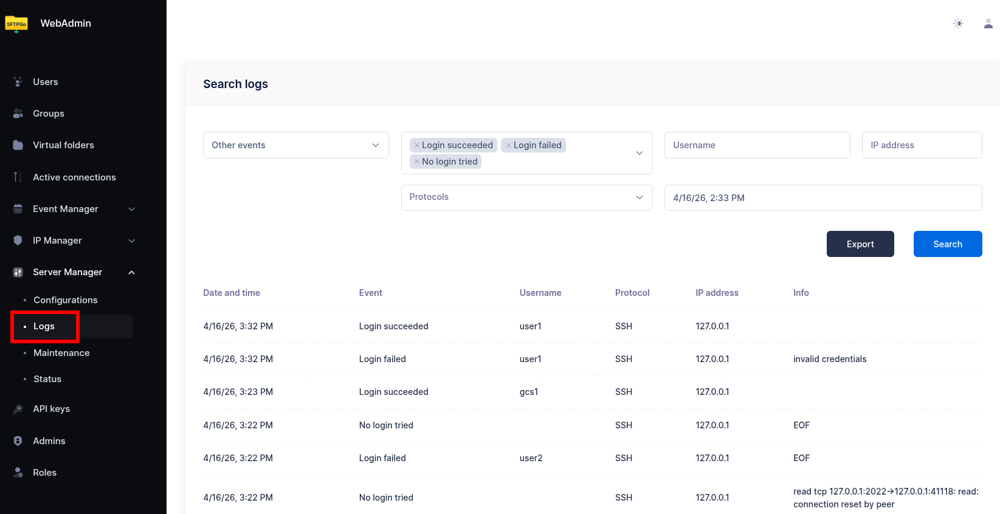
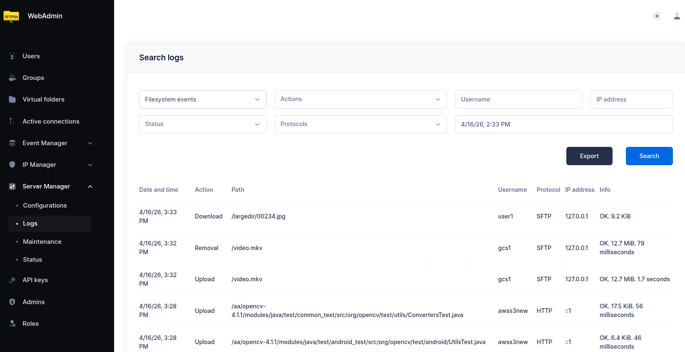
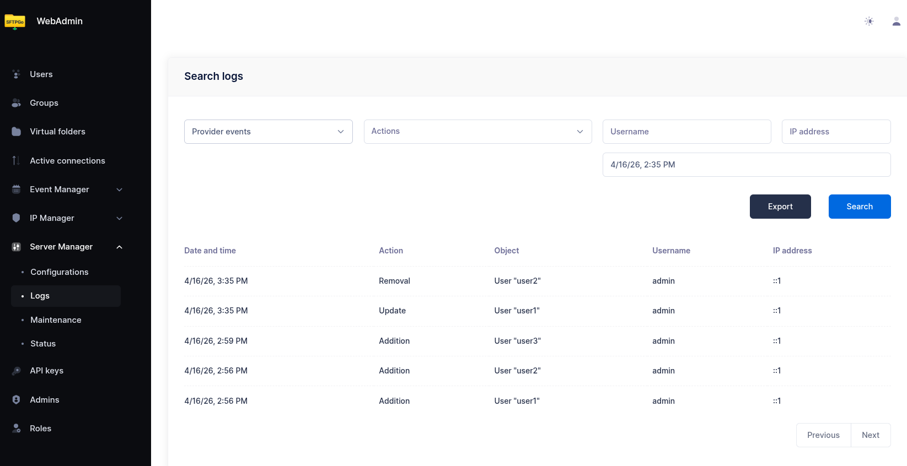

# Audit Logs

By default, SFTPGo writes logs to the systemd journal or to a file, depending on your configuration.

For persistent, searchable audit logs, you can store events in a database by installing two plugins:

- **EventStore** — captures and stores filesystem, provider, and log events.
- **EventSearch** — enables searching and exporting stored events from the WebAdmin UI.

Both plugins connect to the same database. EventStore writes events; EventSearch reads them.

## Supported databases

- PostgreSQL
- MySQL / MariaDB
- SQLite

PostgreSQL and MySQL are recommended for distributed or high-volume deployments. SQLite is suitable for single-instance setups.

## Installation

- **Linux**: install the `sftpgo-plugins` package from the [official repository](../installation.md#linux-windows-docker). Plugins are installed in `/usr/bin`.
- **Windows**: plugins are included in the [SFTPGo installer](../installation.md#windows).
- **Docker**: use an image tag that includes plugins. Plugins are located in `/usr/local/bin`. See [Docker installation](../installation.md#docker).

## Configuration

:warning: Any configuration change described below requires a service restart to take effect (e.g. `systemctl restart sftpgo`).

### Step 1: Create the database

Create a dedicated database for audit logs. This must be separate from SFTPGo's main data provider database.

**PostgreSQL example:**

```sql
CREATE DATABASE sftpgo_events;
```

**MySQL example:**

```sql
CREATE DATABASE sftpgo_events CHARACTER SET utf8mb4 COLLATE utf8mb4_unicode_ci;
```

For SQLite, no database needs to be created in advance; the plugin creates the file automatically.

The EventStore plugin automatically creates the required tables on first start.

### Step 2: Configure the plugins

Configuration is done through environment variables. Set the database connection string for both plugins using the appropriate DSN format for your database.

#### PostgreSQL

```shell
SFTPGO_PLUGIN_EVENTSTORE_DSN="host='192.168.1.5' port=5432 dbname='sftpgo_events' user='sftpgo' password='your_password' connect_timeout=10"
SFTPGO_PLUGIN_EVENTSEARCH_DSN="host='192.168.1.5' port=5432 dbname='sftpgo_events' user='sftpgo' password='your_password' connect_timeout=10"
```

#### MySQL

```shell
SFTPGO_PLUGIN_EVENTSTORE_DSN="sftpgo:your_password@tcp(192.168.1.5:3306)/sftpgo_events?charset=utf8mb4&interpolateParams=true&timeout=10s&writeTimeout=10s&readTimeout=10s"
SFTPGO_PLUGIN_EVENTSEARCH_DSN="sftpgo:your_password@tcp(192.168.1.5:3306)/sftpgo_events?charset=utf8mb4&interpolateParams=true&timeout=10s&writeTimeout=10s&readTimeout=10s"
```

#### SQLite

**Linux:**

```shell
SFTPGO_PLUGIN_EVENTSTORE_DSN="/var/lib/sftpgo/sftpgo_events.db"
SFTPGO_PLUGIN_EVENTSEARCH_DSN="/var/lib/sftpgo/sftpgo_events.db"
```

**Windows:**

```shell
SFTPGO_PLUGIN_EVENTSTORE_DSN="C:\\ProgramData\\SFTPGo Enterprise\\sftpgo_events.db"
SFTPGO_PLUGIN_EVENTSEARCH_DSN="C:\\ProgramData\\SFTPGo Enterprise\\sftpgo_events.db"
```

### Step 3: Configure SFTPGo to load the plugins

The following environment variables register both plugins with SFTPGo and define which events to capture. The audit log setup uses plugin indices `0` and `1`. If you configure additional plugins (e.g., KMS, GeoIP), they must use index `2` or higher. See [Plugin indexing](../plugins.md#plugin-indexing) for details.

```shell
# EventStore plugin (notifier)
SFTPGO_PLUGINS__0__TYPE=notifier
SFTPGO_PLUGINS__0__NOTIFIER_OPTIONS__FS_EVENTS="download,upload,delete,rename,mkdir,rmdir,ssh_cmd,copy"
SFTPGO_PLUGINS__0__NOTIFIER_OPTIONS__PROVIDER_EVENTS="add,update,delete"
SFTPGO_PLUGINS__0__NOTIFIER_OPTIONS__PROVIDER_OBJECTS="user,folder,group,admin,api_key,share,event_action,event_rule,role,ip_list_entry,configs"
SFTPGO_PLUGINS__0__NOTIFIER_OPTIONS__LOG_EVENTS="1,2,3,4,5,6"
SFTPGO_PLUGINS__0__NOTIFIER_OPTIONS__RETRY_MAX_TIME=300
SFTPGO_PLUGINS__0__NOTIFIER_OPTIONS__RETRY_QUEUE_MAX_SIZE=10000
SFTPGO_PLUGINS__0__CMD="/usr/bin/sftpgo-plugin-eventstore"
SFTPGO_PLUGINS__0__ARGS="serve,--driver,postgres"
SFTPGO_PLUGINS__0__AUTO_MTLS=1

# EventSearch plugin (eventsearcher)
SFTPGO_PLUGINS__1__TYPE=eventsearcher
SFTPGO_PLUGINS__1__CMD="/usr/bin/sftpgo-plugin-eventsearch"
SFTPGO_PLUGINS__1__ARGS="serve,--driver,postgres"
SFTPGO_PLUGINS__1__AUTO_MTLS=1
```

Replace `postgres` with `mysql` or `sqlite` to match your database. For Docker images, change the plugin paths to `/usr/local/bin/sftpgo-plugin-eventstore` and `/usr/local/bin/sftpgo-plugin-eventsearch`. On Windows, use the full path to the plugin executables (e.g., `C:\Program Files\SFTPGo Enterprise\sftpgo-plugin-eventstore.exe`).

:warning: **Docker Compose:** Do not wrap environment variable values in double quotes in your `docker-compose.yml` file. Docker Compose treats quotes as part of the actual value, which results in invalid connection strings.

### Step 4: Restart and verify

Restart the SFTPGo service:

```shell
sudo systemctl restart sftpgo
```

On Windows, restart the SFTPGo service from the Services management console or by running `Restart-Service "SFTPGo"` in PowerShell.

Once running, a new **Logs** menu item appears in the WebAdmin sidebar under the **Server Manager** section.

{data-gallery="audit-logs"}

## Using the audit logs

The Logs page in WebAdmin provides three tabs for searching different event categories:

- **Filesystem Logs** — file transfers (uploads, downloads), directory operations (create, delete, rename), SSH commands, and file copies. Each entry shows the timestamp, username, action, file path, protocol, client IP, and transfer status.
- **Provider Logs** — administrative changes to SFTPGo objects (users, groups, admins, event rules, etc.). Each entry shows who made the change, what was changed, and when. You can expand an entry to view the full object data.
- **Log Events** — authentication and connection failures. Useful for identifying brute-force attempts or misconfigured clients.

{data-gallery="audit-logs"}

Each tab provides filters to narrow results by time range, username, IP address, action type, and other criteria. Results can be exported for external analysis.

{data-gallery="audit-logs"}

## Event types

### Filesystem events

Captured via `NOTIFIER_OPTIONS__FS_EVENTS`. Available events:

| Event | Description |
| ----- | ----------- |
| `download` | File downloaded |
| `upload` | File uploaded |
| `delete` | File or directory deleted |
| `rename` | File or directory renamed |
| `mkdir` | Directory created |
| `rmdir` | Directory removed |
| `ssh_cmd` | SSH command executed (SCP, rsync, etc.) |
| `copy` | File copied |

### Provider events

Captured via `NOTIFIER_OPTIONS__PROVIDER_EVENTS` and `NOTIFIER_OPTIONS__PROVIDER_OBJECTS`. Provider events track administrative changes to SFTPGo configuration objects.

**Actions:** `add`, `update`, `delete`

**Object types:** `user`, `folder`, `group`, `admin`, `api_key`, `share`, `event_action`, `event_rule`, `role`, `ip_list_entry`, `configs`

### Log events

Captured via `NOTIFIER_OPTIONS__LOG_EVENTS`. These track authentication and connection failures:

| ID | Event |
| -- | ----- |
| 1 | Login failed |
| 2 | Login with non-existent user |
| 3 | No login attempted |
| 4 | Algorithm negotiation failed |
| 5 | Login succeeded |
| 6 | Legal agreement accepted |

## Additional configuration

### Event retention

To automatically delete old events, set the retention period in hours:

```shell
SFTPGO_PLUGIN_EVENTSTORE_RETENTION=720
```

This example deletes events older than 30 days. Set to `0` (default) to keep events indefinitely.

### Connection pool

For high-traffic deployments, you can configure the maximum number of database connections:

```shell
SFTPGO_PLUGIN_EVENTSTORE_POOL_SIZE=20
SFTPGO_PLUGIN_EVENTSEARCH_POOL_SIZE=10
```

Default is `0` (unlimited). SQLite always uses a single connection regardless of this setting.

### Instance ID

In multi-instance deployments, set an instance identifier to distinguish events from different SFTPGo nodes:

```shell
SFTPGO_PLUGIN_EVENTSTORE_INSTANCE_ID="node-1"
```

### MySQL TLS

For MySQL connections with custom TLS certificates, use the `--custom-tls` flag with URL-encoded parameters:

```shell
SFTPGO_PLUGINS__0__ARGS="serve,--driver,mysql,--custom-tls,root_cert%3D%2Fpath%2Fto%2Fca.pem%26tls_mode%3D1"
```

Parameters: `root_cert`, `client_cert`, `client_key`, `tls_mode` (set `tls_mode=1` to skip certificate verification).

### Database schema management

The EventStore plugin provides subcommands for managing the database schema:

```shell
# Apply pending migrations
sftpgo-plugin-eventstore migrate --driver postgres

# Reset the database schema (destructive!)
sftpgo-plugin-eventstore reset --driver postgres
```

The `DSN` environment variable must be set when running these commands.
