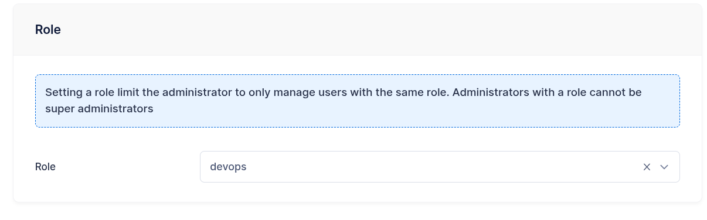
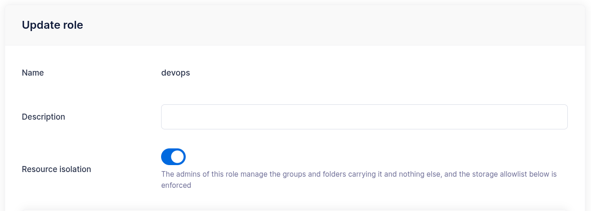
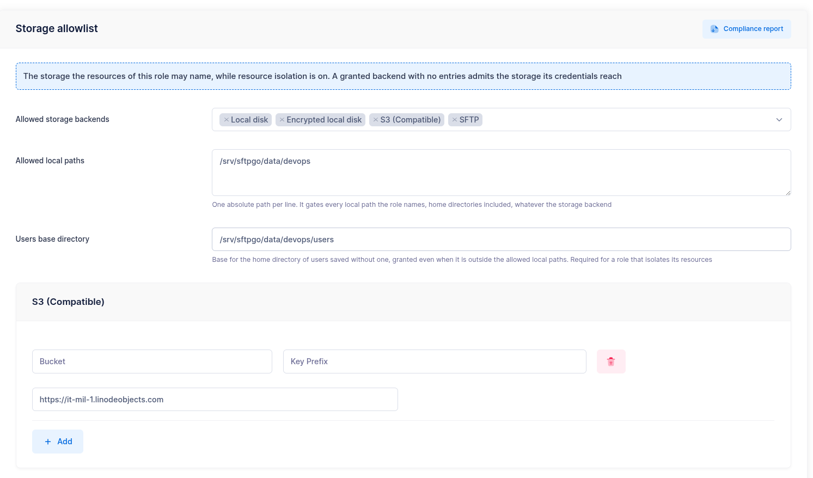
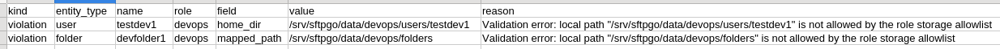

# Roles

Roles enable delegated administration: an administrator with a role manages the users that carry the same role. With [resource isolation](#resource-isolation) the same boundary extends to groups, virtual folders and the storage they may name, so a role describes a tenant.

Roles decide _which resources_ an administrator can see and manage; [admin permissions](admin-permissions.md) decide _which features_ that administrator can use. The two settings compose freely.

## How roles work

A **role** is a named label. It is assigned to users and administrators and, with resource isolation, to groups and virtual folders. An administrator carrying a role is a **role administrator** on this page: it views and manages the users with the same role, and the users it creates receive its role automatically.

{data-gallery="role-admin"}

| | Global administrator | Role administrator |
| -- | --------------------- | -------------------------- |
| **Role assigned** | None | One role |
| **Users** | All users, with or without a role | The users carrying the same role; the users it creates or updates receive its role |
| **Groups and virtual folders** | All of them | All of them, or the ones carrying its role once the role [isolates its resources](#resource-isolation) |
| **Connections, event search** | All | Filtered to its role |
| **Wildcard `*` permission** | Allowed | Refused: the save fails with a validation error |

## Permission model

Every permission of the [admin permissions](admin-permissions.md) reference except `*` can be granted to a role administrator. The role scopes what each permission reaches:

| Permission | Scope for a role administrator |
| ---------- | ------------------------------------ |
| `add_users`, `edit_users`, `del_users`, `view_users` | The users carrying the role. The role of a user is set to the administrator's role on create and on update. |
| `quota_scans`, `disable_mfa` | The users carrying the role. |
| `view_conns`, `close_conns` | The connections of the users carrying the role. |
| `view_events` | Filesystem, provider and log events of the role. |
| `view_groups`, `manage_groups`, `del_groups`, `view_folders`, `manage_folders`, `del_folders` | Every group and folder, or the ones carrying the role once it isolates its resources. |
| `view_status`, `view_defender`, `manage_defender` | Global: the server status and the defender blocklist, which is per IP address, are the same for every administrator. |

The features that require `*` (administrators, roles, Event Manager rules and actions, system configuration, IP lists, API keys, retention checks, backup and restore) are out of reach for a role administrator.

## Resource isolation

Without isolation a role administrator holding group and folder permissions attaches any group and any virtual folder to its users, including the ones another tenant defined. Resource isolation extends the role to the group and folder catalogs and to the storage the resources of the role may name.

It is enabled per role, with the **Resource isolation** switch of the role page or the `resource_isolation` field of the REST API, and it is **off by default**: a role behaves as before until it is turned on. It is available on MySQL, MariaDB, PostgreSQL, CockroachDB and SQLite; on the memory and bolt data providers the switch is refused with an error. The license sets how many roles can isolate their resources; the WebAdmin license page and `GET /api/v2/license` show the allowance, and roles with the switch off are not counted. When the allowance is exceeded, after a downgrade or while the license is inactive, the roles already isolating keep isolating, saving a role with isolation on is refused until the count is back inside the allowance, and turning isolation off is always accepted. The role page shows the switch and the storage allowlist while the license admits isolated roles, and on a role that already isolates its resources.

{data-gallery="role-resource-isolation"}

The groups and folders a role administrator creates receive its role, as its users already do, whether or not the role isolates: the resources a tenant creates follow it when its role starts isolating.

While a role isolates its resources:

- role administrators of that role see the groups and the folders carrying it and nothing else; global administrators see everything;
- a user references the groups and folders of its own role only, and a group references the folders of its own role; a save naming a resource of another role is refused as for a resource that does not exist;
- the [storage allowlist](#storage-allowlist) of the role is enforced every time a user, a group or a folder carrying the role is saved.

### Enabling isolation on an existing role

Enabling the switch validates the role alone and changes nothing in the stored users, groups and folders, so prepare them first:

1. Set the **Users base directory** of the role: it is required for isolation, and it is where the home directories of the role's users are generated, see [Home directories](#home-directories).
2. Declare the [storage allowlist](#storage-allowlist): the backends the role may use and, within each, the resources.
3. Assign the role to the groups and the folders the tenant owns, see [Assigning the role to groups and folders](#assigning-the-role-to-groups-and-folders). A group or a folder left without a role disappears from the role administrators' console as soon as the switch is on, and a user referencing it can no longer log in, see [Accounts referencing another role](#accounts-referencing-another-role).
4. Read the [storage compliance report](#storage-compliance-report): it lists the stored configurations the allowlist rejects and the accounts the switch will lock out, before either has any effect.
5. Turn the switch on.

### Assigning the role to groups and folders

A global administrator sets the role of a group or a folder with the **Role** selector of the WebAdmin group and folder pages, with the `role` field of the group and folder objects in the REST API, or through a `loaddata` import. A role administrator never sets it: the groups and folders it creates take its role, the ones it updates keep the stored one. For a global administrator an update replaces the stored role with the one in the request, so a `PUT` that omits `role` clears it: send the complete object.

A global administrator changes or clears the role of a group or a folder while no user, administrator or group of a different role references it; otherwise the save is refused, since those references would stop resolving. A role is removed once nothing references it, its own users, administrators, groups and folders included.

Usernames, group names and folder names are unique across the installation: SFTP, FTP and WebDAV authenticate with the username alone, so two roles cannot share one. A role administrator choosing a name another role already uses receives the usual duplicate error, which says that the name is taken and nothing more.

### What isolating one role does not do

Isolating role A constrains the administrators of A and hides the resources of A from the administrators of the other isolated roles. Global administrators, administrators without a role and administrators of a role that does not isolate keep seeing and editing the groups and folders of A. Isolation is complete when every role that needs it has the switch on.

Event rules are not scoped by role: they are configured by global administrators and an action with a source or target folder mounts that folder on every account it runs for, whatever role each of them carries.

### Accounts referencing another role

At login the groups of an account, membership groups included, and its folders are compared with its role. The resources of an isolating role belong to the users of that role; groups and folders carrying no role, or a role that does not isolate, form one shared set that users without a role and users of non-isolating roles reference freely. An account that references a resource of another set cannot log in, on every protocol, and a role administrator whose administrator groups carry another role cannot log in either. The client receives the usual login refusal, the server log names the reference, and the failure does not count as an authentication failure for the [defender](defender.md). A group holding a folder of another role locks out every member: the members themselves are saved as usual, the group is what needs the repair.

The state comes from data that predates the switch, since the API refuses to create such references, or from a hook response, see below. Global administrators are not affected and repair the data; turning the switch off restores every login. Saving such an account, or a group holding a folder of another role, is reserved to global administrators: a role administrator receives a message that names them, and the account keeps listing the reference, name included, until it is repaired. The users list shows the account with the settings merged from that group, while the effective configuration and the test connection of the account report the error, as the login does.

### Externally provisioned accounts

The pre-login hook, the external authentication hook and the authentication plugins decide the role of the accounts they return, as they do for every other field: the LDAP plugin maps it from `role_group_prefix`. A hook is trusted and can place an account in any role; the groups and folders it names must carry that role, or the save of the returned account fails and the login with it, as for a missing resource. See [the returned user](dynamic-user-mod.md#the-returned-user) for what a response replaces and for the virtual folders created with it.

### Turning isolation off

Turning the switch off ends the scoping: the groups and folders keep the role label they carry, every administrator sees them again, the allowlist is no longer enforced on save, and the accounts refused for a cross-role reference log in again. Turning it back on requires the same preparation as the first time.

## Storage allowlist

The allowlist declares the storage the users, groups and folders of an isolating role may name. It is edited on the role page, one section per backend, and stored in the `settings.storage_allowlist` field of the role object.

{data-gallery="role-storage-allowlist"}

The allowlist is read in two steps:

1. **Allowed storage backends** lists the backends the resources may use. A backend that is not listed is refused, the local disk included. A user or a group with storage ["None"](groups.md#users-with-storage-none) takes its storage from the primary group and needs no backend.
2. Within a listed backend, the section of that backend lists the resources: a section with no entries admits every resource the configured credentials reach, a section with entries admits the configurations matching one of them.

A new role grants nothing: list the backends the tenant needs before its resources are saved with isolation on, the storage of a primary group included.

### When the allowlist takes effect

The allowlist is enforced when a user, a group or a folder carrying the role is **saved**, not while a session runs. Narrowing it applies to the next save of each resource: the stored configurations keep serving and the accounts using them keep working until they are saved again, so an edit to the allowlist locks no account out; turning the switch on does, for the accounts the [compliance report](#storage-compliance-report) lists as references. The [compliance report](#storage-compliance-report) lists the stored configurations a narrowed allowlist rejects, so they can be repaired before their next save.

### What each section grants

| Section | Entries | What matches |
| ----- | ------- | -------- |
| Local | Absolute paths | A named path equal to an entry or below it, compared on path separators: `/data/customer-a` does not admit `/data/customer-aaa`. The section applies whatever the storage backend, because the home directory of an account is a local path even when its files live on a cloud backend. With no entries, no named local path is admitted: the accounts of the role get the home directory generated from the users base directory. |
| S3 | Bucket, optional key prefix, endpoint | The bucket and the endpoint as written; an entry with no bucket grants every bucket of its endpoint. |
| Azure Blob | Account, container, optional key prefix, endpoint | The container of the account, whatever the letter case, the scheme and a trailing slash of the endpoint. A configuration carrying its account and container in a SAS URL matches too. |
| Google Cloud | Bucket, optional key prefix, universe domain | The bucket of the universe domain; an empty domain and `googleapis.com` are one service. |
| SFTP, FTP | Endpoints as `host:port`, and for SFTP the allowed SOCKS proxies | The endpoint as written; an entry with no port takes the default port of the backend, 22 or 21, as a configuration without a port does. The remote path is decided by the account on the remote server and is not part of the allowlist. |
| HTTP | Base URLs with a scheme and a host | The endpoints under the entry's path; an entry with no path matches every path of that host, the query string is compared as written. An entry may name a unix domain socket, `http://unix?socket_path=/run/api.sock`, in which case the socket and the `api_prefix` are the resource. |

Write the entries the way the users of the role write their configurations: names and endpoints are compared as written, so `https://s3-endpoint:443` and `https://s3-endpoint` are two entries. A key prefix is the exception, and it is what lets several roles share one bucket: the prefix of a configuration is admitted when it is equal to the prefix of an entry or below it, on a `/` boundary, so `tenant-a/` does not admit `tenant-ab/`.

When the SFTP section has at least one entry, endpoint or proxy, a configured SOCKS proxy must be among the allowed proxies: the proxy resolves the endpoint in its own network. The allowed proxies decide which proxy a configuration may use, not whether it uses one: a configuration without a proxy connects directly, to the allowed endpoints or, with none listed, to any host. To bound the hosts, list the endpoints.

A configuration whose local path or key prefix contains a [placeholder](groups.md#placeholders) is measured on the literal text before the first placeholder: `/data/%role%/%username%` is measured as `/data/`, so an entry for `/data` admits it. A value that opens with a placeholder is refused, and so is an entry containing one, since entries are literal text.

### Backends granted with no entries

A backend listed with no entries admits every resource the credentials configured on the user, the group or the folder reach:

- on S3, Azure Blob and Google Cloud this includes the identity of the server, an instance role, a managed identity or application default credentials: a configuration with no credentials of its own is admitted when it names no endpoint, so that identity speaks to the default host of its cloud;
- on SFTP, FTP and HTTP the credentials always belong to the configuration, so the entries bound the host the server connects to. With no entries a role administrator can name any host the server reaches: the server opens the connection and the test connection reports its outcome, on FTP the reply of the remote service included, which is a way to survey the network the server sits in.

List the endpoints the SFTP, FTP and HTTP sections may use, and on an installation whose process carries a storage identity list the entries of every granted backend.

### Home directories

The home directory of a user is a local path whatever its storage backend, so it is measured against the **Allowed local paths**, with one exception: the directory generated from the **Users base directory** of the role.

| `home_dir` in the request | Result |
| ------------------------- | --------------------------- |
| Empty | Generated as `<users_base_dir>/<username>`, accepted whatever the allowed paths. |
| `<users_base_dir>/<username>` | Accepted, whatever the allowed paths: it is the path the server would have generated. |
| Under an allowed path | Accepted. |
| Anywhere else, `<users_base_dir>/team/<username>` included | Refused. |

The users base directory of the role is required to enable isolation, and the global `users_base_dir` does not apply to its accounts. It is what keeps the accounts savable when the allowed local paths are empty: leave `home_dir` empty on the accounts of the role, cloud accounts included, and the server generates it.

Changing the users base directory applies to the accounts saved from that moment: the accounts already stored keep the home directory they have, which now sits outside the base and is measured against the allowed paths like any other named path. Add the old base to the allowed paths, or move the data and update the accounts; the [compliance report](#storage-compliance-report) lists the ones the new allowlist rejects. Clearing `home_dir` and saving generates it under the new base, which points the account at a new, empty directory and leaves the data where it was.

### Storage compliance report

The report lists the stored configurations that the allowlist of a role rejects, as `violation` rows with the entity, the field the value was read from and the rule that rejected it, and the accounts the isolation refuses at login, as `reference` rows with the account, the mapping and the group or folder of another role it names. It requires every permission, `*`, since its findings name administrators and resources of every role, and it is computed on demand with the **Compliance report** button of the role page, or through `GET /api/v2/roles/{name}/storage-compliance`, as JSON or as a CSV export. The JSON answer carries at most 1000 findings and says so with a `truncated` field; the CSV export streams all of them.

{data-gallery="role-storage-compliance"}

Violations and references are listed whatever the state of the switch, so run the report **before** enabling isolation to see what the allowlist would reject and which logins the switch would refuse: a violation leaves the account working until its next save, a reference refuses its login as soon as the role isolates. Once the role isolates, the report also carries **posture** findings, which describe how wide the isolation is rather than what is wrong with it:

- the backends granted with no entries;
- an allowed local path that is a filesystem root;
- the administrators whose permissions read the resources of every role: the ones carrying no role and the ones carrying a role that does not isolate. Administrators holding every permission are left out, so read it next to their list.

## Typical use case

Roles are useful when several teams or departments need independent user management:

1. Create a role for each team, for example `finance` and `engineering`, with its users base directory and its storage allowlist.
2. Create an administrator for each team lead and assign it the corresponding role.
3. Assign the role to the groups and the folders the team owns, read the storage compliance report, then enable resource isolation.
4. Each team lead creates and manages the users, groups and folders of its team, within the storage the allowlist declares, and cannot see or affect the other teams.

Global administrators retain full visibility and control across all roles.
