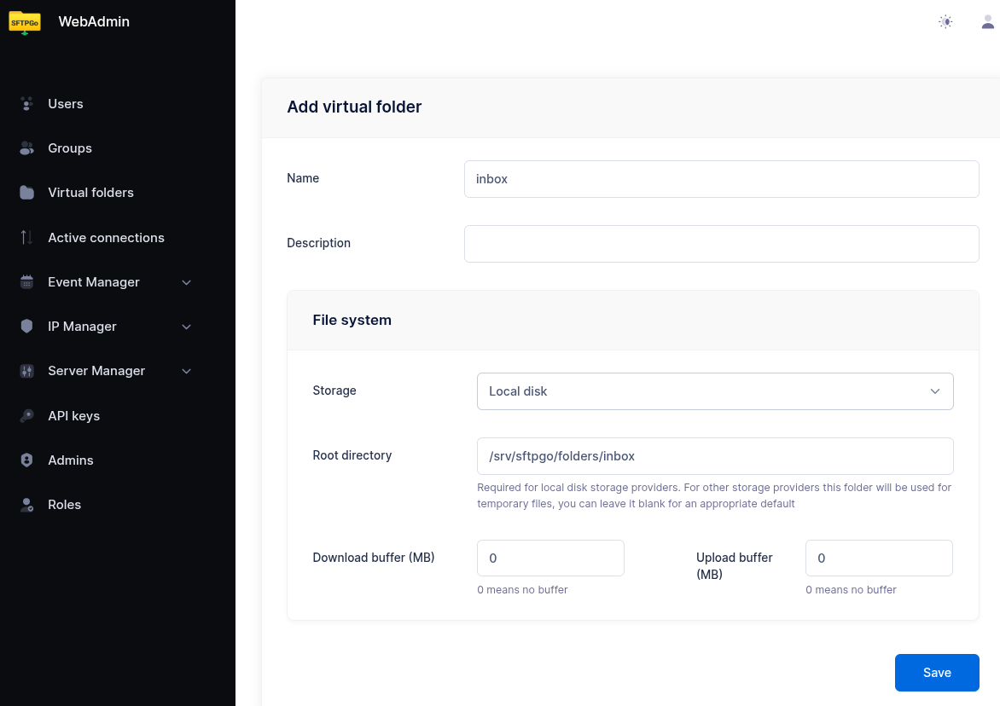
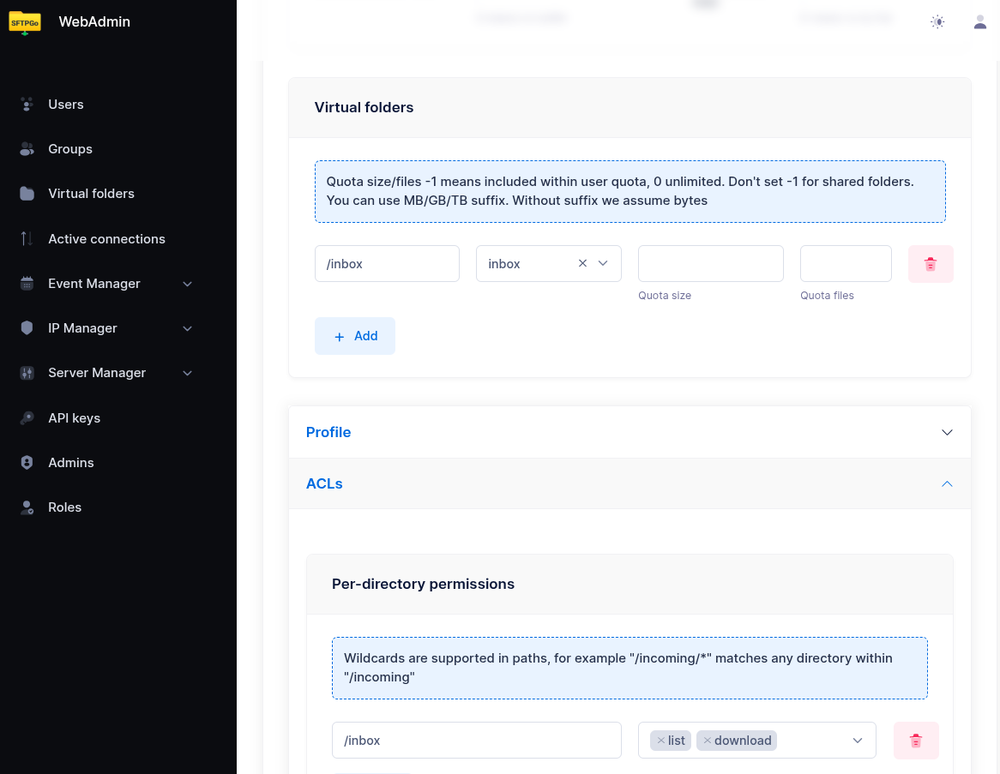
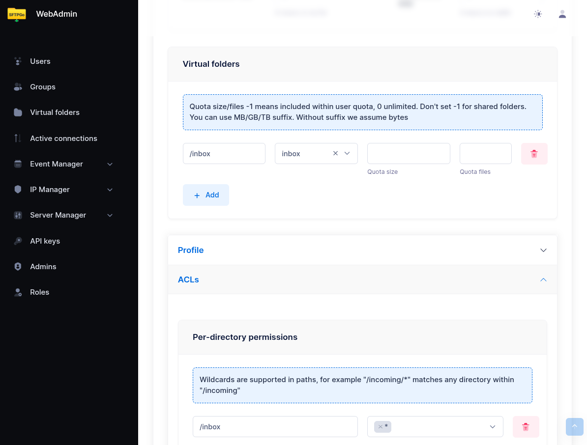
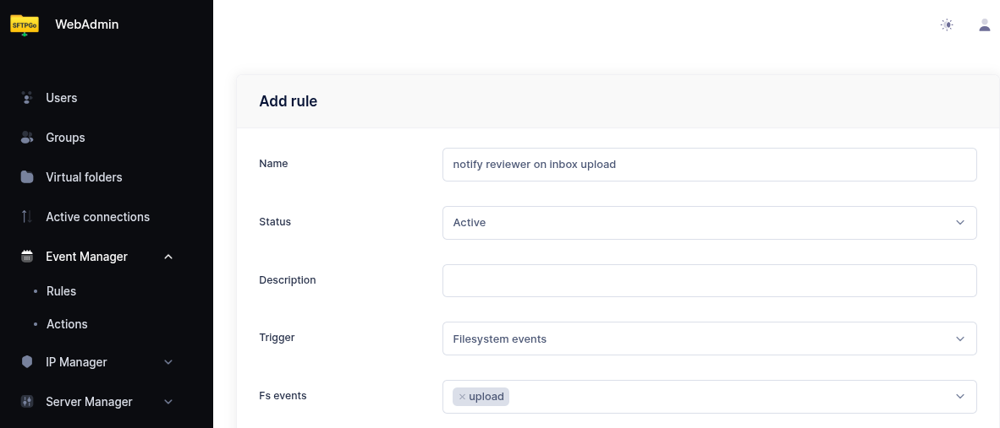
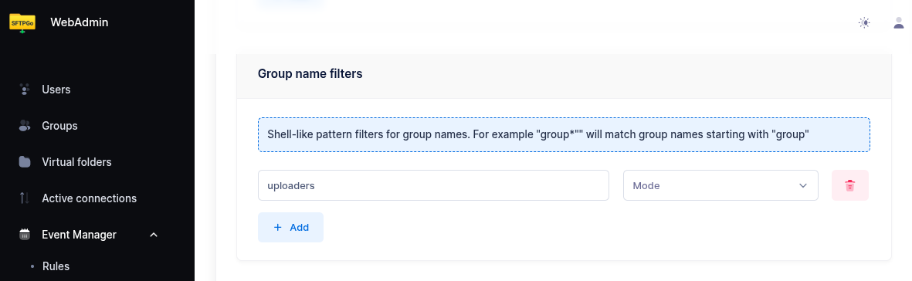
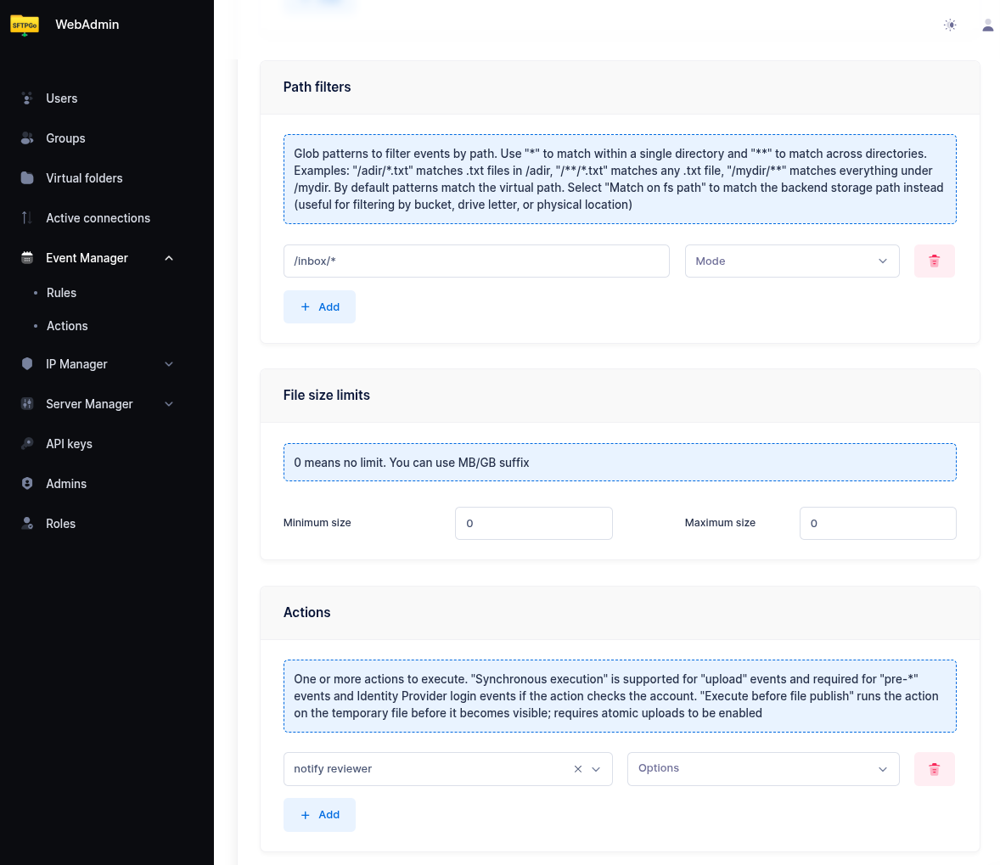

# Upload Approval Workflow

This tutorial shows how to build a review-and-publish workflow using built-in SFTPGo features. An uploader drops files into a dedicated drop folder; a reviewer is notified by email; the reviewer then publishes the approved file by creating a share, by moving it to a delivery folder mapped to a remote backend, or by handing it off to a partner SFTPGo account for pull.

The setup combines the following features:

- **Virtual folders** mounted on multiple groups so the right roles share the right storage: uploaders and reviewers see the same `/inbox`; under Option B, reviewers and partner accounts see the same `/delivery` (partners never see `/inbox`).
- **Per-folder permissions** to give uploaders write-only access and reviewers full access.
- **Share filters** (denied share paths or shares-disabled) to make sure only reviewers can publish content externally.
- **Event rules** to notify reviewers when a new file is dropped, and optionally to notify partners when a file is ready.

## How It Works

1. The uploader writes a file into a virtual folder (for example `/inbox`). They have permission to upload but not to download, delete, or share — once the file is uploaded, it is out of their reach.
2. An event rule fires on the upload and sends an email to the reviewer with the file path and uploader name.
3. The reviewer opens `/inbox` and reviews the file (download, preview, etc.). The WebClient is the most convenient interface, but any SFTP, FTP, or WebDAV client works equally well — the reviewer can pick the tool they prefer.
4. The reviewer publishes the file in one of three ways:
    - **Share**: creates a share for the file directly from the WebClient.
    - **Push to a remote backend**: moves the file to a delivery folder mapped to a remote SFTP, S3, Azure Blob, GCS, or FTP system.
    - **Pull by a partner account**: moves the file to a delivery folder also visible to a separate SFTPGo account, used by the partner system for pull via SFTP/FTP/WebDAV.

Once uploaded, the file is read-only from the uploader's perspective — they can see it in the directory listing but cannot download, overwrite, or delete it. The reviewer is the only person who decides whether and how the content leaves the system.

## Step 1: Create the Drop Folder

From the WebAdmin, expand **Virtual folders** and create a new folder named `inbox` backed by the storage of your choice (local, S3, Azure, GCS, SFTP — any backend works).

This folder will be mounted on both the uploader and reviewer groups so they share the same physical storage.

{data-gallery="approval-inbox-folder"}

## Step 2: Create the Uploader Group

Create a group named `uploaders`. In the **Virtual folders** section, mount the `inbox` folder at `/inbox` with quota and ratio set to your needs.

In the **Permissions** section, configure permissions per directory:

| Path | Permissions |
| ------ | ------------- |
| `/inbox` | `list, upload` |

The uploader can list `/inbox` (required for the WebClient to navigate into the folder) and upload new files into it, but cannot download, delete, rename, or overwrite. Files become read-only from the uploader's point of view as soon as the upload completes — they appear in the listing but no further action is possible on them.

In the **ACLs** section, restrict sharing:

- **Web client options**: enable `shares-disabled`.

This prevents uploaders from creating any share, regardless of path. Alternatively, if uploaders should be able to share files outside `/inbox` (for example from their home directory), set **Denied share paths** to `/inbox` instead.

{data-gallery="approval-uploader-permissions"}

## Step 3: Create the Reviewer Group

Create a group named `reviewers`. Mount the same `inbox` folder at `/inbox` (same virtual folder, so both groups see the same files).

In the **Permissions** section, grant full access:

| Path | Permissions |
| ------ | ------------- |
| `/inbox` | `*` (all permissions) |

In the **Profile** section, leave sharing enabled — reviewers can create shares for files in `/inbox`.

If reviewers also have a delivery folder for forwarding files (see [Step 6](#step-6-publishing-options)), mount that here as well with `*` permissions.

{data-gallery="approval-reviewer-permissions"}

## Step 4: Assign Users to Groups

Assign uploader users to the `uploaders` group and reviewer users to the `reviewers` group as primary group membership. Each user inherits the group's virtual folders and permissions automatically — there is no per-user configuration to maintain.

This makes scaling trivial: to onboard a new uploader, just create the user and add them to the `uploaders` group; the same applies for new reviewers (and, if Option B is configured, for new partner accounts in the `partners` group). To revoke access, remove the user from the group or delete the user — no permissions need to be recomputed.

:information_source: Use **secondary** group membership if a user already has a primary group with their personal home directory and you only want to add the inbox access on top.

## Step 5: Notify Reviewers on Upload

From the WebAdmin, expand the **Event Manager** section and create a new email action named `notify reviewer`.

Configure it as follows:

- **Recipients**: the reviewer's email address (or use a distribution list).
- **Subject**: `New file awaiting review: {{.ObjectName}}`
- **Body**:

```shell
  User {{.Name}} uploaded a new file to the inbox.

  File: {{.VirtualPath}}
  Size: {{humanizeBytes .FileSize}}
  Uploaded at: {{.Timestamp}}

  Log in to the WebClient to review and publish: https://sftpgo.example.com/web/client/files?path=%2Finbox
```

Now create an event rule named `notify reviewer on inbox upload`:

- **Trigger**: Filesystem events
- **Events**: `upload`
- **Conditions**:
  - add a group filter with pattern `uploaders` so the rule fires only for files dropped by uploader users — without this, a reviewer who uploads or copies a file into `/inbox` would also trigger a notification to themselves.
  - add a path filter with pattern `/inbox/*` so only uploads into the inbox folder trigger the notification.
- **Actions**: select `notify reviewer`.

{data-gallery="approval-notification-rule"}
{data-gallery="approval-notification-rule"}
{data-gallery="approval-notification-rule"}

## Step 6: Publishing Options

The reviewer can publish an approved file in three ways. Option C (share) is available out-of-the-box and requires no extra setup. Options A and B require mounting a `/delivery` virtual folder on the `reviewers` group.

### Option A: Push to a Remote Backend

A virtual folder mapped directly to a remote system — SFTP server, S3 bucket, Azure container, GCS bucket, or FTP server. When the reviewer moves a file into `/delivery`, SFTPGo transfers it to the remote system.

Example for SFTP delivery:

1. Create a virtual folder named `delivery` with backend type **SFTP** and the partner's connection details (host, port, credentials, remote path prefix).
2. Mount it at `/delivery` on the `reviewers` group with `*` permissions.
3. Reviewers transfer files from `/inbox` to `/delivery` using the WebClient **Copy** action. The WebClient Copy action handles the cross-backend transfer (server-side download from the source backend + upload to the destination backend); after the copy completes, the reviewer deletes the original from `/inbox` to finish the move.

The same approach works with any virtual folder backend: S3, Azure Blob, GCS, or FTP.

### Option B: Pull by a Third-Party SFTPGo Account

A virtual folder backed by local (or any) storage and mounted on **two groups**: the `reviewers` group (write access, to drop approved files) and a separate `partners` group (read access, used by the third-party recipient to pull files via SFTP).

1. Create a virtual folder named `delivery` backed by the storage of your choice.
2. Mount it at `/delivery` on the `reviewers` group with `*` permissions.
3. Create a `partners` group, mount the same `delivery` folder at `/` (or wherever convenient) with `list, download, delete` permissions, and assign partner users to that group.
4. Partner systems connect to SFTPGo via SFTP/FTP/WebDAV with the partner credentials and pull the approved files.

This pattern keeps the partner credential surface inside SFTPGo — no need to manage outbound credentials to a remote server, and partner access can be revoked, audited, or IP-restricted using standard SFTPGo controls (defender, rate limiting, GeoIP filter, allowed IP/networks).

### Option C: Publish via Share

The reviewer creates a share for the file directly from the WebClient — no virtual folder configuration is needed. Shares support password protection, expiration, recipient email authentication, and automatic email delivery of the share link to one or more recipients. See the [Shares tutorial](shares.md) for the full set of options, including how to send the share link automatically.

### Notify the Recipient

In option A or B, you can optionally trigger a notification when a file lands in `/delivery` so the recipient knows a file is ready:

- **Email** to a partner contact, using the same email action pattern as Step 5.
- **HTTP webhook** to the partner's API or a workflow engine, using an HTTP action.

Create a separate event rule with trigger `upload`, path condition `/delivery/*`, group condition `reviewers`, and the desired notification action.

## How the Reviewer Approves a File

Once notified, the reviewer connects to SFTPGo and navigates to `/inbox`. The WebClient is the easiest way to access the share dialog, but any SFTP/FTP/WebDAV client can be used for download, move, and delete operations.

**To publish via share** (Option C, WebClient only):

1. Select the file.
2. Click **Share**.
3. Configure the share (expiration, password protection, recipient email authentication, etc.) and submit. The share link can be delivered automatically by email — see the [Shares tutorial](shares.md).

**To publish via delivery folder** (Option A or B):

1. Select the file.
2. Copy the file from `/inbox` to `/delivery`.
3. The partner system receives the file (Option A) or pulls it from `/delivery` via SFTP/FTP/WebDAV (Option B).

**To reject a file**:

1. Delete the file from `/inbox`.

If you want the uploader to be notified of rejection, add a second event rule on the `delete` event with a path condition `/inbox/*` and an email action targeted at the uploader. The `delete` event includes `{{.Name}}` (the user who performed the delete — the reviewer) and `{{.ObjectName}}` so the message can read "Reviewer X has rejected your file Y".

## Storage Backend Support

This workflow uses only standard SFTPGo features and works on every backend:

| Backend | Notes |
| --------- | ------- |
| Local filesystem | Most common setup for the inbox folder |
| Encrypted filesystem (CryptFs) | Files at rest encrypted; reviewer reads through the same VFS |
| AWS S3 | Cross-backend moves use server-side copy + delete |
| Azure Blob, Google Cloud Storage | Same as S3 |
| SFTP (remote) | Works for both inbox and delivery folders |
| FTP (remote) | Works for both inbox and delivery folders |

## What This Workflow Provides

- **Separation of duties**: uploaders cannot publish content; reviewers cannot upload through this path.
- **Email notification** when a new file needs review.
- **Native interfaces**: reviewers use the standard WebClient or any SFTP/FTP/WebDAV client — no special approval interface to learn.
- **Multiple publish paths**: shares, push to remote backends, or pull by partner SFTPGo accounts.
- **Audit trail**: all uploads, downloads, shares, moves, and deletes are recorded in the standard event log and can be searched via the eventsearcher plugin.
- **Group-based scaling**: add or remove uploaders, reviewers, and partners by changing group membership; no per-user configuration.

## Related Tutorials

- [Shares](shares.md) — full reference for share configuration, password protection, expiration, and automatic email delivery of share links.
- [Upload Notifications & Webhooks](eventmanager-notifications.md) — more notification patterns.
- [Antivirus Scanning (ICAP)](eventmanager-icap.md) — combine with this workflow to scan files before they reach the inbox.
- [Data Retention](eventmanager-retention.md) — auto-expire pending files left unreviewed.
- [Copy & Archive Workflows](eventmanager-copy.md) — server-side cross-backend transfers.
- [Virtual Folders Integration](eventmanager-folders.md) — more on cross-backend virtual folder usage.
