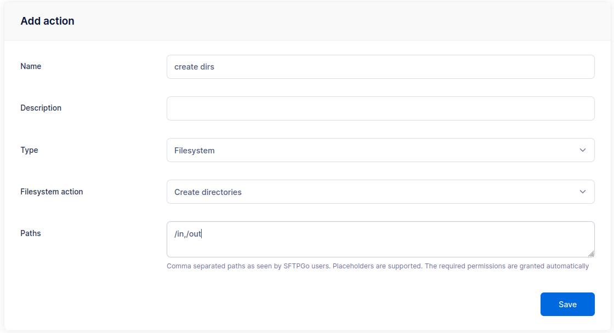
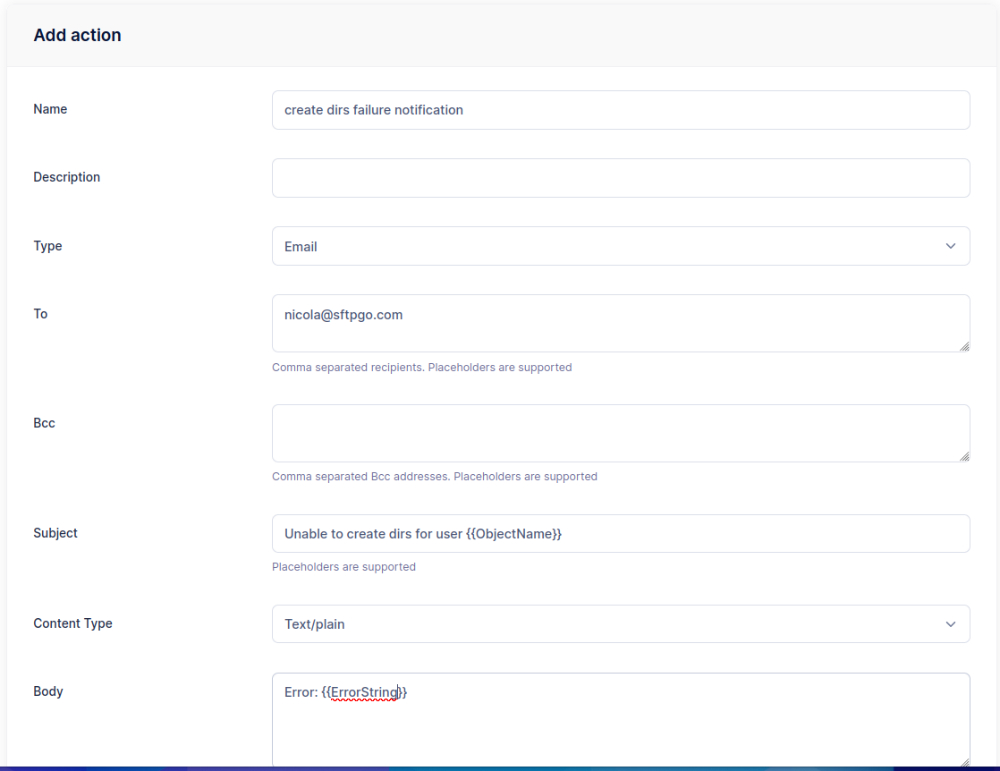
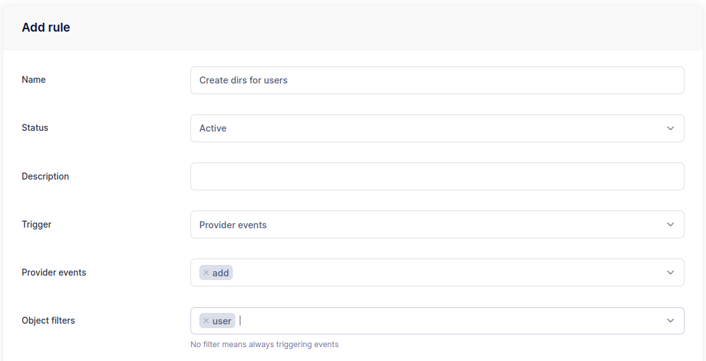
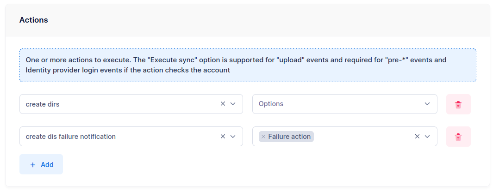

# Automatic Folder Structure

This tutorial shows how to automatically create a predefined folder structure whenever a new user is provisioned. This is useful for enforcing a consistent directory layout across all users — for example, dedicated `in` and `out` directories for file exchange workflows.

## Goal

When a new user is added, automatically create the folders `/in` and `/out` in their home directory. If the creation fails, send an email notification to the administrator.

## Step 1: Create a Filesystem Action

From the WebAdmin, expand the **Event Manager** section, select **Event actions** and add a new action.

Create an action named `create dirs`, set the type to `Filesystem`, choose `Create directories` as the filesystem action, and add the paths `/in` and `/out`.

{data-gallery="create-dir-action"}

You can add as many directories as needed — they are created recursively (equivalent to `mkdir -p`), so intermediate directories are handled automatically.

## Step 2: Create a Failure Notification Action

Create a second action named `create dirs failure notification`, set the type to `Email` and configure the recipients.

- **Subject**: `Unable to create dirs for user {{.ObjectName}}`
- **Body**: `Errors: {{ stringJoin .Errors ", " }}`

The `{{.ObjectName}}` placeholder resolves to the username of the newly created user.

{data-gallery="create-dir-failure-action"}

## Step 3: Create a Provider Event Rule

Select **Event rules** and create a rule named `Create dirs for users`.

- **Trigger**: Provider event
- **Provider events**: `add`
- **Object filters**: `user`

{data-gallery="create-dir-rule"}

As actions, select `create dirs` and `create dirs failure notification`. Mark the notification action as **Is failure action** — this way, the email is sent only when the directory creation fails.

{data-gallery="create-dir-rule-action"}

Done! Create a new user and verify that the `/in` and `/out` directories are automatically created in their home directory.
