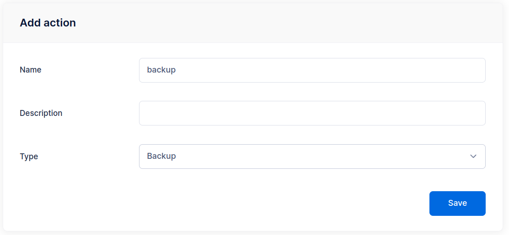
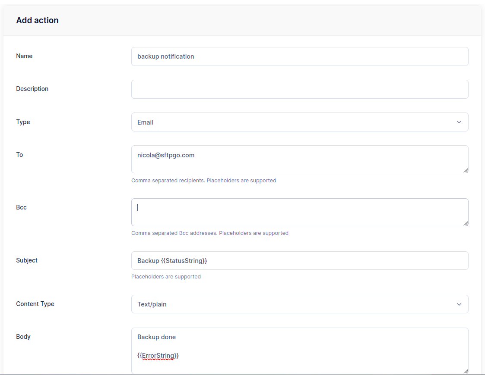
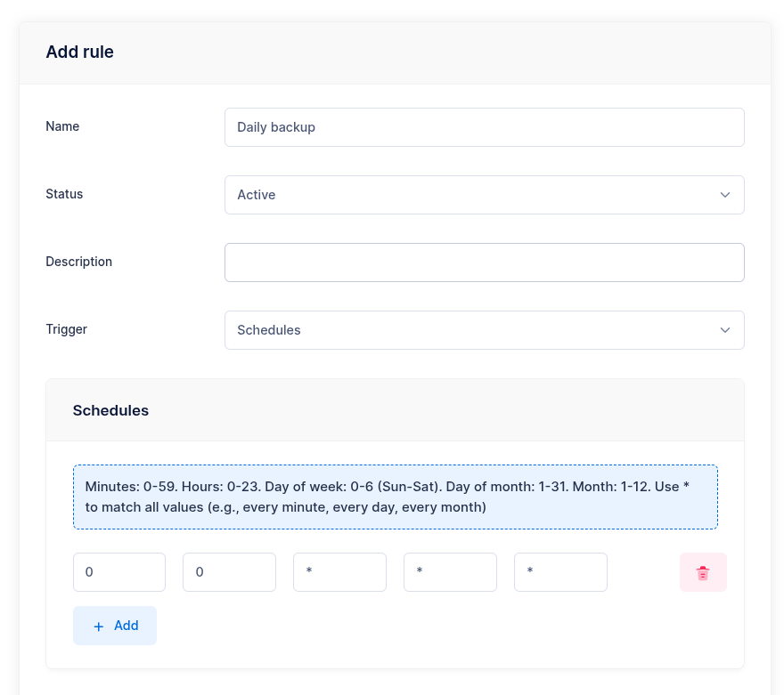
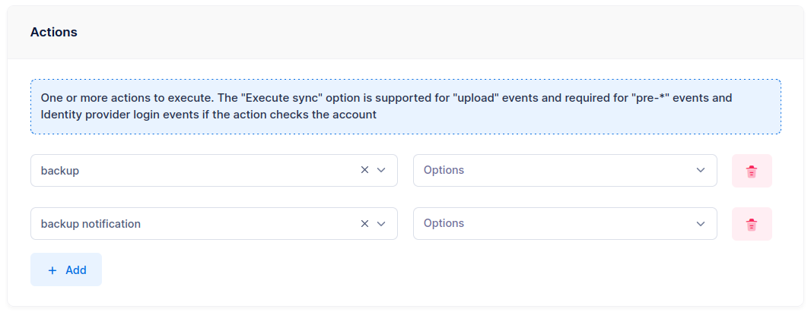

# Daily Backups

You can schedule SFTPGo data backups (users, folders, groups, admins etc.) on a regular basis, such as daily, and receive an email notification with the result.

## Prerequisites

We will use an email action for the notification, so make sure you have a working SMTP configuration. You can configure it using environment variables:

```shell
SFTPGO_SMTP__HOST="your smtp server host"
SFTPGO_SMTP__FROM="SFTPGo <sftpgo@example.com>"
SFTPGO_SMTP__USER=sftpgo@example.com
SFTPGO_SMTP__PASSWORD="your password"
SFTPGO_SMTP__AUTH_TYPE=1 # change based on what your server supports
SFTPGO_SMTP__ENCRYPTION=2 # change based on what your server supports
```

:information_source: The SMTP server can also be configured directly through the WebAdmin UI by navigating to **Server Manager > Configurations > SMTP**.

## Step 1: Create a Backup Action

From the WebAdmin, expand the **Event Manager** section, select **Event actions** and add a new action.
Create an action named `backup` and set the type to `Backup`.

{data-gallery="backup"}

## Step 2: Create a Notification Action

Create another action named `backup notification`, set the type to `Email` and fill the recipient/s.
As email subject set `Backup notification`.
As email body set `Backup done {{ stringJoin .Errors ", " }}`. The `stringJoin` function joins all error messages in the `.Errors` list using a comma and space as a separator. If no errors occurred, the resulting string will be empty.

{data-gallery="backup-notification"}

## Step 3: Create a Scheduled Rule

Now select **Event rules** and create a rule named `Daily backup`, select `Schedule` as trigger and schedule a backup at midnight UTC time.

{data-gallery="schedule"}

As actions select `backup` and `backup notification`.

{data-gallery="backup-actions"}

Done! SFTPGo will make a new backup every day and you will receive an email with the status of the backup. The backup files will have names like this `backup_<week day>_<hour>_<minute>.json`.
