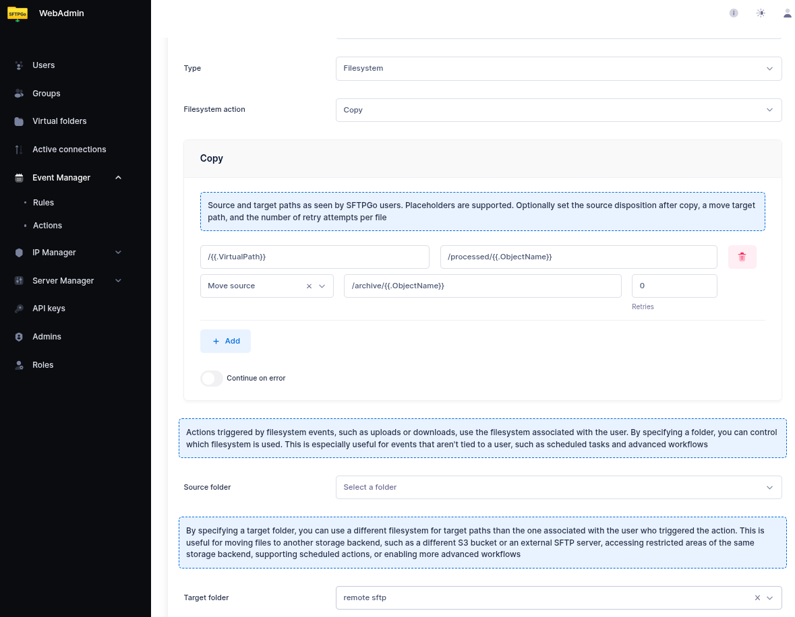

# Copy & Archive Workflows

The Event Manager's **Copy** action is one of the most powerful filesystem actions, supporting glob patterns, source disposition (delete or move after copy), per-file retries, and continue-on-error behavior. This tutorial demonstrates common copy workflows.

For cross-backend copying using virtual folders, see the [Virtual Folders Integration](eventmanager-folders.md) tutorial.

## Basic Copy After Upload

The simplest case: copy every uploaded file to a backup directory.

### Step 1: Create a Copy Action

From the WebAdmin, create a new action named `copy to backup`, set the type to `Filesystem`, and choose `Copy` as the filesystem action.

Add a copy entry:

- **Source**: `/{{.VirtualPath}}`
- **Target**: `/backup/{{.ObjectName}}`

This copies the uploaded file to the `/backup` directory, preserving the original filename.

### Step 2: Create a Rule

Create a rule with `Filesystem events` trigger, `upload` event, and select the `copy to backup` action.

## Glob Patterns: Copy Multiple Files

Glob patterns let you select multiple files from a directory. This is especially useful in scheduled rules where you want to process all matching files at once.

### Example: Copy All CSV Files

Create a copy action with:

- **Source**: `/inbound/*.csv`
- **Target**: `/processed/`

This copies all `.csv` files from `/inbound` to `/processed`. The `*` wildcard matches any sequence of characters in the filename. Subdirectories inside `/inbound` are **not** recursed into.

Supported patterns follow standard shell syntax:

- `*` — matches any sequence of characters
- `?` — matches a single character
- `[abc]` — matches any character in the set

Example patterns:

| Pattern | Matches |
| --------- | --------- |
| `/inbox/*.csv` | All CSV files in `/inbox` |
| `/data/report_??.txt` | `report_01.txt`, `report_AB.txt`, etc. |
| `/uploads/*_2026*` | Files containing `_2026` in their name |

## Source Disposition: Delete or Move After Copy

Source disposition controls what happens to the source file after a successful copy. This eliminates the need for separate delete/rename actions and avoids race conditions.

### Delete After Copy

Set **After copy** to `Delete source`. The source file is removed after a successful copy.

This is the recommended approach for "move" workflows. With a separate copy-then-delete approach (e.g., copy an entire folder and then delete it), files added between the copy and the delete would be lost — they were not included in the copy but are removed by the delete. Source disposition eliminates this race condition by deleting each file individually, immediately after its copy succeeds.

### Move to Archive After Copy

Set **After copy** to `Move source` and specify an archive path. The source file is moved to the archive location after a successful copy.

- **Archive path**: `/archive/{{.ObjectName}}` — the archive path supports placeholders.
- If the archive is on the **same filesystem**, an atomic rename is used.
- If the archive is on a **different filesystem** (e.g., the source is local and the archive is a virtual folder backed by SFTP), SFTPGo falls back to a streaming copy + delete.

This three-step workflow (copy to target, move source to archive) is common in B2B file exchange:

1. Partner uploads a file to `/inbound`.
2. The copy action copies it to the processing system.
3. The source is moved to `/archive` for audit trail.

{data-gallery="copy-disposition"}

## Continue on Error

When processing multiple files (via glob patterns), enable **Continue on error** to process all files even if some fail. Without this option, the first failure stops the entire action.

Errors are collected (up to 100 entries) and reported at the end. This is useful for batch processing where one inaccessible file should not prevent the rest from being copied.

## Per-File Retries

Configure **Max retries** (0–5) for transient failures. Each retry waits 5 seconds. Retries apply to both the file copy and the source disposition step.

:warning: With `Max retries = 5`, a single failing file could add up to 25 seconds of delay. Combined with multiple failing files, this can significantly increase the total action duration.

## Complete Example: Scheduled File Distribution

This example demonstrates a scheduled rule that distributes uploaded CSV files from a shared inbox to a processing directory, with source archival and error tolerance.

### Step 1: Create the Copy Action

Create an action named `distribute csv files` with:

- **Source**: `/inbox/*.csv`
- **Target**: `/processing/`
- **After copy**: Move source
- **Archive path**: `/archive/{{.ObjectName}}`
- **Max retries**: 2
- **Continue on error**: Enabled

With a source folder set to a virtual folder that provides access to the shared storage.

### Step 2: Create a Scheduled Rule

Create a rule with:

- **Trigger**: Schedule
- **Schedule**: Every 15 minutes (minutes `*/15`, hours `*`)
- **Actions**: `distribute csv files`

Every 15 minutes, SFTPGo will:

1. Find all `.csv` files in `/inbox`.
2. Copy each to `/processing/`.
3. Move the source of each successfully copied file to `/archive/`.
4. Continue processing even if some files fail.
5. Report all errors at the end.
