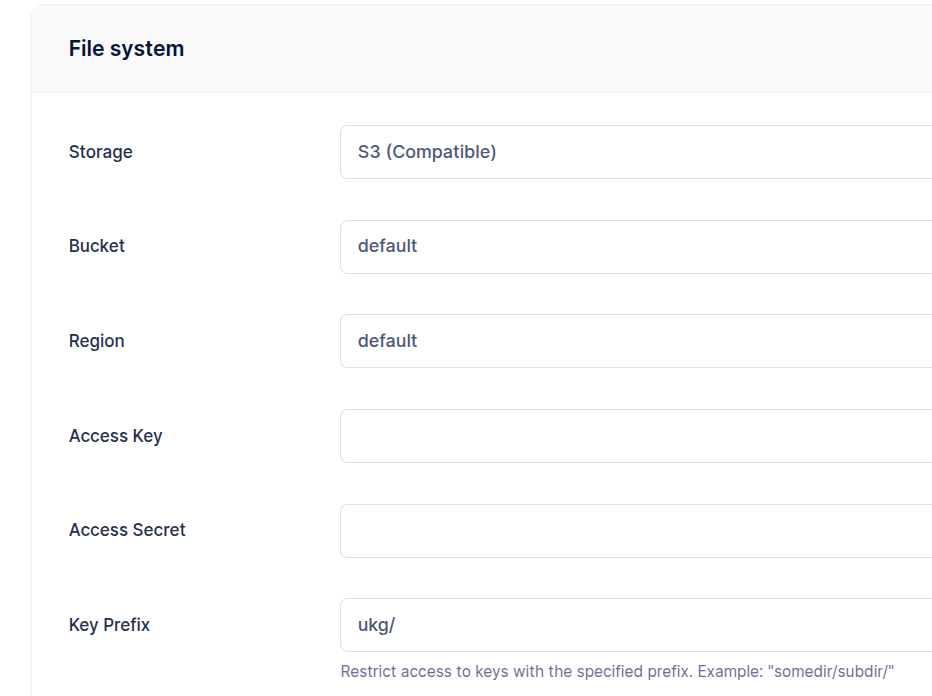
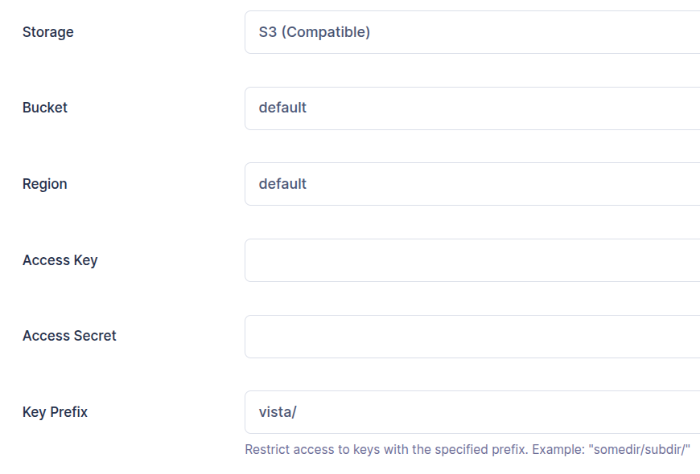
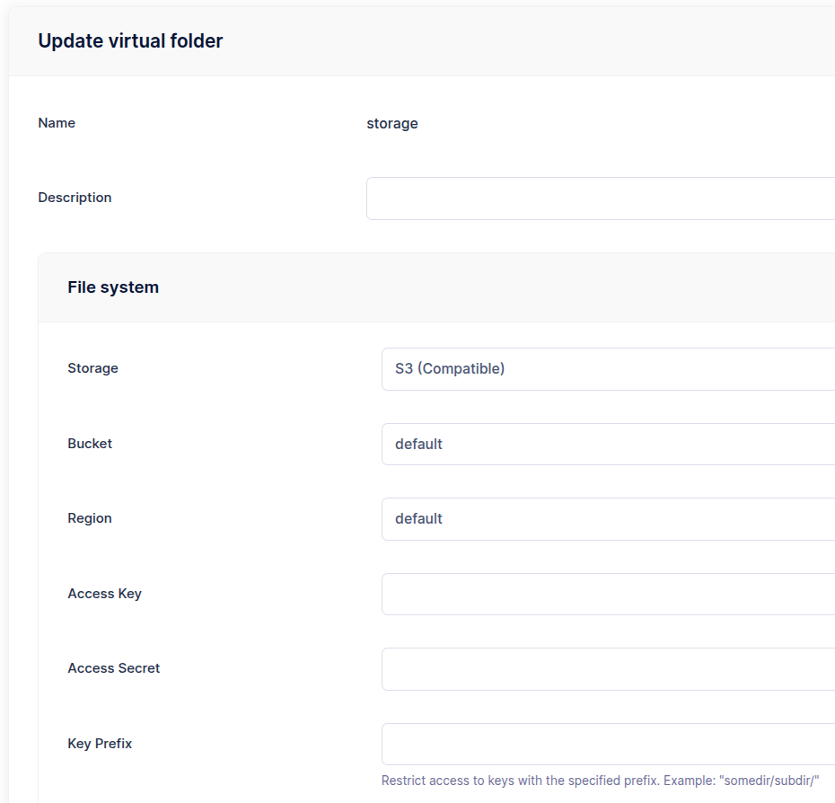
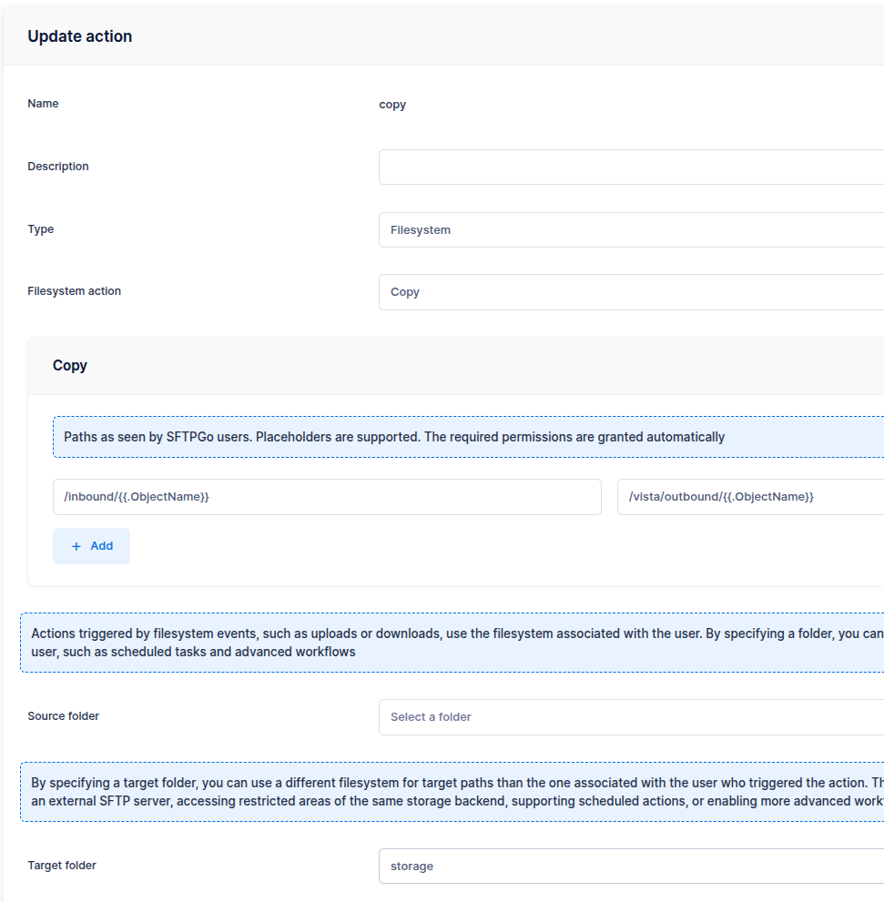
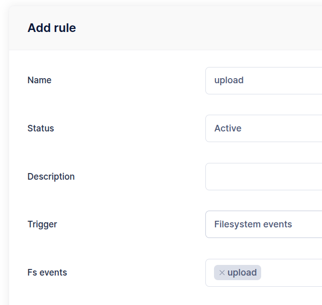
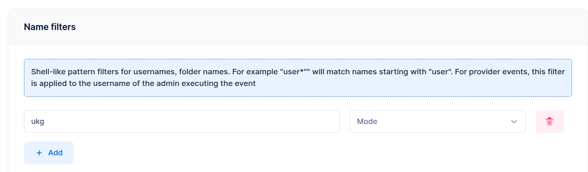
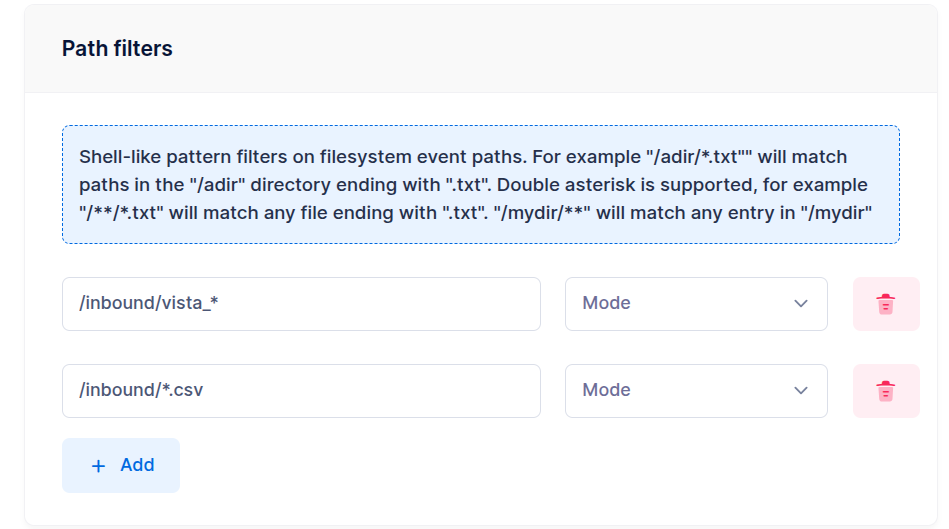
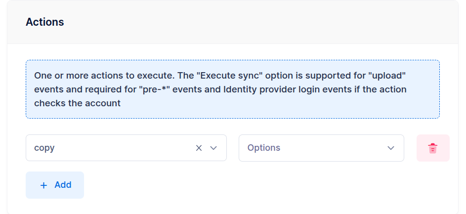
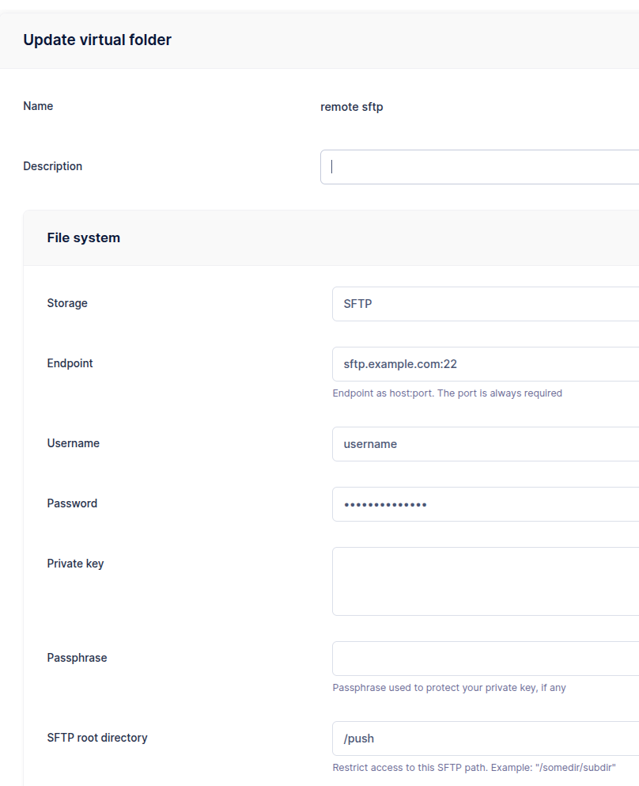
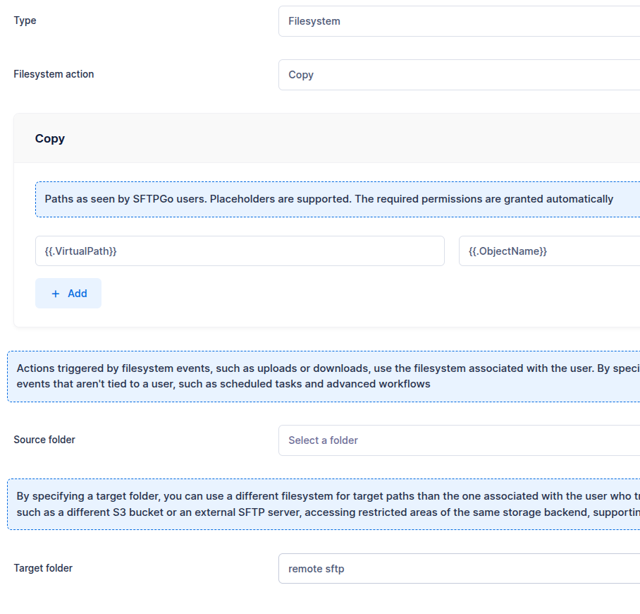

# Virtual Folders Integration

Using virtual folders with the Event Manager unlocks powerful automation workflows, such as copying uploaded files to different storage locations — either within the same backend (but outside the user's security context) or to an external server or cloud storage provider. These operations can be triggered by events like file uploads or scheduled tasks, and they require no custom scripting or complex setup.

Let's explore a few example scenarios to see how this feature can be used in practice.

## Scenario 1: Cross-User File Copy (Same Backend)

### Goal

We have two users on the same S3 storage:

- The user `ukg` has the key prefix set to `ukg/` so it can only access this folder.

{data-gallery="ukgfs"}

- The user `vista` has the key prefix set to `vista/` so it can only access this folder.

{data-gallery="vistafs"}

Each time the user `ukg` uploads files to the `/inbound` folder that:

- start with `vista_`, and
- end with `.csv`

we want to automatically copy those files to the `/outbound` folder of the user `vista`.

### The Challenge

By default, actions are executed within the security context of the user who performed the upload. Since the user `ukg` is restricted to their own directory and cannot access the `vista` user's folder, this operation would normally be blocked.

To support this use case, we define a virtual folder with permissions to access the `vista` user's directory. The copy action is then configured to use this virtual folder as the destination.

### Step 1: Create a Storage Folder

Create a folder named `storage` without setting a key prefix. This gives the folder visibility over the entire storage and allows it to be reused for other actions. Of course, if needed, you can also assign a key prefix to restrict access to a specific portion of the storage.

{data-gallery="storagefolder"}

### Step 2: Create a Copy Action

In the Event Manager section, create a new action of type `Filesystem` and choose `Copy` as the action type.
Set the source path to `/inbound/{{.ObjectName}}` and the target path to `/vista/outbound/{{.ObjectName}}`.
Finally, select `storage` as the target folder.

{data-gallery="copyaction"}

Explore the details:

- The source path is set to `/inbound/{{.ObjectName}}`. The placeholder `{{.ObjectName}}` is replaced with the file name — for example, if a file is uploaded to `/inbound/test.csv`, it becomes `test.csv`. Alternatively, you can use the more generic `{{.VirtualPath}}` placeholder, which would resolve to `/inbound/test.csv` in the same scenario.
- The target folder is set to `storage`, so the target path is relative to that folder.
- The target path is `/vista/outbound/{{.ObjectName}}`. This means that if the user `ukg` uploads the file `/inbound/test.csv`, it will be copied to `/vista/outbound/test.csv`.

:information_source: All paths are relative. For example, if the storage folder had a key prefix set to `vista/`, the correct target path would be `/outbound/{{.ObjectName}}` instead.

### Step 3: Create a Rule

Define a rule to execute this action after each upload.

Set `Filesystem events` as trigger and `upload` as event.

{data-gallery="upload-rule1"}

In the **Name filters** section, you can restrict which users the rule applies to. In this case, we specify `ukg`, but you can also define multiple users or patterns — for example, `user*` matches all usernames that start with `user`.

{data-gallery="upload-rule2"}

Similar filters can be applied based on groups or roles as well.

We also want to restrict the rule to files uploaded to the `/inbound` folder that start with `vista_` and end with `.csv`. To do this, configure the following path filters.

- `/inbound/vista_*`
- `/inbound/*.csv`

{data-gallery="upload-rule3"}

Keep in mind that these are virtual paths (relative to the user's home). You can also filter on the [filesystem path](#virtual-path-vs-filesystem-path-filters) if you need to match by physical storage location.

Finally select the `copy` action and save the rule.

{data-gallery="upload-rule4"}

That's it! Now upload some test files to confirm everything works as expected. For example:

- Files uploaded outside of `/inbound` → the action will not be triggered.
- Files in `/inbound` with the correct prefix and extension → the action will be triggered.
- Files in `/inbound` with a .txt extension → the action will not be triggered.
- Files in a subdirectory like `/inbound/subdir`, even with the correct extension → the action will not be triggered, we haven't used the double asterisk syntax to match subdirectories.

### Virtual Path vs Filesystem Path Filters

By default, rule path patterns match against the **virtual path** — the path as seen by the user (e.g., `/inbound/vista_report.csv`). This is the most common and intuitive approach.

However, you can also configure individual patterns to match against the **filesystem path** — the actual storage location. This is useful when you need to filter based on the physical backend, for example:

| Backend | Example filesystem path |
| --------- | ------------------------ |
| Local (Linux) | `/home/sftpgo/ukg/inbound/vista_report.csv` |
| S3 | `ukg/inbound/vista_report.csv` |
| Azure Blob | `ukg/inbound/vista_report.csv` |
| GCS | `ukg/inbound/vista_report.csv` |

For cloud storage backends, the filesystem path is the object key (key prefix + relative path) — it does not include the bucket or container name. For instance, if two users share the same S3 bucket but have different key prefixes (`ukg/` and `vista/`), you can use a filesystem path pattern like `ukg/**` to match only files under the `ukg` prefix regardless of the virtual path structure.

:information_source: Cloud storage paths have no leading slash, so use `prefix/**` rather than `/prefix/**`. Always use forward slashes, even for Windows paths. See [Path filters](../eventmanager.md#path-filters) for full details.

## Scenario 2: Copy to External SFTP Server

### Goal

Each time the user `vista` uploads files with `.csv` or `.xml` extensions to the `/inbound` folder, we want to automatically transfer these files to the `/push` directory on an external SFTP server.

This is very similar to Scenario 1 — we define a copy action and a target folder using the external SFTP server as storage backend.

### Step 1: Create an SFTP Folder

Create a folder that is backed by the remote SFTP server.

{data-gallery="sftp-folder"}

This time, we've set the SFTP root directory to `/push`, which restricts the folder's access to that directory. As a result, the target paths defined in the copy action are relative to `/push`.

### Step 2: Create a Copy Action

For the action configuration:

- Set the source path to `/{{.VirtualPath}}`.
- Set the target path to `/{{.ObjectName}}`. Since the SFTP folder uses `/push` as its root directory, this path is relative to `/push`.

{data-gallery="sftp-copy"}

:information_source: The `push` folder must already exist on the remote SFTP server for the action to succeed.

### Step 3: Create a Rule

For the rule:

- Use `vista` as name filter so that the action will be executed only for this user.
- Use `/inbound/*.csv` and `/inbound/*.xml` as path filters to limit the execution to these file extensions.
- Select `sftp copy` as the action.

That's it! Now upload some test files to confirm everything works as expected.
