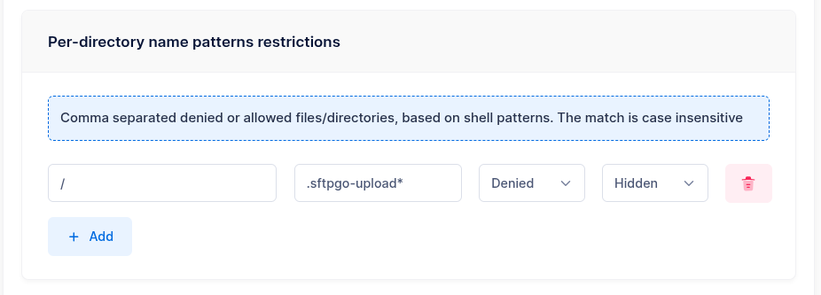
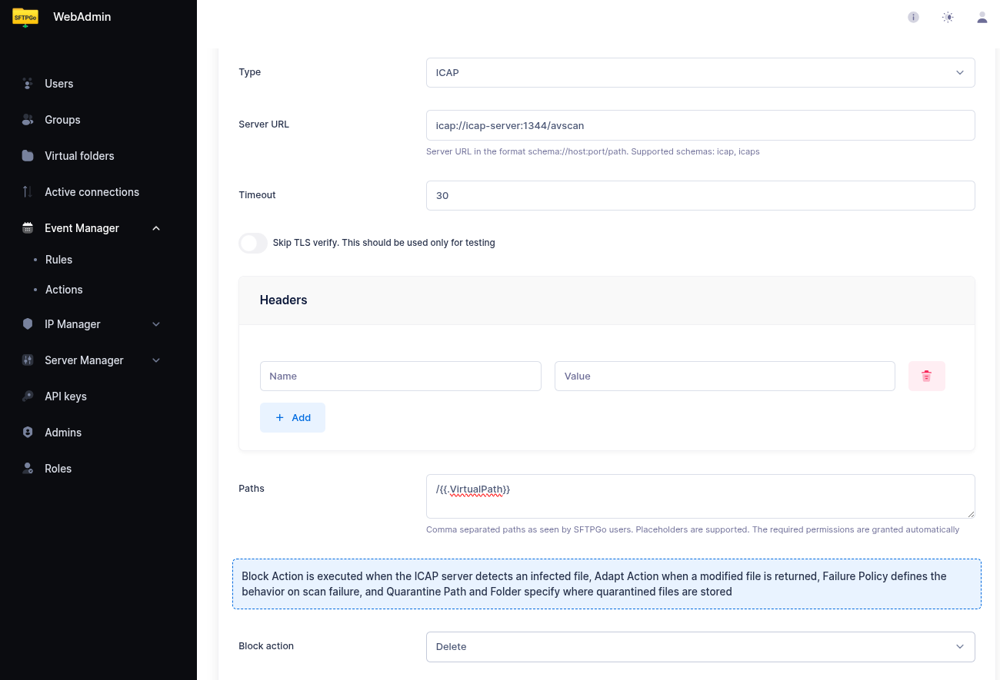
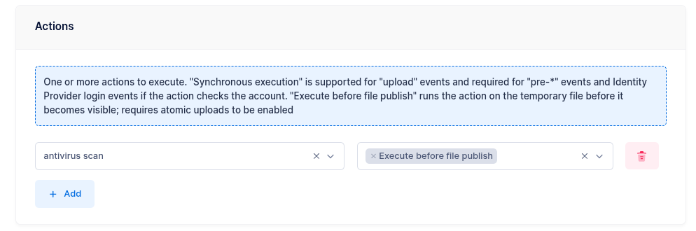

# Antivirus Scanning with ICAP

This tutorial shows how to configure automatic antivirus scanning for uploaded files using the ICAP protocol and the **Execute Before File Publish** feature. Uploaded files are scanned *before* they become visible to other users — if the scan detects a threat, the file is deleted and never published.

## How It Works

1. A user uploads a file via SFTP, FTP, or HTTP/WebDAV.
2. The file is written to a temporary location (`.sftpgo-upload.<id>.<filename>`).
3. The ICAP action sends the file to an ICAP server (e.g., ClamAV via c-icap) for scanning.
4. If the scan passes, the file is renamed to its final path and becomes visible.
5. If the scan detects a threat, the temporary file is deleted — the file never appears.

The file is hidden from other users during the entire scanning process.

## Prerequisites

- An ICAP-compatible antivirus or DLP server (RFC 3507). Common options include:
  - [ClamAV](https://www.clamav.net/){:target="_blank"} with [c-icap](https://c-icap.sourceforge.net/){:target="_blank"}
  - [OPSWAT MetaDefender ICAP Server](https://www.opswat.com/products/metadefender/icap){:target="_blank"}
  - Symantec Protection Engine
  - [Skyhigh Security Secure Web Gateway](https://www.skyhighsecurity.com/){:target="_blank"}
  - [Trend Micro InterScan Web Security](https://www.trendmicro.com/){:target="_blank"}
  - Any other ICAP-compatible solution

## Step 1: Enable Atomic Uploads

Atomic uploads are required for the Execute Before File Publish feature. Set the following environment variable:

```shell
SFTPGO_COMMON__UPLOAD_MODE=1
```

This tells SFTPGo to write uploads to a temporary file first, then rename to the final path on success.

## Step 2: Configure File Pattern Filters

To prevent users from seeing or accessing temporary upload files during scanning, configure a file pattern filter. This can be set per-user or, more conveniently, on a **group** that all users belong to.

In the user or group settings, add a file pattern filter:

- **Path**: `/`
- **Denied patterns**: `.sftpgo-upload*`
- **Policy**: `Hide`

{data-gallery="icap-filter"}

With the **Hide** policy, temporary files are completely invisible — they do not appear in directory listings and all operations on them are blocked. This is the recommended setting.

Alternatively, the **Deny** policy makes the files appear in listings but blocks all operations (download, delete, rename). Use this if you need visibility into ongoing uploads.

:information_source: Apply this filter to a group to enforce it for all users at once, rather than configuring each user individually.

## Step 3: Create an ICAP Action

From the WebAdmin, expand the **Event Manager** section, select **Event actions** and add a new action.

Create an action named `antivirus scan` and set the type to `ICAP`.

Configure the ICAP settings:

- **URL**: Your ICAP server URL (e.g., `icap://icap-server:1344/avscan`)
- **Path**: The file to scan — set this to `/{{.VirtualPath}}`. When combined with "Execute before file publish", this resolves to the temporary file path automatically, so the scan targets the staged file before it is published.

{data-gallery="icap-action"}

### Failure Policies

When the ICAP scan detects a threat, you can configure the response:

| Policy | Behavior |
| -------- | ---------- |
| **Delete** | The file is removed immediately. This is the default when used with Execute Before File Publish — the temporary file is deleted and never published. |
| **Quarantine** | The file is moved to a quarantine directory. Configure a virtual folder as the quarantine destination — this allows quarantining to a different storage backend (e.g., a dedicated quarantine S3 bucket). |
| **No action** | The scan result is logged but the file is left in place. Use this for monitoring/alerting without blocking. |

### Quarantine with Virtual Folders

To quarantine infected files to a separate storage location:

1. Create a virtual folder named `quarantine` backed by the desired storage (e.g., a dedicated S3 bucket, a local directory, or an SFTP server).
2. In the ICAP action, set the failure policy to **Quarantine** and select `quarantine` as the quarantine folder.

This provides isolation — infected files are moved out of the user's storage entirely.

## Step 4: Create an Event Rule

Now select **Event rules** and create a rule named `Scan uploads`.

- **Trigger**: Filesystem events
- **Events**: Upload

In the actions section, select `antivirus scan` and enable **Execute before file publish**.

{data-gallery="icap-rule"}

### Synchronous vs Asynchronous Mode

By default (only "Execute before file publish" enabled), the scanning runs **asynchronously**:

- The client receives a success response immediately after the upload completes.
- The scan runs in the background.
- If the scan fails, the file is silently removed — the client is not informed via the protocol.

If you also enable **Execute sync** on the same action, the scanning runs **synchronously**:

- The client waits for the scan to complete.
- If the scan passes, the client receives a success response.
- If the scan fails, the client receives an error response.

The trade-off is potential client timeout — for large files, the scan may take significant time. Configure client-side timeouts accordingly.

### Adding a Failure Notification

Add a second action to the rule — for example, an email action — and mark it as a **failure action**. This way, administrators are notified when a scan detects a threat:

- **Subject**: `Antivirus alert: infected file from {{.Name}}`
- **Body**: `User {{.Name}} uploaded an infected file: {{.ObjectName}} ({{humanizeBytes .FileSize}}). The file has been blocked. Errors: {{ stringJoin .Errors ", " }}`

## Step 5: Test

Upload a test file via SFTP or FTP. It should:

1. Not appear in directory listings during scanning (thanks to the Hide filter).
2. Appear at its final path after the scan completes successfully.

To test threat detection, you can use the [EICAR test file](https://www.eicar.org/download-anti-malware-testfile/){:target="_blank"} — a harmless test string recognized by all antivirus engines.

## Storage Backend Support

ICAP works transparently on **all** storage backends:

| Backend | Notes |
| --------- | ------- |
| Local filesystem | Files staged in the same directory |
| Encrypted filesystem (CryptFs) | Files are decrypted transparently for scanning |
| AWS S3 | Rename uses server-side copy + delete |
| Azure Blob Storage | Rename uses server-side copy + delete |
| Google Cloud Storage | Rename uses server-side copy + delete |
| SFTP (remote) | Supported when buffer size is 0 |
| FTP (remote) | Rename via RNFR/RNTO |

:information_source: On cloud storage backends, the rename step after scanning involves a server-side copy followed by a delete. For very large files, this adds latency proportional to the file size.

## Important Notes

- **TempPath incompatibility**: If the server-wide `TempPath` option is set, staged actions are skipped for local and encrypted filesystems. Use file pattern filters instead of `TempPath` to hide temporary files. See [Execute Before File Publish — Limitations](../execute-before-file-publish.md#limitations) for details.
- **Multiple actions**: You can combine ICAP with other staged actions in the same rule (e.g., ICAP scan + HTTP webhook for logging). All staged actions must pass before the file is published.
- **Non-staged rules**: Other rules matching the same upload event (without "Execute before file publish") will run *after* the file is published. If the ICAP scan fails and the file is never published, those rules do not execute.
