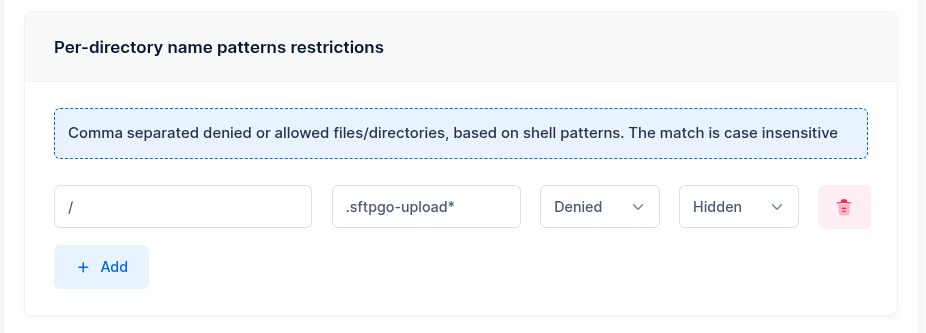
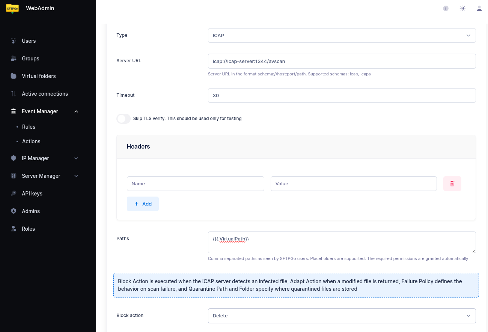
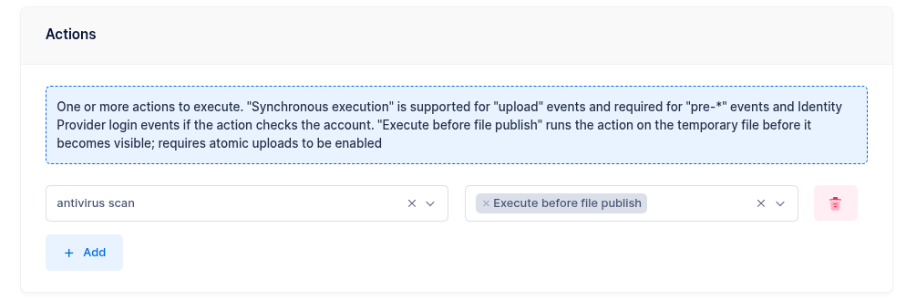

# Antivirus Scanning with ICAP

This tutorial shows how to configure automatic antivirus scanning for uploaded files using the ICAP protocol and the **Execute Before File Publish** feature. Uploaded files are scanned *before* they are published at their final path — if the scan detects a threat, the file is deleted or quarantined and never published.

## How It Works

1. A user uploads a file via SFTP, FTP, or HTTP/WebDAV.
2. The file is written to a temporary location (`.sftpgo-upload.<id>.<filename>`).
3. The ICAP action sends the file to an ICAP server (e.g., ClamAV via c-icap) for scanning.
4. If the scan passes, the file is renamed to its final path and becomes visible.
5. If the scan detects a threat, the temporary file is deleted or quarantined — the file never appears at its final path.

The temporary file is an ordinary file in the destination directory: the file pattern filter of step 2 hides it from users during the scan.

## Prerequisites

- An ICAP-compatible antivirus or DLP server (RFC 3507). Common options include:
  - [ClamAV](https://www.clamav.net/){:target="_blank"} with [c-icap](https://c-icap.sourceforge.net/){:target="_blank"}
  - [OPSWAT MetaDefender ICAP Server](https://www.opswat.com/products/metadefender/icap){:target="_blank"}
  - Symantec Protection Engine
  - [Skyhigh Security Secure Web Gateway](https://www.skyhighsecurity.com/){:target="_blank"}
  - [Trend Micro InterScan Web Security](https://www.trendmicro.com/){:target="_blank"}
  - Any other ICAP-compatible solution

## Step 1: Enable Atomic Uploads

Atomic uploads are required for the Execute Before File Publish feature. Set the following environment variable:

```shell
SFTPGO_COMMON__UPLOAD_MODE=1
```

This tells SFTPGo to write uploads to a temporary file first, then rename to the final path on success.

## Step 2: Configure File Pattern Filters

Without a file pattern filter, the temporary upload file appears in directory listings and can be downloaded or deleted, by the uploader and by every user who reaches the directory, while the scan runs. Configure a file pattern filter to hide it. This can be set per-user or, more conveniently, on a **group** that all users belong to.

In the user or group settings, add a file pattern filter:

- **Path**: `/`
- **Denied patterns**: `.sftpgo-upload*`
- **Policy**: `Hide`

:warning: A filter defined on a subdirectory replaces the one on `/` for that directory. Where a user or group has a filter on a specific path, for example allowed extensions on `/inbox`, add `.sftpgo-upload*` to its denied patterns as well.

{data-gallery="icap-filter"}

With the **Hide** policy, temporary files do not appear in directory listings and all operations on them are blocked. The ICAP action reads them regardless, since event actions are not bound by file pattern filters.

Alternatively, the **Deny** policy makes the files appear in listings but blocks all operations (download, delete, rename). Use this if you need visibility into ongoing uploads.

## Step 3: Create an ICAP Action

From the WebAdmin, expand the **Event Manager** section, select **Event actions** and add a new action.

Create an action named `antivirus scan` and set the type to `ICAP`.

Configure the ICAP settings:

- **URL**: Your ICAP server URL (e.g., `icap://icap-server:1344/avscan`)
- **Path**: The file to scan — set this to `/{{.VirtualPath}}`. When combined with "Execute before file publish", this resolves to the temporary file path automatically, so the scan targets the staged file before it is published.

{data-gallery="icap-action"}

### Block Action

The **Block action** decides what happens to the temporary file when the scan reports a threat:

| Option | Behavior |
| -------- | ---------- |
| **Delete** | The temporary file is removed. |
| **Quarantine** | The temporary file is moved to the quarantine path. Configure a virtual folder as the quarantine destination to quarantine to a different storage backend (e.g., a dedicated quarantine S3 bucket). |
| **Ignore** | The action leaves the file alone. The upload is rejected all the same, so SFTPGo removes the temporary file. |

With Execute Before File Publish the upload is rejected for every verdict other than clean: the option decides where the file ends up, not whether it is published. The **Adapt action** and the **Failure policy** cover a modified file and a scan that cannot be executed with the same options, see [ICAP](../filesystem-actions.md#icap).

### Quarantine with Virtual Folders

To quarantine infected files to a separate storage location:

1. Create a virtual folder named `quarantine` backed by the desired storage (e.g., a dedicated S3 bucket, a local directory, or an SFTP server).
2. In the ICAP action, set the block action to **Quarantine** and select `quarantine` as the quarantine folder.

This provides isolation — infected files are moved out of the user's storage entirely.

With "Execute before file publish" the scanned file is still at its temporary path (`.sftpgo-upload.<id>.<filename>`): a quarantine path ending with `/` keeps that temporary name. Use `/quarantine/{{.Name}}/{{pathJoin (stringSlice (pathDir .VirtualPath) .ObjectName)}}` to store the file under its original name and directory layout, partitioned by user (e.g. `/quarantine/alice/inbox/report.pdf`). Use `{{.ObjectName}}` in notifications too — as in the failure email below — so messages show the name the user uploaded.

## Step 4: Create an Event Rule

Now select **Event rules** and create a rule named `Scan uploads`.

- **Trigger**: Filesystem events
- **Events**: Upload

In the actions section, select `antivirus scan` and enable **Execute before file publish**.

{data-gallery="icap-rule"}

### Synchronous vs Asynchronous Mode

By default (only "Execute before file publish" enabled), the scanning runs **asynchronously**:

- The client receives a success response immediately after the upload completes.
- The scan runs in the background.
- If the scan fails, the file is removed — the client is not informed via the protocol.

If you also enable **Synchronous execution** on the same action, the scanning runs **synchronously**:

- The client waits for the scan to complete.
- If the scan passes, the client receives a success response.
- If the scan fails, the client receives an error response.

The trade-off is potential client timeout — for large files, the scan may take significant time. Configure client-side timeouts accordingly.

### Adding a Failure Notification

Add a second action to the rule — for example, an email action — and mark it as a **failure action**. Email actions need an SMTP server: configure it from the WebAdmin under **Server Manager > Configurations > SMTP**, where the settings apply without a restart, or in the [SMTP section](../config-file.md#smtp) of the configuration file. This way, administrators are notified when a scan detects a threat:

- **Subject**: `Antivirus alert: infected file from {{.Name}}`
- **Body**: `User {{.Name}} uploaded an infected file: {{.ObjectName}} ({{humanizeBytes .FileSize}}). The file has been blocked. Scan result: {{.ICAPResult.Status}}{{if .ICAPResult.Threat}}, threat: {{.ICAPResult.Threat}}{{end}}`

The [`{{.ICAPResult}}`](../placeholders.md#icapresult) placeholder exposes the scan outcome and the threat name reported by the ICAP server; [`{{.ICAPResults}}`](../placeholders.md#icapresults) lists the per-file results when a rule scans multiple paths.

## Step 5: Test

Upload a test file via SFTP or FTP. It should:

1. Not appear in directory listings during scanning (thanks to the Hide filter).
2. Appear at its final path after the scan completes successfully.

Check with a directory listing rather than with a file attribute request: within the SFTP or FTP session that performed the upload, a request for the attributes of the final path returns the uploaded size while the scan runs, so that clients verifying their uploads report success. See [the file while the actions run](../execute-before-file-publish.md#the-file-while-the-actions-run) for the behavior of the other protocols.

To test threat detection, you can use the [EICAR test file](https://www.eicar.org/download-anti-malware-testfile/){:target="_blank"} — a harmless test string recognized by all antivirus engines.

## Storage Backend Support

ICAP supports every storage backend:

| Backend | Notes |
| --------- | ------- |
| Local filesystem | Files staged in the same directory |
| Encrypted filesystem (CryptFs) | Files are decrypted for scanning |
| AWS S3 | Rename uses server-side copy + delete |
| Azure Blob Storage | Rename uses server-side copy + delete |
| Google Cloud Storage | Rename uses server-side copy + delete |
| SFTP (remote) | Supported when buffer size is 0 |
| FTP (remote) | Rename via RNFR/RNTO |

:information_source: On cloud storage backends, the rename step after scanning involves a server-side copy followed by a delete. For very large files, this adds latency proportional to the file size.

## Important Notes

- **Multiple actions**: You can combine ICAP with other staged actions in the same rule (e.g., ICAP scan + HTTP webhook for logging). All staged actions must pass before the file is published.
- **Non-staged rules**: Other rules matching the same upload event (without "Execute before file publish") run *after* the file is published. If the scan fails, the upload is reported to them as failed: set their **Status filters** to the successful status so that they react to published files alone.
