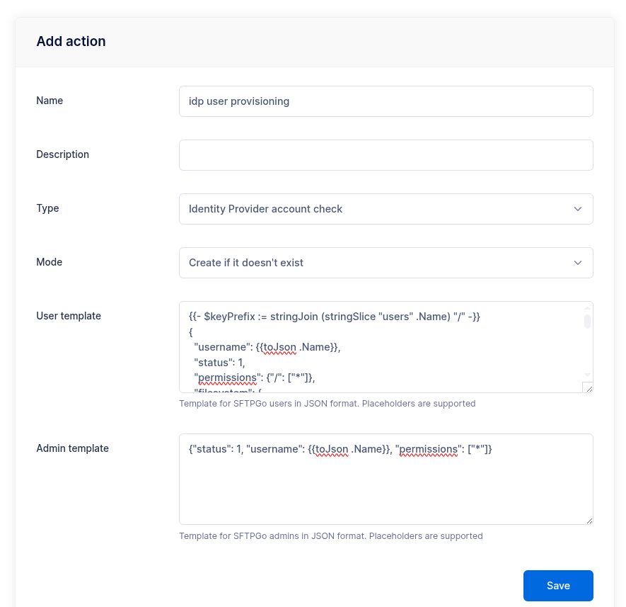
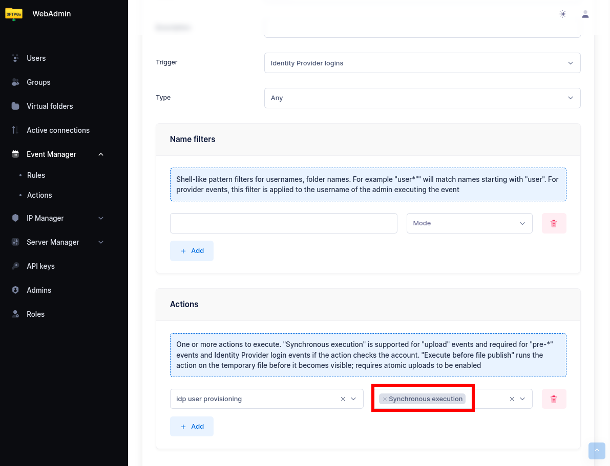

# Auto Provisioning via Identity Provider

This tutorial shows how to automatically create SFTPGo user accounts when someone logs in through an external Identity Provider (IdP) such as Keycloak, Azure AD, or Okta. This eliminates the need to manually pre-create accounts — users are provisioned on their first login.

## How It Works

1. A user clicks "Sign in with OpenID" on the SFTPGo login page.
2. After authenticating with the IdP, SFTPGo receives the ID token.
3. An Event Manager rule with an **Identity Provider login** trigger fires.
4. The **Identity Provider account check** action creates (or updates) the SFTPGo user based on a template you define.
5. The user is logged in automatically.

## Prerequisites

- A configured [OpenID Connect](../oidc.md) integration with your Identity Provider. OIDC can be configured via environment variables, configuration file, or directly from the WebAdmin UI under **Server Manager > Configurations > OIDC** (requires `SFTPGO_HOOK__ENABLE_OIDC_UI=1`).
- The IdP should include the username (and optionally roles, email, or other attributes) in the ID token.

## Step 1: Configure OIDC Custom Fields

If your IdP provides additional attributes you want to use during provisioning (e.g., roles, department, storage quota), add them to the OIDC `custom_fields` configuration:

```shell
SFTPGO_HTTPD__BINDINGS__0__OIDC__CUSTOM_FIELDS=sftpgo_role,department
```

These fields will be available in the action template as `{{.IDPFields.sftpgo_role}}`, `{{.IDPFields.department}}`, etc.

## Step 2: Create an Identity Provider Account Check Action

From the WebAdmin, expand the **Event Manager** section, select **Event actions** and add a new action.

Create an action named `idp user provisioning`, set the type to `Identity Provider account check`.

In the **User template** field, enter a JSON template that defines the user to create. The JSON structure matches the user object documented in the [REST API](https://sftpgo.com/rest-api){:target="_blank"}. This template uses Go template syntax with access to all [placeholders](../placeholders.md), including `{{.IDPFields}}` for custom IdP claims.

### Example: S3 Backend with Group Mapping

This template creates a user with an S3 storage backend, using the username as the key prefix and mapping IdP roles to SFTPGo groups:

```json
{{- $keyPrefix := stringJoin (stringSlice "users" .Name) "/" -}}
{
  "username": {{toJson .Name}},
  "status": 1,
  "permissions": {"/": ["*"]},
  "filesystem": {
    "provider": 1,
    "s3config": {
      "bucket": "my-sftpgo-bucket",
      "region": "eu-central-1",
      "key_prefix": {{$keyPrefix | toJson}}
    }
  },
  "groups": [
    {{- $roles := .IDPFields.sftpgo_role -}}
    {{- range $i, $role := $roles -}}
      {{- if ne $i 0}},{{end}}
      {"type": {{if eq $i 0}}1{{else}}2{{end}},
       "name": {{$role | toJson}}}
    {{- end}}
  ]
}
```

- `$keyPrefix` is built by joining `"users"` and the username with `/` — e.g., `users/alice`.
- The `groups` array is populated from the `sftpgo_role` claim. The first role gets type `1` (primary group), subsequent roles get type `2` (secondary).
- All string values use `toJson` for safe JSON encoding.

{data-gallery="idp-action"}

### Example: Local Filesystem with Fixed Group

A simpler template for local filesystem users that assigns everyone to the same group:

```json
{
  "username": {{toJson .Name}},
  "status": 1,
  "home_dir": {{filePathJoin (stringSlice "/srv/sftpgo/data" .Name) | toJson}},
  "permissions": {"/": ["*"]},
  "groups": [
    {"type": 1, "name": "default-users"}
  ]
}
```

:information_source: The groups referenced in the template must already exist in SFTPGo. The IdP account check action creates or updates users, but does not create groups.

## Step 3: Create an Event Rule

Now select **Event rules** and create a rule named `IdP auto provisioning`.

- Set **Identity Provider login** as the trigger.
- As actions, select the `idp user provisioning` action and enable **Execute sync**.

:warning: **Synchronous execution is required.** The account must be created before the login flow completes. Without "Execute sync", the action runs asynchronously and the login will fail because the account does not exist yet.

{data-gallery="idp-rule"}

Done! When a user logs in through the IdP for the first time, SFTPGo will create their account automatically. On subsequent logins, the account is updated with the latest template values — useful for keeping group memberships or storage settings in sync with IdP attributes.

## Tips

- **Enable OIDC in WebAdmin UI**: To configure OIDC from the WebAdmin UI (Server Manager > Configurations > OIDC), you must set the environment variable `SFTPGO_HOOK__ENABLE_OIDC_UI=1`.
- **Test with debug logging**: Enable debug mode to see the full ID token in the logs — this helps you identify which claims are available and how they are structured. Set `SFTPGO_HTTPD__BINDINGS__0__OIDC__DEBUG=1` (adjust the binding index if needed).
- **Conditional fields**: Use Go template conditions to handle optional fields:

```json
{{if .IDPFields.department}}
  "description": {{toJson .IDPFields.department}},
{{end}}
```

- **Admin provisioning**: The action also supports an admin template for provisioning WebAdmin accounts. When a user logs in with a role that maps to the admin role (see [OIDC role mapping](../oidc.md#role-mapping)), the admin template is used instead of the user template. A minimal admin template:

```json
{"status": 1, "username": {{toJson .Name}}, "permissions": ["*"]}
```
