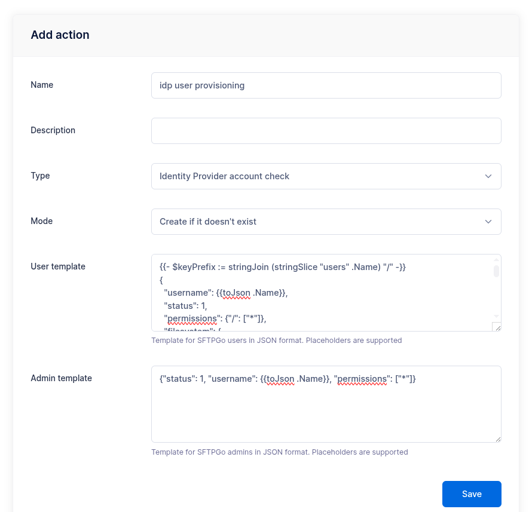
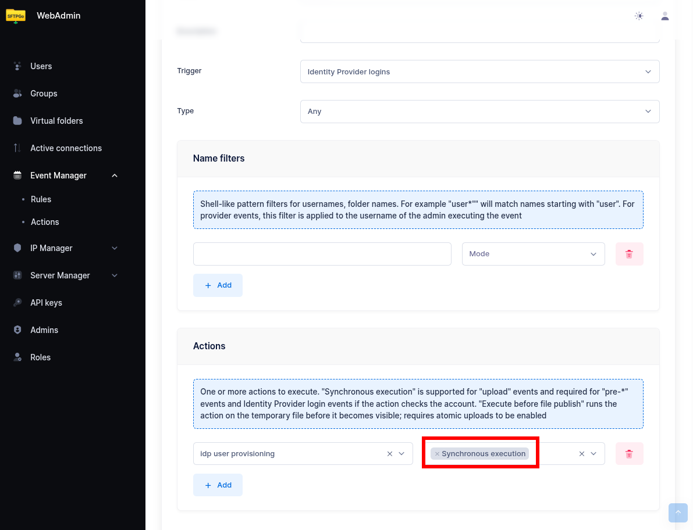

# Auto Provisioning via Identity Provider

An OpenID Connect Identity Provider (IdP) such as Keycloak, Microsoft Entra ID or Okta authenticates the person. The account the person works with, its storage, permissions and limits, is defined in SFTPGo: a login through the IdP succeeds when an SFTPGo user with the mapped username exists. This tutorial sets up an Event Manager rule that creates that user at the first login, from a template, so that accounts need no manual creation.

## How it works

1. The user clicks "Sign in with OpenID" on the Web Client login page and authenticates with the IdP.
2. SFTPGo validates the ID token and reads the username from the configured claim.
3. A rule with the **Identity Provider login** trigger runs the **Identity Provider account check** action: the action renders a JSON user template with the data of the token and creates the user, or updates it when it exists.
4. SFTPGo loads the user and opens the session.

Provisioned users appear in the users list like any other user.

## Prerequisites

- OpenID Connect configured from the configuration file, environment variables or the WebAdmin under **Server Manager > Configurations > OpenID Connect**. See [OpenID Connect](../oidc.md).
- The claim set as `username_field` names the SFTPGo account. Choose it before the first user is provisioned: accounts are stored under its value, and a different claim later means different account names. See [Choosing the username claim](../oidc.md#choosing-the-username-claim).

:warning: With provisioning enabled, every identity the IdP authenticates for SFTPGo gets an account. Limit who can sign in: restrict the client on the IdP side to the intended users or groups, or set `user_role_values` so that only identities carrying a given role claim log in. See [Role mapping](../oidc.md#role-mapping).

## Step 1: Create the account check action

From the WebAdmin expand **Event Manager**, select **Event actions** and add an action named `idp user provisioning` of type **Identity Provider account check**.

In **User template** enter the JSON of the user to create. This template creates a user on the local disk, with a directory of its own and full permissions:

```json
{
  "username": {{toJson .Name}},
  "status": 1,
  "home_dir": {{filePathJoin (stringSlice "/srv/sftpgo/data" .Name) | toJson}},
  "permissions": {"/": ["*"]}
}
```

- `username` must be `{{toJson .Name}}`: `.Name` is the username read from the ID token, and the login looks up exactly that account.
- `status` is `1` for an active user.
- `home_dir` is the root directory of the user, here `/srv/sftpgo/data/<username>`: `filePathJoin` builds the path and `toJson` quotes it.
- `permissions` grants every operation on `/`.

The template is a Go template that produces the user object of the [REST API](https://sftpgo.com/rest-api){:target="_blank"}: every field the API accepts can be set, and a field left out takes its default. Wrap each string value in `toJson` so that quotes and special characters are escaped. The available placeholders and functions are listed in [Placeholders & Templates](../placeholders.md).

Leave **Mode** on **Create or update** for now; [Keep accounts in sync or create them once](#keep-accounts-in-sync-or-create-them-once) explains the choice.

{data-gallery="idp-action"}

## Step 2: Create the rule

Select **Event rules** and add a rule named `IdP auto provisioning`:

- **Trigger**: **Identity Provider login**, event **User login**.
- **Actions**: `idp user provisioning` with **Synchronous execution** enabled.

:warning: Synchronous execution is required: the account must exist before the login completes. An asynchronous action runs after the account lookup, and the first login fails.

{data-gallery="idp-rule"}

## Step 3: Test the login

Open the Web Client login page in a private browser window and sign in with the OpenID button as an identity that has no SFTPGo account yet. The session opens and the new user appears in the users list of the WebAdmin.

When the login page shows "Failed to get user associated with OpenID token", the rule did not produce a usable account. The server log has the cause, in the event manager messages starting with `unable to handle IDP login event`. The usual ones:

- the template renders invalid JSON, for example because a claim is missing or has an unexpected type;
- the rendered user is refused, for example because a referenced group does not exist or the home directory is not an absolute path;
- more than one rule with a synchronous account check action matches the login: keep one.

To see the claims the IdP sends, enable **Debug logs** in the OpenID Connect configuration (`debug` in the configuration file): the ID token claims are written to the log at each login. Turn it off after the tests, the log then carries personal data.

## Keep accounts in sync or create them once

The **Mode** of the action decides what happens at the logins after the first:

- **Create or update**: the template is rendered at every login and the stored user is replaced with the result. The account follows the IdP: a changed claim, or a changed template, is applied at the next login. The settings an administrator edits in the WebAdmin are replaced too, since a field the template does not set returns to its default. The fields the user may edit from the Web Client keep their values: password, public keys, TLS certificates, description, email addresses and the API key authentication setting. To let the template own the identity data, remove the matching self-service change from the **Web client/REST API** options of the user or of its group: description and email addresses are then rewritten at every login.
- **Create if it doesn't exist**: the template is rendered for a username without an account, once. From then on the account is managed in SFTPGo and the IdP authenticates it.

Choose the first when the IdP is the source of truth for storage and group membership, the second when administrators tune accounts after their creation.

:information_source: Groups combine the two: let the template assign the user to a group and set permissions, quota or virtual folders on the group. The template stays the same and the changes survive the next login. The groups named in a template must exist: the action creates users, not groups.

## Use the IdP claims

Claims beyond the username reach the template through `custom_fields` in the OpenID Connect configuration (**Custom claims** in the WebAdmin):

```shell
SFTPGO_HTTPD__BINDINGS__0__OIDC__CUSTOM_FIELDS=sftpgo_groups,department
```

Each listed claim is available as `{{.IDPFields.<claim>}}`, with the type the IdP gives it: string, number, boolean or list. The IdP must include the claim in the ID token; some providers need a dedicated scope or a client mapper for it. See [Custom fields](../oidc.md#custom-fields).

### Optional claims

A claim is present only for the identities that carry it. Test it, so that the field is written only when the claim exists:

```json
{
  "username": {{toJson .Name}},
  "status": 1,
  "home_dir": {{filePathJoin (stringSlice "/srv/sftpgo/data" .Name) | toJson}},
  "permissions": {"/": ["*"]},
  {{- if .IDPFields.department}}
  "description": {{toJson .IDPFields.department}},
  {{- end}}
  "groups": [{"type": 1, "name": "default-users"}]
}
```

### Groups from a claim

A list claim maps to SFTPGo groups. With a claim named `sftpgo_groups` holding for example `["sales", "eu"]`, a Keycloak realm role or an Entra ID group claim:

```json
{
  "username": {{toJson .Name}},
  "status": 1,
  "home_dir": {{filePathJoin (stringSlice "/srv/sftpgo/data" .Name) | toJson}},
  "permissions": {"/": ["*"]},
  "groups": [
    {{- range $i, $group := .IDPFields.sftpgo_groups}}
    {{- if ne $i 0}},{{end}}
    {"type": {{if eq $i 0}}1{{else}}2{{end}}, "name": {{toJson $group}}}
    {{- end}}
  ]
}
```

The first group becomes the primary group (`type` 1), the others secondary groups (`type` 2). `range` needs a list: a claim that carries a single string is used directly, `"groups": [{"type": 1, "name": {{toJson .IDPFields.sftpgo_groups}}}]`. A claim with another shape fails the template, and the login with it, so check the token with the debug logs first.

## Cloud storage

The storage of the user is the `filesystem` object of the REST API user, with `provider` selecting the backend: `1` S3, `2` Google Cloud Storage, `3` Azure Blob, `4` encrypted local disk, `5` SFTP, `6` HTTP, `7` FTP. This template gives each user a prefix of its own in an S3 bucket, `users/<username>/`:

```json
{{- $keyPrefix := stringJoin (stringSlice "users" .Name) "/" -}}
{
  "username": {{toJson .Name}},
  "status": 1,
  "permissions": {"/": ["*"]},
  "filesystem": {
    "provider": 1,
    "s3config": {
      "bucket": "my-sftpgo-bucket",
      "region": "eu-central-1",
      "key_prefix": {{toJson $keyPrefix}}
    }
  }
}
```

The user sees the prefix as `/` and reaches nothing else in the bucket. With no credentials in the template, SFTPGo uses the ones of the environment it runs in, for example the IAM role of the instance; fixed credentials go in `s3config` as `access_key` and `access_secret`:

```json
"access_key": "AKIA...",
"access_secret": {"status": "Plain", "payload": "the secret"}
```

The secret is encrypted when the user is saved. No `home_dir` is needed: for cloud storage SFTPGo derives a local working directory from the username. The fields of the other backends are documented in the REST API reference and in the pages of [S3](../s3.md), [Google Cloud Storage](../google-cloud-storage.md), [Azure Blob](../azure-blob-storage.md) and [SFTP](../sftpfs.md).

## Administrators

The same action provisions WebAdmin accounts. An identity whose role claim matches `role_values`, or that uses the admin login link with implicit roles (see [Role mapping](../oidc.md#role-mapping)), raises an **Admin login** event, and the action renders **Admin template** instead of the user template. A minimal template:

```json
{"username": {{toJson .Name}}, "status": 1, "permissions": ["*"]}
```

Set the rule event to **Admin login**, or to **Any** for an action that carries both templates. The template grants its permissions to every identity with the admin role, so keep the assignment of that role on the IdP restricted to the people who administer the server.
