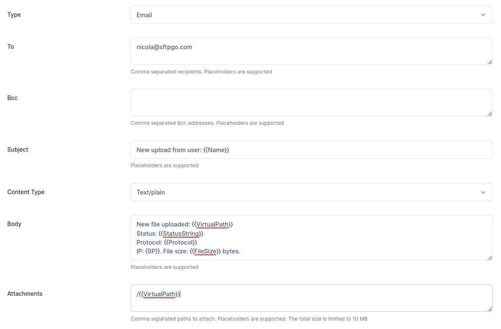
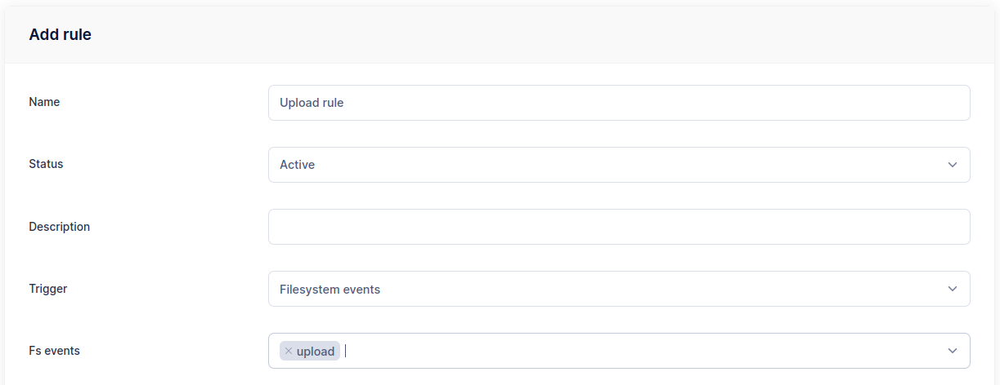
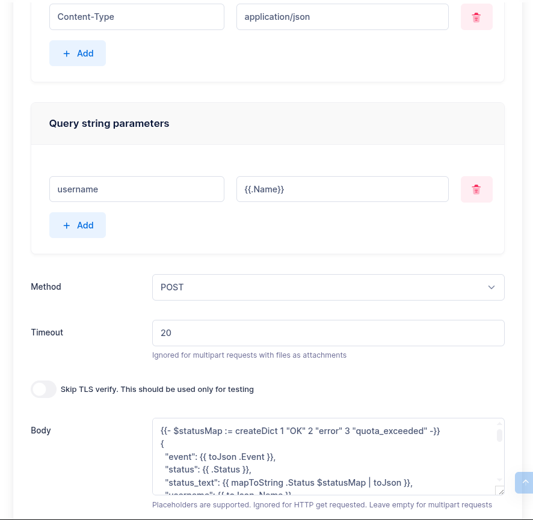

# Upload Notifications and Webhooks

This tutorial covers two common notification use cases:

1. Receiving an **email notification** after each upload.
2. Sending detailed event data to an **external webhook** (HTTP POST) with a custom JSON body.

## Email Notifications

### Step 1: Create an Email Action

From the WebAdmin, expand the **Event Manager** section, select **Event actions** and add a new action.
Create an action named `upload notification`, set the type to `Email` and fill the recipient/s.

Configure the email fields using placeholders to include dynamic event data:

- **Subject**: `Upload notification: {{.ObjectName}}`
- **Body**:

```shell
User {{.Name}} uploaded a file via {{.Protocol}} from {{.IP}}.

File: {{.VirtualPath}}
Size: {{humanizeBytes .FileSize}}
Time: {{.Timestamp.UTC.Format "2006-01-02 15:04:05"}} UTC
Duration: {{.Elapsed}} ms
{{- if .Errors}}
Errors: {{stringJoin .Errors ", "}}
{{- end}}
```

Key placeholders used:

- `{{.ObjectName}}` — the file name (e.g., `report.csv`)
- `{{.Name}}` — the username who performed the upload
- `{{.VirtualPath}}` — the full virtual path (e.g., `/inbound/report.csv`)
- `{{.Protocol}}` — the protocol used (`SFTP`, `FTP`, `HTTP`, `WebDAV`)
- `{{.IP}}` — the client IP address
- `{{humanizeBytes .FileSize}}` — the file size in human-readable format (e.g., `1.5 MB`)
- `{{.Timestamp}}` — the event time, with formatting methods like `.Format`, `.UTC`, `.Unix`
- `{{.Elapsed}}` — the transfer duration in milliseconds

See the [Placeholders & Templates](../placeholders.md) reference for the complete list.

{data-gallery="upload-notification"}

### File Attachments

You can attach the uploaded file to the notification email. In the **Attachments** field, add:

```shell
/{{.VirtualPath}}
```

The path is resolved through the user's virtual filesystem, so it works with all storage backends (local, S3, Azure, GCS, etc.).

:warning: SFTPGo allows a maximum total attachment size of 10 MB. The action will fail for files exceeding this limit. If you need to handle large files, consider using a webhook instead and including a download link.

### Step 2: Create an Upload Rule

Now select **Event rules** and create a rule named `Upload rule`, select `Filesystem events` as trigger and `upload` as filesystem event.
You can also filter events based on protocol, user and group name, filepath shell-like patterns, file size. We omit these additional filters for simplicity.

{data-gallery="upload-rule"}

As actions, select `upload notification`.

Done! Try uploading a new file and you will receive the configured email notification.

## Webhook Integration

HTTP actions let you send structured event data to external systems — monitoring platforms, SIEM tools, custom applications, or automation pipelines. You have full control over the request body using Go templates.

### Step 1: Create an HTTP Action

From the WebAdmin, create a new action named `upload webhook`, set the type to `HTTP`.

Configure the following:

- **URL**: Your webhook endpoint (e.g., `https://api.example.com/sftpgo/events`).
- **Method**: POST (GET, PUT, and DELETE are also supported).
- **Headers**: Add custom headers for authentication or content type. For example, `Content-Type: application/json` and `Authorization: Bearer <token>`. Header values support placeholders — e.g., you can use `{{.Name}}` in a header value.
- **Query parameters**: Add key-value pairs appended to the URL. Values support placeholders — e.g., key `username`, value `{{.Name}}`. Useful for endpoints that expect parameters in the query string rather than the body.
- **Timeout**: Maximum time to wait for a response (in seconds). Defaults to 15 seconds if not set.

In the **Body** field, enter a JSON template. The following example includes most available fields for an upload event:

```json
{{- $statusMap := createDict 1 "OK" 2 "error" 3 "quota_exceeded" -}}
{
  "event": {{ toJson .Event }},
  "status": {{ .Status }},
  "status_text": {{ mapToString .Status $statusMap | toJson }},
  "username": {{ toJson .Name }},
  "role": {{ toJson .Role }},
  "email": {{ toJson .Email }},
  "protocol": {{ toJson .Protocol }},
  "ip_address": {{ toJson .IP }},
  "uid": {{ toJson .UID }},
  "virtual_path": {{ toJson .VirtualPath }},
  "fs_path": {{ toJson .FsPath }},
  "file_name": {{ toJson .ObjectName }},
  "file_size": {{ .FileSize }},
  "file_size_human": {{ humanizeBytes .FileSize | toJson }},
  "elapsed_ms": {{ .Elapsed }},
  "timestamp": "{{ .Timestamp.UTC.Format "2006-01-02T15:04:05Z" }}",
  "errors": {{ toJson .Errors }},
  "metadata": {{ toJson .Metadata }}
}
```

{data-gallery="webhook-action"}

### Template Notes

- **`createDict` + `mapToString`**: Maps the integer status code to a human-readable label.
- **`toJson`**: Safely encodes strings (with quoting and escaping) and other types. Always use `toJson` for string values to handle special characters.
- **`humanizeBytes`**: Converts byte counts to human-readable format (e.g., `10 KB`, `1.5 MB`).
- **`{{.Metadata}}`**: Cloud storage metadata (key/value pairs). Empty for local filesystem.
- **`{{- ... -}}`**: The dash trims surrounding whitespace, keeping the output clean.

### Step 2: Create an Upload Rule

Create a rule with `Filesystem events` as trigger and `upload` as event. Select the `upload webhook` action.

:information_source: For rename and copy events, additional fields are available: `{{.VirtualTargetPath}}` and `{{.FsTargetPath}}` contain the destination paths.

### Multipart Requests with File Attachments

For endpoints that accept file uploads, you can configure the HTTP action as **multipart**. Add parts for the JSON metadata and the uploaded file:

- **Part 1**: Name `metadata`, Body with the JSON template above.
- **Part 2**: Name `file`, File path `/{{.VirtualPath}}`.

This allows you to send both the event data and the file content in a single request.

### Chat platform integrations (Slack, Teams, Discord, Google Chat, Mattermost)

Most chat platforms expose an "incoming webhook" URL that accepts a single HTTP POST with a JSON body. SFTPGo works with all of them — only the body template changes. In every case the HTTP action is configured with method `POST`, header `Content-Type: application/json`, and a timeout of 20 seconds is usually enough.

#### The universal minimum: `{"text": "..."}`

A one-line JSON body with a `text` field is the most portable form and the first thing to try. It works on:

- **Slack** (classic incoming webhooks)
- **Microsoft Teams** (classic Incoming Webhook connectors — the most common Teams setup)
- **Mattermost** (Slack-compatible webhooks)
- **Google Chat** (incoming webhooks)

It does **not** work on:

- **Discord** — uses `{"content": "..."}` instead of `{"text": "..."}`.
- **Teams Workflow / Power Automate webhooks** — require the Adaptive Card format.

Minimal body that covers all four compatible platforms at once:

```
{"text": {{printf "User %s uploaded %s (%s) via %s from %s" .Name .VirtualPath (humanizeBytes .FileSize) .Protocol .IP | toJson}}}
```

Every user-controlled value (`{{.Name}}`, `{{.VirtualPath}}`, `{{.IP}}`, `{{.Errors}}`) goes through `toJson` or `toJsonUnquoted` to avoid breaking the JSON envelope on quotes, backslashes, or control characters. `{{humanizeBytes .FileSize}}` emits a plain string like `1.5 MiB` and can be dropped in unquoted.

#### Slack — Block Kit (richer layout)

```
{
  "blocks": [
    {
      "type": "section",
      "text": {
        "type": "mrkdwn",
        "text": {{printf "*%s* uploaded `%s` (%s) via %s from `%s`" .Name .VirtualPath (humanizeBytes .FileSize) .Protocol .IP | toJson}}
      }
    },
    {
      "type": "context",
      "elements": [
        {"type": "mrkdwn", "text": {{printf "Event UID: %s — %s" .UID (.Timestamp.UTC.Format "2006-01-02T15:04:05Z") | toJson}}}
      ]
    }
  ]
}
```

#### Microsoft Teams — MessageCard (classic webhook, richer layout)

Same endpoint as the simple text version (`https://<tenant>.webhook.office.com/webhookb2/...`), with a structured card instead of plain text.

```
{
  "@type": "MessageCard",
  "@context": "https://schema.org/extensions",
  "summary": {{printf "Upload by %s" .Name | toJson}},
  "themeColor": "0076D7",
  "title": "SFTPGo upload notification",
  "sections": [{
    "facts": [
      {"name": "User",    "value": {{toJson .Name}}},
      {"name": "File",    "value": {{toJson .VirtualPath}}},
      {"name": "Size",    "value": {{humanizeBytes .FileSize | toJson}}},
      {"name": "Protocol","value": {{toJson .Protocol}}},
      {"name": "IP",      "value": {{toJson .IP}}},
      {"name": "When",    "value": {{(.Timestamp.UTC.Format "2006-01-02 15:04:05 UTC") | toJson}}}
    ],
    "markdown": true
  }]
}
```

#### Microsoft Teams — Adaptive Card (Workflow / Power Automate webhook)

Teams webhooks created through Power Automate Workflows require the Adaptive Card schema. A plain `{"text": "..."}` or MessageCard body will be rejected. You can recognize this flavor by the endpoint URL — it usually lives under `*.logic.azure.com` or the newer Power Automate webhook format.

```
{
  "type": "message",
  "attachments": [{
    "contentType": "application/vnd.microsoft.card.adaptive",
    "content": {
      "$schema": "http://adaptivecards.io/schemas/adaptive-card.json",
      "type": "AdaptiveCard",
      "version": "1.4",
      "body": [
        {"type": "TextBlock", "size": "Medium", "weight": "Bolder", "text": "SFTPGo upload"},
        {"type": "FactSet", "facts": [
          {"title": "User",     "value": {{toJson .Name}}},
          {"title": "File",     "value": {{toJson .VirtualPath}}},
          {"title": "Size",     "value": {{humanizeBytes .FileSize | toJson}}},
          {"title": "Protocol", "value": {{toJson .Protocol}}},
          {"title": "IP",       "value": {{toJson .IP}}},
          {"title": "When",     "value": {{(.Timestamp.UTC.Format "2006-01-02 15:04:05 UTC") | toJson}}}
        ]}
      ]
    }
  }]
}
```

#### Discord — simple text

Discord uses `content`, not `text`. This is the one place where the universal `{"text": "..."}` body does not apply.

Endpoint form: `https://discord.com/api/webhooks/<webhook_id>/<token>`

```
{"content": {{printf "**%s** uploaded `%s` (%s) via %s" .Name .VirtualPath (humanizeBytes .FileSize) .Protocol | toJson}}}
```

#### Discord — embed (richer card)

```
{
  "embeds": [{
    "title": "SFTPGo upload",
    "color": 3447003,
    "fields": [
      {"name": "User",     "value": {{toJson .Name}},                    "inline": true},
      {"name": "Size",     "value": {{humanizeBytes .FileSize | toJson}},"inline": true},
      {"name": "Protocol", "value": {{toJson .Protocol}},                "inline": true},
      {"name": "File",     "value": {{toJson .VirtualPath}},             "inline": false}
    ],
    "timestamp": {{(.Timestamp.UTC.Format "2006-01-02T15:04:05Z") | toJson}}
  }]
}
```

#### Mattermost — identity override

Mattermost's built-in webhook is Slack-compatible, so the same `{"text": "..."}` body works out of the box. If you want to override the bot identity, add `username` and `icon_url`:

```
{
  "username": "SFTPGo",
  "icon_url": "https://sftpgo.com/favicon.png",
  "text": {{printf "**%s** uploaded `%s` (%s)" .Name .VirtualPath (humanizeBytes .FileSize) | toJson}}
}
```

### Synchronous vs Asynchronous Execution

By default, webhook actions are **asynchronous** — the upload completes immediately and the webhook fires in the background. If your endpoint needs to validate the upload and potentially reject it:

1. Enable **Execute sync** on the action in the rule.
2. If your webhook returns an HTTP error status (4xx or 5xx), the upload is rejected and the file is removed.

Be mindful of client timeouts — the client waits for the webhook to complete when running synchronously.

### Provider Events

Webhooks also work with **provider events** (user creation, update, deletion, etc.). For provider events, additional fields are available:

- `{{.Object.JSON}}`: The full provider object (user, admin, group, etc.) as JSON.
- `{{.Initiator.Admin.Email}}`: The admin who performed the action.
- `{{.ObjectType}}`: The type of object (`user`, `admin`, `group`, `folder`, `share`, etc.).

Example body for a provider event webhook:

```json
{
  "event": {{ toJson .Event }},
  "object_type": {{ toJson .ObjectType }},
  "object_name": {{ toJson .ObjectName }},
  "object": {{ .Object.JSON }},
  {{- if .Initiator.Admin }}
  "admin": {{ toJson .Initiator.Admin.Email }},
  {{- end }}
  "timestamp": "{{ .Timestamp.UTC.Format "2006-01-02T15:04:05Z" }}"
}
```
