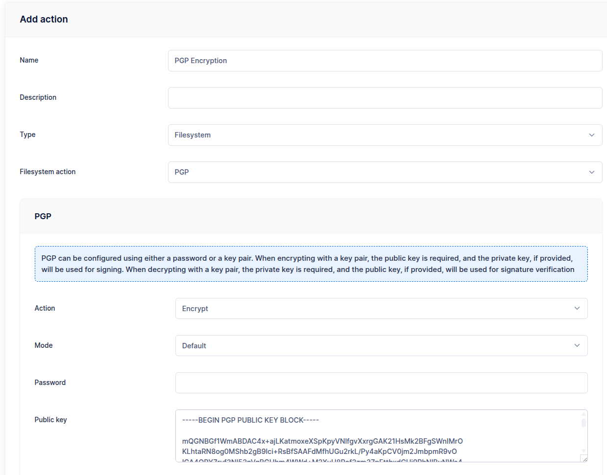
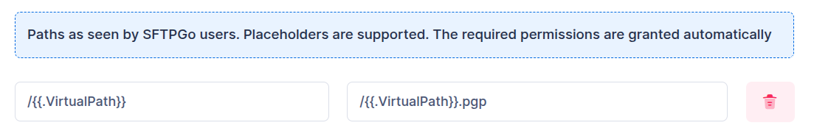
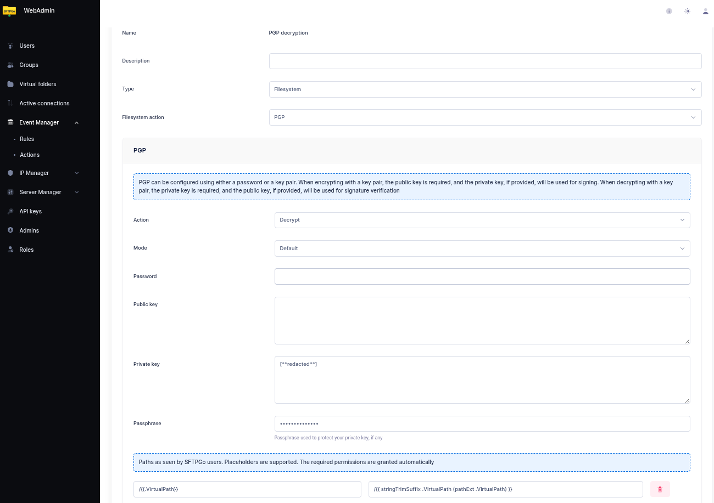

# PGP Encryption and Decryption

PGP is a widely adopted encryption standard that ensures data confidentiality and integrity. By using PGP actions in the Event Manager, you can automatically encrypt or decrypt files immediately after upload. This supports secure, automated workflows for both sending and receiving files.

## Common Use Cases

- **Encrypting files for an external party**: The external party generates a PGP key pair and shares their public key. SFTPGo is configured to automatically encrypt uploaded files using the public key. The trading partner downloads the files and decrypts them using their private key.
- **Decrypting files from an external party**: You share your public key with the external party and ask them to encrypt files before uploading. SFTPGo automatically decrypts the files after upload using your private key. The files are then available in plain form for further processing.

This setup ensures end-to-end file security with minimal manual intervention.

## Key Requirements

PGP actions require either a password or a key pair. When using a key pair:

- For **encryption**, the public key is required. If a private key is also provided, it is used for signing.
- For **decryption**, the private key is required. If a public key is also provided, it is used for signature verification.

## Example: Automatic Encryption After Upload

This example demonstrates how to configure an action to automatically encrypt files after upload.

### Step 1: Create a PGP Encryption Action

From the WebAdmin, expand the **Event Manager** section, select **Event actions** and add a new action. Create an action named `PGP encryption`, set the type to `Filesystem`, the Filesystem action to `PGP` and paste the Public Key.

{data-gallery="pgp-enc"}

Configure the paths:

- Source path: `/{{.VirtualPath}}`
- Target path: `/{{.VirtualPath}}.pgp`

For example, a file named `file.txt` will be encrypted and stored as `file.txt.pgp`.

{data-gallery="pgp-enc"}

### Step 2: Create an Upload Rule

Define a rule that executes this action after uploads. Select `Filesystem events` as trigger and `upload` as event.

Additional actions can be configured as part of the rule, such as deleting the original plain text file upon successful encryption and/or sending an email notification.

## Example: Automatic Decryption After Upload

This example shows how to automatically decrypt PGP-encrypted files upon upload, making the plaintext version available for further processing.

### Step 1: Create a PGP Decryption Action

From the WebAdmin, create a new action named `PGP decryption`, set the type to `Filesystem`, the Filesystem action to `PGP` and select the `Decrypt` option. Paste the Private Key (and optionally the Public Key for signature verification).

Configure the paths:

- Source path: `/{{.VirtualPath}}`
- Target path: `/{{ stringTrimSuffix .VirtualPath (pathExt .VirtualPath) }}`

For example, a file named `report.csv.pgp` will be decrypted and stored as `report.csv`. The `pathExt` helper extracts the file extension (`.pgp`) and `stringTrimSuffix` removes it. This approach works with any extension, not just `.pgp`.

{data-gallery="pgp-dec"}

### Step 2: Create an Upload Rule

Define a rule that executes this action after uploads. Select `Filesystem events` as trigger and `upload` as event.

You can add a path filter such as `*.pgp` to ensure the action only runs on encrypted files.

Optionally, add a second action to delete the original `.pgp` file after successful decryption, keeping only the plaintext version.
