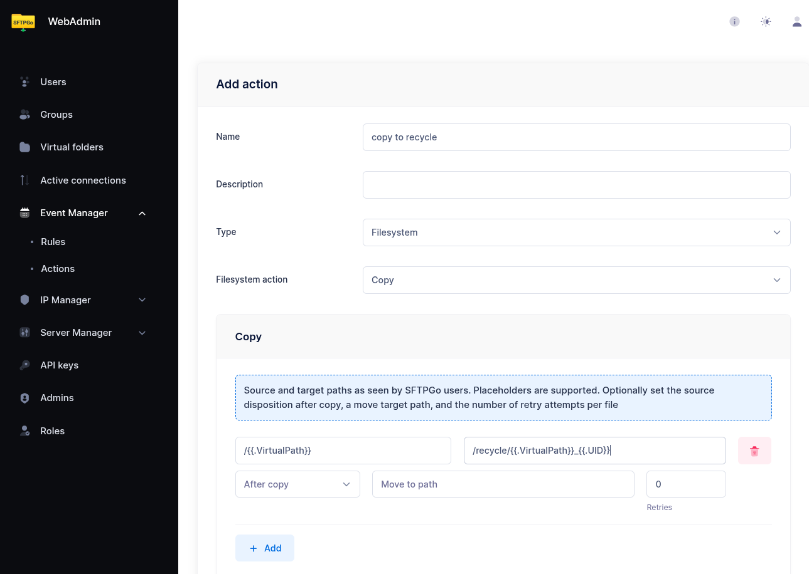
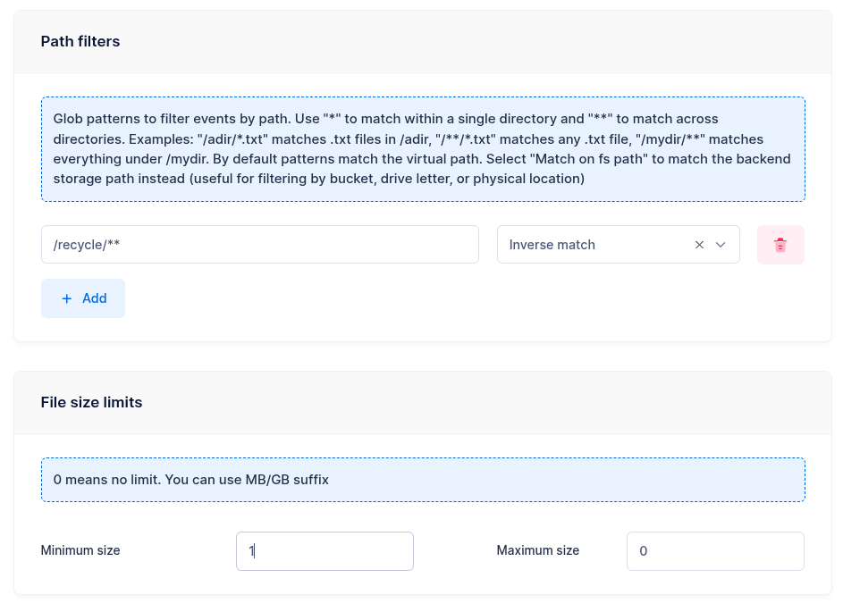
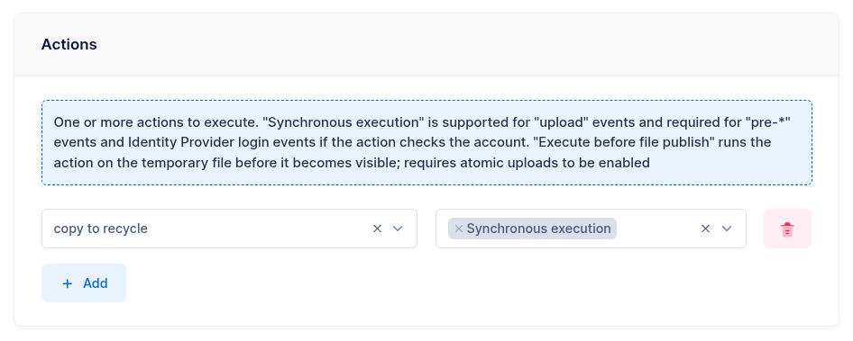
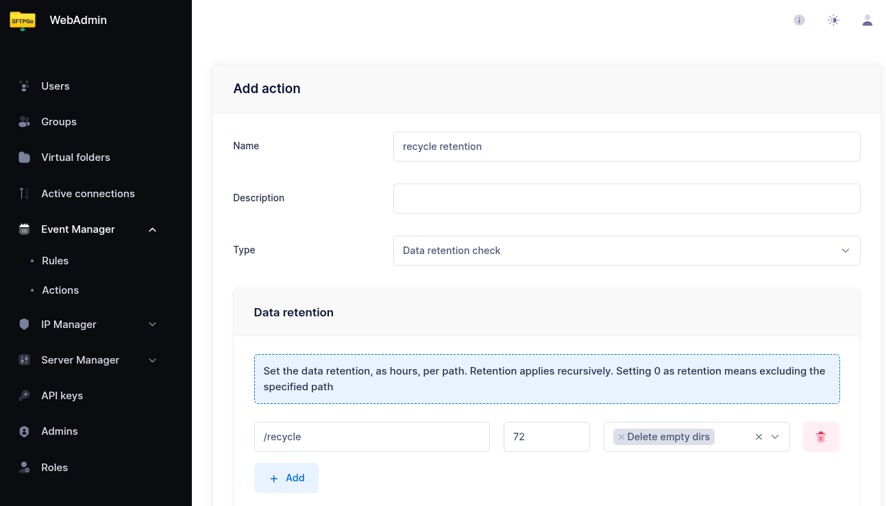

# Recycle Bin

This tutorial shows how to configure a Recycle Bin, where files are copied to a separate folder before being overwritten or deleted. An automatic retention policy cleans up the recycle folder periodically.

This approach uses two rules:

1. A **pre-upload / pre-delete** rule that copies the file to `/recycle` before the operation proceeds.
2. A **scheduled** rule that cleans up files older than a configurable threshold from `/recycle`.

## Step 1: Create a Copy to Recycle Action

From the WebAdmin, expand the **Event Manager** section, select **Event actions** and add a new action.

Create an action named `copy to recycle`, set the type to `Filesystem`, and choose `Copy` as the filesystem action.

Add a copy entry:

- **Source**: `/{{.VirtualPath}}`
- **Target**: `/recycle/{{.VirtualPath}}_{{.UID}}`

The `{{.UID}}` placeholder appends a unique event identifier to the filename, ensuring that multiple versions of the same file do not overwrite each other in the recycle folder. For example, deleting `/reports/q1.csv` produces a recycle copy named `/recycle/reports/q1.csv_<unique-id>`.

{data-gallery="recycle-copy-action"}

## Step 2: Create a Pre-Upload / Pre-Delete Rule

Now select **Event rules** and create a rule named `copy_to_recycle`.

- **Trigger**: Filesystem events
- **Events**: `pre-upload`, `pre-delete`

The rule triggers *before* the upload or delete operation, so the current version of the file is still available to be copied.

### Conditions

Add a path filter to exclude the recycle folder itself — otherwise, deleting files from the recycle folder would trigger another copy, creating an infinite loop:

- **Pattern**: `/recycle/**`
- **Inverse match**: enabled

This means "match all paths *except* those under `/recycle/`".

Set a **minimum file size** filter to `1` byte. This serves two purposes: it skips empty files on delete, and — more importantly — it detects overwrites on `pre-upload`. When a user uploads a file that already exists, the `pre-upload` event fires with the size of the *existing* file. A minimum size of 1 ensures the rule only triggers when there is an existing file to preserve (size > 0), so new uploads to a path that doesn't exist yet are not affected.

{data-gallery="recycle-rule-conditions"}

### Actions

Select the `copy to recycle` action and enable **Execute sync**.

:warning: **Synchronous execution is required.** The copy must complete before the upload or delete operation proceeds. Without "Execute sync", the original file might be overwritten or deleted before the copy finishes.

{data-gallery="recycle-rule-actions"}

## Step 3: Create a Retention Policy for the Recycle Folder

To prevent the recycle folder from growing indefinitely, create a scheduled rule that automatically deletes old files.

### Create a Retention Action

Create a new action named `recycle retention`, set the type to `Data retention check`.

Add a retention policy:

| Path | Retention (hours) | Delete empty dirs |
| ------ | ------------------- | ------------------- |
| `/recycle` | 72 | Yes |

This deletes files older than 72 hours (3 days) from the `/recycle` folder and removes any empty subdirectories left behind.

{data-gallery="recycle-retention-action"}

### Create a Scheduled Rule

Create a rule named `recycle_retention`:

- **Trigger**: Schedule
- **Schedule**: Daily at 01:00 UTC (hour `1`, day of week `*`)
- **Actions**: `recycle retention`

## How It Works in Practice

1. A user deletes `/reports/q1.csv`.
2. The `pre-delete` rule fires and synchronously copies the file to `/recycle/reports/q1.csv_<unique-id>`.
3. The delete operation proceeds — `/reports/q1.csv` is removed.
4. The file remains in `/recycle` for 72 hours.
5. The nightly retention job cleans up files older than 72 hours.

The same flow applies to uploads that overwrite existing files — the `pre-upload` trigger saves the current version before it is replaced.
