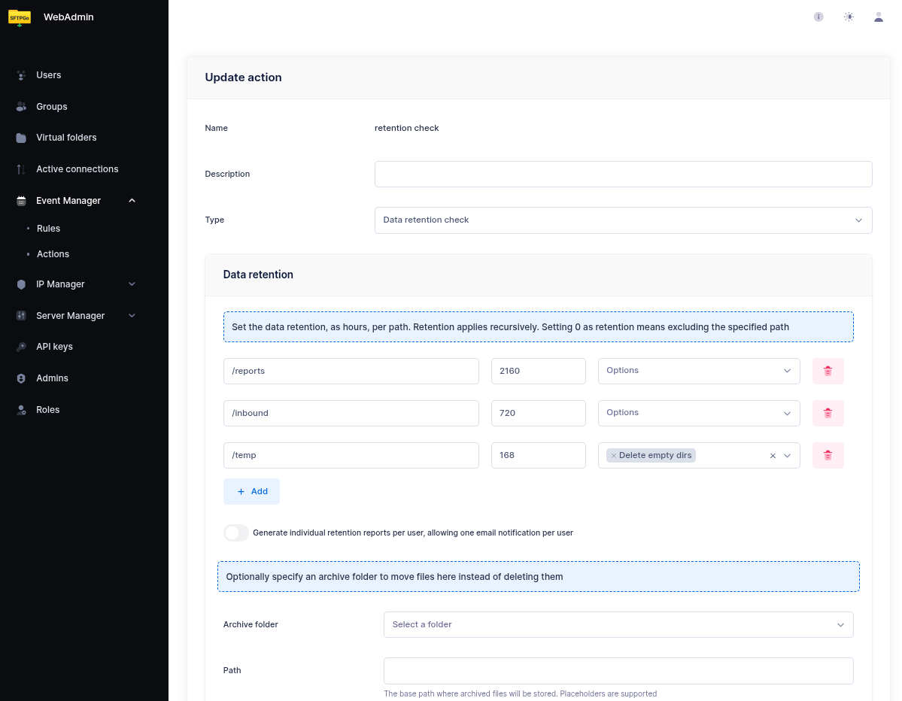
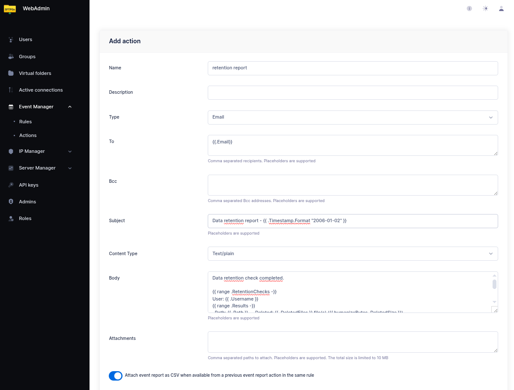
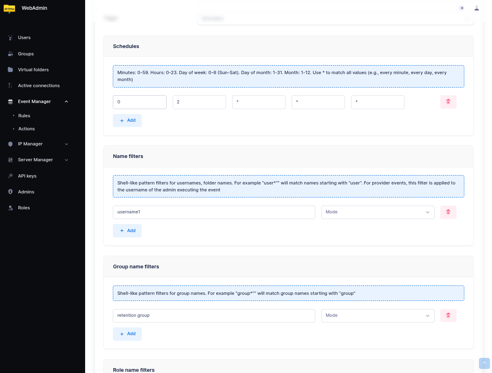
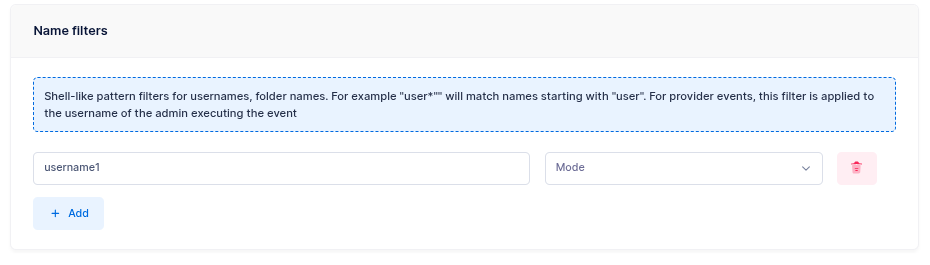
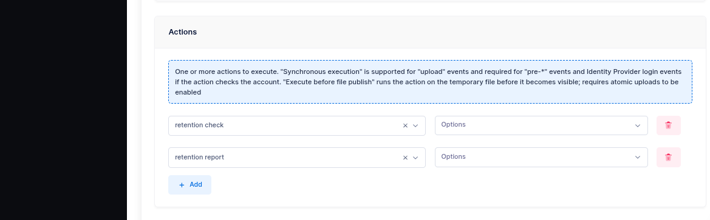

# Data Retention

This tutorial shows how to configure automatic data retention policies that delete or archive files older than a configurable threshold. This is a common compliance and storage management requirement.

## How It Works

The **Data retention check** action scans user directories and applies per-folder retention policies. Files older than the configured threshold are automatically removed or moved to an archive folder. The action generates a report that can be sent via email or webhook.

## Step 1: Create a Data Retention Action

From the WebAdmin, expand the **Event Manager** section, select **Event actions** and add a new action.

Create an action named `retention check`, set the type to `Data retention check`.

Configure the retention policies — each entry defines a virtual path and a retention period in hours:

| Path | Retention (hours) | Description |
| ------ | ------------------- | ------------- |
| `/inbound` | 720 | Delete files older than 30 days |
| `/temp` | 168 | Delete files older than 7 days |
| `/reports` | 2160 | Delete files older than 90 days |

{data-gallery="retention-action"}

:warning: **Paths are literal — no wildcards, no placeholders.** A path like `/inbound/*` is *not* a pattern: it looks for a directory literally named `*` inside `/inbound/` and finds nothing. To clean the contents of `/inbound`, just set the path to `/inbound`. The configured folder itself is always preserved — only its contents older than the retention period are removed. Sub-directories that become empty after cleanup can be removed too by enabling **Delete empty directories** on the entry.

If you need different retention paths for different groups of users, create one rule per group — each rule has its own action and its own user filter.

### Archive Instead of Delete

If you prefer to archive files instead of deleting them, specify an **archive folder**. Files are moved to the virtual folder instead of being permanently removed. This is useful for compliance scenarios where you need to keep files accessible but outside the user's working directories.

The archive folder must be a virtual folder configured in SFTPGo — it can use any storage backend. For example, you could archive to a cheaper storage tier (e.g., S3 Glacier via lifecycle policies) while keeping the user's primary storage on standard S3.

## Step 2 (optional): Add a notification

The rule is already usable with just the retention check created above — SFTPGo will run the cleanup on schedule and log the results. A notification is only needed if you want to be actively informed. If you don't need one, skip ahead to [Step 3](#step-3-create-a-scheduled-rule).

Two notification channels are available: **email** and **HTTP webhook**. Pick the one that fits your workflow; you can also chain both on the same rule.

### Option A — email notification

Create an email action (for example named `retention report`). A minimal configuration is enough:

- **Recipients** — one or more email addresses.
- **Subject** — any text, e.g. `Data retention report — {{ .Timestamp.Format "2006-01-02" }}`.
- **Body** — any text. A fixed string like `Data retention check completed. The detailed report is attached.` works perfectly.
- **Attachments** — add `{{.RetentionReports}}` to attach the full detailed results as a compressed CSV archive.

The body is free-form and can be as simple or as elaborate as you like. If you prefer to see the summary inline in the email itself, the template below iterates over the checks and prints one line per folder:

```text
Data retention check completed.

{{ range .RetentionChecks -}}
User: {{ .Username }}
{{ range .Results -}}
  Path: {{ .Path }} — Deleted: {{ .DeletedFiles }} file(s) ({{ humanizeBytes .DeletedSize }})
  {{- if .Error }} — Error: {{ .Error }}{{ end }}
{{ end }}
{{ end -}}

{{ if .Errors }}Errors: {{ stringJoin .Errors ", " }}{{ end }}
```

This is shown here as an example of what is possible — do not feel obliged to reproduce it. A one-line body plus the attached report is an equally valid and common choice.

{data-gallery="retention-email"}

#### Per-user notifications

If you want each user to receive their own retention report instead of a single aggregated email, enable **Split events** on the rule. In split mode:

- `{{.Email}}` is automatically set to the user's email address.
- `{{.ObjectName}}` is set to the username.
- The rule fires once per user, so each user receives only their own report.

Set the email recipients to `{{ stringJoin .Email "," }}` to automatically use the user's configured email address.

### Option B — HTTP webhook

Create an HTTP action (for example named `retention webhook`) to POST the result to an external system. This is often a better fit than email when the consumer is a monitoring tool, a chat bot, or an internal service:

- **Endpoint** — the target URL (e.g. `https://example.com/sftpgo/retention`).
- **Method** — `POST` (also `GET`, `PUT`, `DELETE` are supported if your endpoint needs them).
- **Headers** — optional; add `Authorization`, `Content-Type`, or whatever your endpoint expects.
- **Body** — set to `{{.RetentionReports}}` to send the compressed CSV archive as the raw request body. The receiving endpoint gets the same `.zip` payload that would otherwise be attached to the email.

#### Sending the results as JSON

If the receiving endpoint prefers a structured JSON payload over the zip archive, set the Body to `{{toJson .RetentionChecks}}` — the `toJson` helper serializes the retention results to JSON. Remember to add a `Content-Type: application/json` header (SFTPGo sets the content type only for multipart bodies; for a plain body it sends whatever header you configure).

A minimal JSON webhook action:

- **Method** — `POST`
- **Endpoint** — `https://example.com/sftpgo/retention`
- **Headers** — `Content-Type: application/json`
- **Body** — `{{toJson .RetentionChecks}}`

The endpoint receives an array, one element per user that was processed:

```json
[
  {
    "username": "userA",
    "email": ["userA@example.com"],
    "action_name": "retention check",
    "type": 0,
    "results": [
      {
        "path": "/inbound",
        "retention": 720,
        "deleted_files": 3,
        "deleted_size": 1048576,
        "elapsed": 125000000
      }
    ]
  }
]
```

Field notes: `type` is `0` for delete and `1` for archive; `retention` is in hours; `deleted_size` is in bytes; `elapsed` is a Go duration in nanoseconds; `error` and `info` are optional per-folder fields and appear only when present.

## Step 3: Create a Scheduled Rule

Now select **Event rules** and create a rule named `Daily retention check`.

- Set **Schedule** as the trigger.
- Configure the schedule — for example, every day at 02:00 UTC: hours `2`, day of week `*`.

{data-gallery="retention-schedule"}

### Scoping the Rule

:warning: **Paths go in the action, not in the rule.** The paths to clean are configured inside the `Data retention check` action. The rule's `Name / Group / Role` filters select the **users** for which the action runs — they are **not** filters on file paths. Putting a path pattern like `/folder/*` under Name Filters makes the rule match zero users: it still fires on schedule, runs against nobody, and the notification email reports no deletions.

Retention actions run in the **user context**: the path configured on the action is resolved relative to each matching user's home directory. For example, with a retention path of `/inbound`:

- On Linux: `userA` (home `/sftpgo/userA`) → cleans `/sftpgo/userA/inbound`; `userB` (home `/sftpgo/userB`) → cleans `/sftpgo/userB/inbound`.
- On Windows: `userA` (home `C:\sftpgo\userA`) → cleans `C:\sftpgo\userA\inbound`; `userB` (home `C:\sftpgo\userB`) → cleans `C:\sftpgo\userB\inbound`.

The path on the action is always written in virtual form with forward slashes (`/inbound`) regardless of the underlying platform — SFTPGo resolves it against each user's filesystem.

If you want the retention check to run only for specific users or groups, add conditions in the rule:

- **Name filters**: Specify usernames or patterns (e.g., `username1` or `customer_*`).
- **Group filters**: Specify group names.
- **Role filters**: Specify roles.

If no filters are configured, the retention check runs for **all users**.

When the same rule needs to apply to many users (e.g., all customers, all vendors), assigning those users to an SFTPGo **group** and filtering the rule by group is usually cleaner than maintaining a list of usernames or a wildcard pattern: new users inherit the policy automatically as soon as they join the group, and removing a user from the group takes them out of the rule with no rule edit.

On instances with many users, prefer exact values (usernames, group names, or role names) over wildcard patterns — see [Name, group, and role filters](../eventmanager.md#name-group-and-role-filters) for the reason.

{data-gallery="retention-rule-name-filter"}

:warning: If you have a user with visibility over the entire storage (e.g., an admin-level user with no key prefix restriction), be careful:

- **To avoid unintended deletions**: exclude that user using a name filter, or restrict the rule to specific users. Otherwise, the retention check running for that user could delete files belonging to other users.
- **To apply retention across the entire storage**: restrict the rule to only that user using a name filter. This is useful when you want a single retention policy that cleans up all files older than a given threshold, regardless of which user uploaded them.

As actions, select `retention check` — this is the only action strictly required. If you created a notification in Step 2, add it to the list as well (email, webhook, or both). Notification actions can be marked as **Failure action** if you only want to be alerted when something goes wrong.

{data-gallery="retention-rule-actions"}

Done! SFTPGo will run the retention check daily and send you a report with the results.

## Note on File Modification Time

The retention check determines file age based on the **last modification time**. Be aware that clients can adjust this timestamp using the `chtimes` command (e.g., `touch -t` or SFTP `setstat`), which could cause files to be retained longer than expected — or deleted sooner.

If this is a concern, you have two options:

- **Remove the `chtimes` permission** from the affected users or groups, preventing them from modifying file timestamps entirely.
- **Silently ignore chtimes requests** by setting the following environment variable:

```shell
SFTPGO_COMMON__SETSTAT_MODE=1
```

With this setting, SFTPGo accepts `chtimes` requests without returning an error to the client, but does not actually change the file modification time. This avoids breaking clients that always send `chtimes` after an upload while ensuring that retention policies are based on the real upload time.
