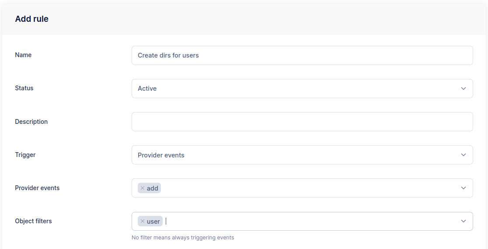

# Event Manager

The Event Manager enables administrators to automate server operations by configuring HTTP notifications, executing commands, sending email alerts, and more—based on server events or scheduled triggers.

At its core, the Event Manager consists of two main components: rules and actions.

- Rules define the conditions that determine when an action should be executed. Think of a rule as a "when this happens, and these conditions are met, then do that" type of logic.
- Actions are the tasks carried out when a rule is triggered. These actions can be dynamically customized using placeholders—variables that represent contextual data related to the event (such as file name, username, or file size). To further tailor these values, SFTPGo provides helper functions that format or transform placeholders directly within your templates. For a complete list of placeholders and helper functions, see the [documentation](../eventmanager.md).

Let's see some common use cases.

## Preliminary Note

We will use email actions in the following paragraphs, so let's assume you have a working SMTP configuration.
You can adapt the following snippet to configure an SMTP server using environment variables.

```shell
SFTPGO_SMTP__HOST="your smtp server host"
SFTPGO_SMTP__FROM="SFTPGo <sftpgo@example.com>"
SFTPGO_SMTP__USER=sftpgo@example.com
SFTPGO_SMTP__PASSWORD="your password"
SFTPGO_SMTP__AUTH_TYPE=1 # change based on what your server supports
SFTPGO_SMTP__ENCRYPTION=2 # change based on what your server supports
```

SFTPGo supports several placeholders for event actions. You can see all supported placeholders by clicking on the "info" icon at the top right of the add/update action page.

:information_source: The SMTP server can also be configured directly through the WebAdmin UI by navigating to Server Manager -> Configurations -> SMTP.

## Daily backups

You can schedule SFTPGo data backups (users, folders, groups, admins etc.) on a regular basis, such as daily.

From the WebAdmin expand the `Event Manager` section, select `Event actions` and add a new action.
Create an action named `backup` and set the type to `Backup`.

{data-gallery="backup"}

Create another action named `backup notification`, set the type to `Email` and fill the recipient/s.
As email subject set `Backup notification`.
As email body set `Backup done {{ stringJoin .Errors ", " }}`. The `stringJoin` function joins all error messages in the `.Errors` list using a comma and space as a separator. If no errors occurred, the resulting string will be empty.

{data-gallery="backup-notification"}

Now select `Event rules` and create a rule named `Daily backup`, select `Schedule` as trigger and schedule a backup at midnight UTC time.

{data-gallery="schedule"}

As actions select `backup` and `backup notification`.

{data-gallery="backup-actions"}

Done! SFTPGo will make a new backup every day and you will receive an email with the status of the backup. The backup will be saved on the server side in the configured backup directory. The backup files will have names like this `backup_<week day>_<hour>.json`.

## Automatically create a folder structure

Suppose you want to automatically create the folders `in` and `out` when you create new users.

From the WebAdmin expand the `Event Manager` section, select `Event actions` and add a new action.
Create an action named `create dirs`, with the settings you can see in the following screen.

{data-gallery="create-dir-action"}

Create another action named `create dirs failure notification`, set the type to `Email` and fill the recipient/s.
As email subject set `Unable to create dirs for user {{.ObjectName}}`.
As email body set `Errors: {{ stringJoin .Errors ", " }}`.

{data-gallery="create-dir-failure-action"}

Now select `Event rules` and create a rule named `Create dirs for users`, select `Provider event` as trigger, `add` as provider event and `user` as object filters.

{data-gallery="create-dir-rule"}

As actions select `create dirs` and `create dirs failure notification`, check `Is failure action` for the notification action.
This way you will only be notified by email if an error occurs.

{data-gallery="create-dir-rule-action"}

Done! Create a new user and check that the defined directories are automatically created.

## Upload notifications

Let's see how you can receive an email notification after each upload and, optionally, the uploaded file as well.

From the WebAdmin expand the `Event Manager` section, select `Event actions` and add a new action.
Create an action named `upload notification` with the settings you can see in the following screen.

{data-gallery="upload-notification"}

You can optionally add the uploaded file as an attachment but note that SFTPGo allows you to attach a maximum of 10MB. Then the action will fail for files bigger than 10MB.

Now select `Event rules` and create a rule named `Upload rule`, select `Filesystem events` as trigger and `upload` as filesystem event.
You can also filters events based on protocol, user and group name, filepath shell-like patterns, file size. We omit these additional filters for simplicity.

{data-gallery="upload-rule"}

As actions, select `upload notification`.
Done! Try uploading a new file and you will receive the configured email notification.

## Virtual folders integration

Using virtual folders with the EventManager unlocks powerful automation workflows, such as copying uploaded files to different storage locations—either within the same backend (but outside the user’s security context) or to an external server or cloud storage provider. These operations can be triggered by events like file uploads or scheduled tasks, and they require no custom scripting or complex setup.

Let’s explore a few example scenarios to see how this feature can be used in practice.

### Scenario 1

We have the following scenario.

- The user `ukg` has the key prefix set to `ukg/` so it can only access this folder.

{data-gallery="ukgfs"}

- The user `vista` has the key prefix set to `vista/` so it can only access this folder.

{data-gallery="vistafs"}

Each time the user `ukg` uploads files to the `/inbound` folder that:

- start with `vista_`, and
- end with `.csv`

we want to automatically copy those files to the `/outbound` folder of the user `vista`.

To achieve this, we need to define a copy action that runs after each upload. By default, actions are executed within the security context of the user who performed the upload. Since the user `ukg` is restricted to their own directory and cannot access the `vista` user's folder, this operation would normally be blocked.

To support this use case, we define a virtual folder with permissions to access the `vista` user’s directory. The copy action is then configured to use this virtual folder as the destination, allowing the operation to succeed outside the security context of the `ukg` user.

Create a folder named `storage` without setting a key prefix. This gives the folder visibility over the entire storage and allows it to be reused for other actions. Of course, if needed, you can also assign a key prefix to restrict access to a specific portion of the storage.

{data-gallery="storagefolder"}

In the EventManager section, create a new action of type `Filesystem` and choose `Copy` as the action type.
Set the source path to `/inbound/{{.ObjectName}}` and the target path to `/vista/outbound/{{.ObjectName}}`.
Finally, select `storage` as the target folder.

{data-gallery="copyaction"}

Explore the details:

- The source path is set to `/inbound/{{.ObjectName}}`. The placeholder `{{.ObjectName}}` is replaced with the file name—for example, if a file is uploaded to `/inbound/test.csv`, it becomes `test.csv`. Alternatively, you can use the more generic `{{.VirtualPath}}` placeholder, which would resolve to `/inbound/test.csv` in the same scenario.
- The target folder is set to `storage`, so the target path is relative to that folder.
- The target path is `/vista/outbound/{{.ObjectName}}`. This means that if the user `ukg` uploads the file `/inbound/test.csv`, it will be copied to `/vista/outbound/test.csv`.

:information_source: All paths are relative. For example, if the storage folder had a key prefix set to `vista/`, the correct target path would be `/outbound/{{.ObjectName}}` instead.

Finally, define a rule to execute this action after each upload.

Set `Filesystem events` as trigger and `upload` as event.

{data-gallery="upload-rule1"}

In the `Name filters` section, you can restrict which users the rule applies to. In this case, we specify `ukg`, but you can also define multiple users or patterns—for example, `user*` matches all usernames that start with `user`.

{data-gallery="upload-rule2"}

Similar filters can be applied based on groups or roles as well.

We also want to restrict the rule to files uploaded to the `/inbound` folder that start with `vista_` and end with `.csv`. To do this, configure the following path filters.

- `/inbound/vista_*`
- `/inbound/*.csv`

{data-gallery="upload-rule3"}

Keep in mind that paths are relative, not absolute.

Finally select the `copy` action and save the rule.

{data-gallery="upload-rule4"}

That's it! Now upload some test files to confirm everything works as expected. For example:

- Files uploaded outside of `/inbound` → the action will not be triggered.
- Files in `/inbound` with the correct prefix and extension → the action will be triggered.
- Files in `/inbound` with a .txt extension → the action will not be triggered.
- Files in a subdirectory like `/inbound/subdir`, even with the correct extension → the action will not be triggered, we haven't used the double asterisk syntax to match subdirectories.

### Scenario 2

Each time the user `vista` uploads files with `.csv` or `.xml` extensions to the `/inbound` folder, we want to automatically transfer these files to the `/push` directory on an external SFTP server.

This is very similar to the `Scenario 1`, we have to define a copy action and a target folder using the external SFTP server as storage backend.

Create a folder that is backed by the remote SFTP server.

{data-gallery="sftp-folder"}

This time, we've set the SFTP root directory to `/push`, which restricts the folder's access to that directory. As a result, the target paths defined in the copy action are relative to `/push`.

For the action configuration:

- Set the source path to `/{{.VirtualPath}}`.
- Set the target path to `/{{.ObjectName}}`. Since the SFTP folder uses `/push` as its root directory, this path is relative to `/push`.

{data-gallery="sftp-copy"}

:information_source: The `push` folder must already exist on the remote SFTP server for the action to succeed.

For the rule:

- we use `vista` as name filter so that the action will be executed only for this user
- `/inbound/*.csv` and `/inbound/*.xml` as path filters to limit the execution to these file extension
- select `sftp copy` as the action.

That's it! Now upload some test files to confirm everything works as expected.

## Recycle Bin

Let's see how we can configure a Recycle Bin style function where files are not deleted strait away, but instead moved to a separate folder.

To easily apply the Recycle Bin to multiple users we will create a virtual folder and a group, this way all users who belong to the group will have a Recycle Bin.

Create a virtual folder named `recycle` with the settings you can see in the following screen.

{data-gallery="recycle-folder"}

Create a group named `recycle` with the settings you can see in the following screen.

{data-gallery="recycle-group"}

Make your users members of the `recycle` group.

From the WebAdmin expand the `Event Manager` section, select `Event actions` and add a new action.
Create an action named `move to recycle` with the settings you can see in the following screen.

{data-gallery="recycle-move-action"}

Now select `Event rules` and create a rule named `Recycle rule`, select `Filesystem events` as trigger, `pre-delete` as filesystem event and exclude the `/recycle` path.

{data-gallery="recycle-rule"}

{data-gallery="recycle-rule-path"}

As actions, select `move to recycle` and set `Execute sync`.

Done! Try deleting a file, it will be moved to the Recycle Bin.

You can also add a scheduled event rule to automatically delete files older than a configurable time from the `/recycle` folder.
