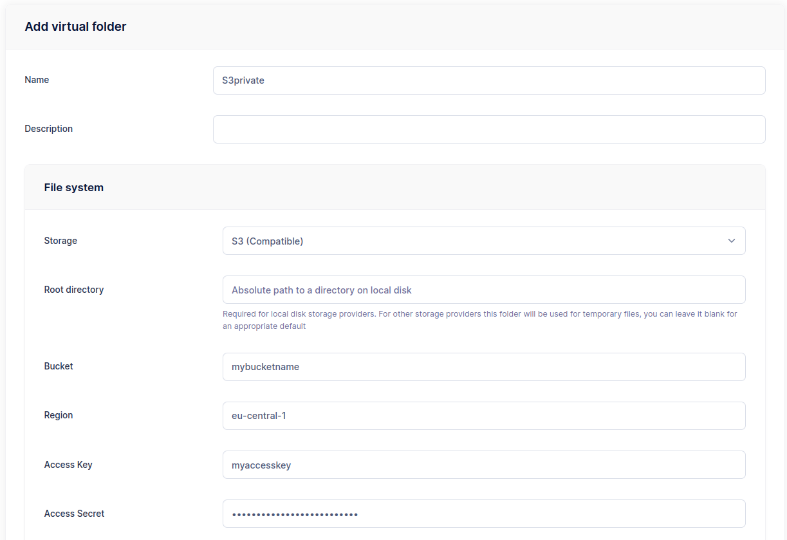
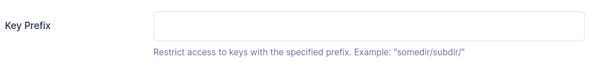
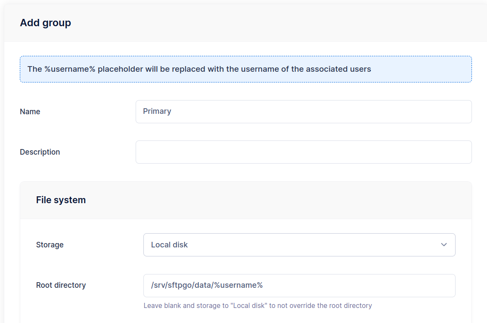
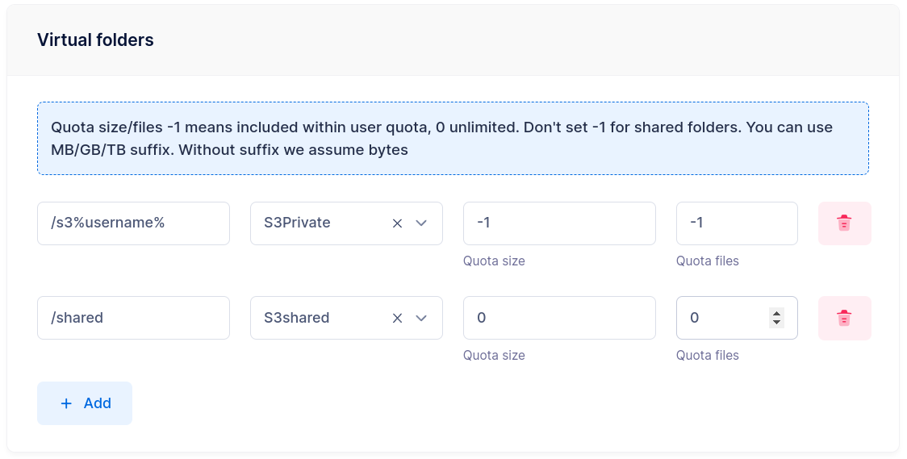
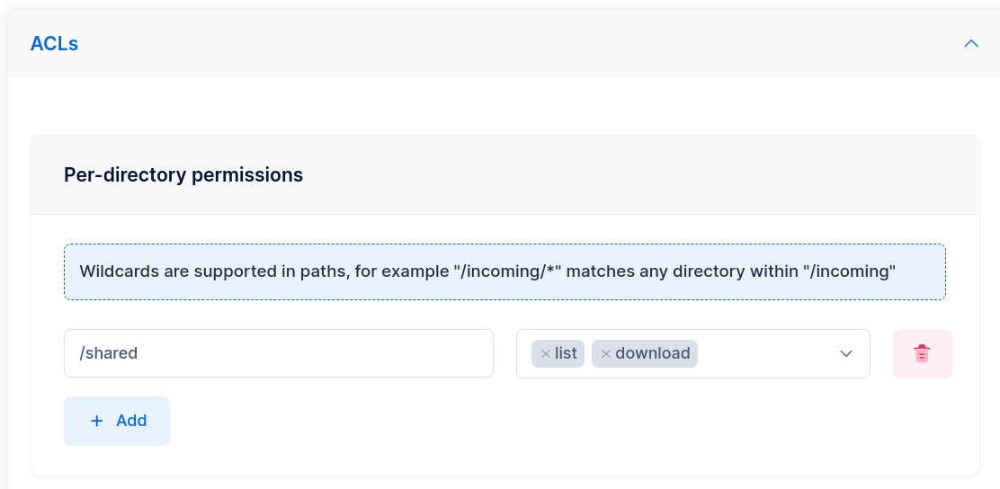
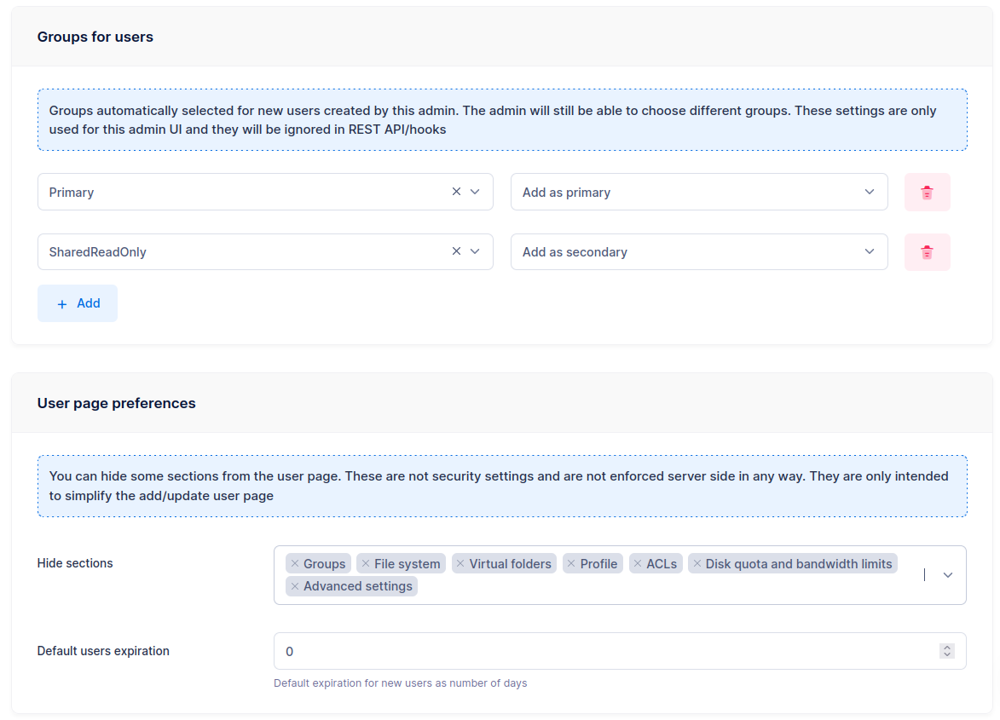
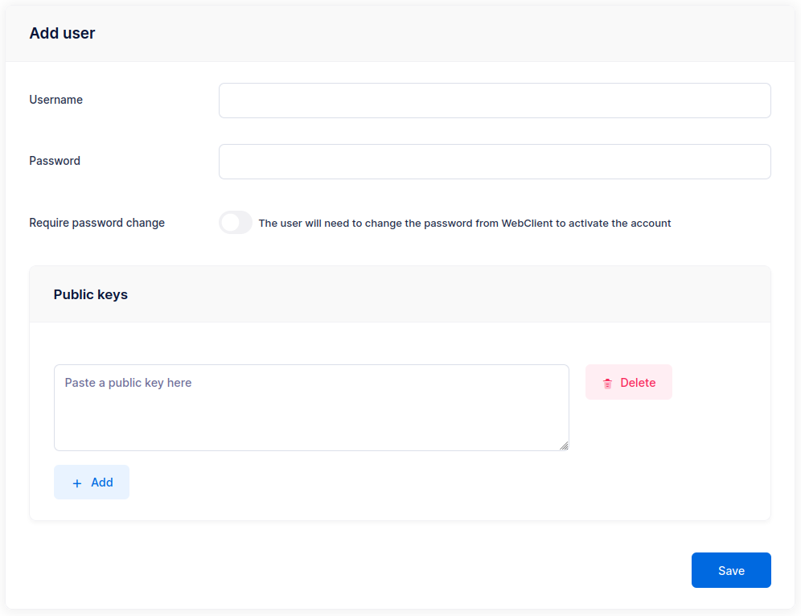

# Groups and Simplified User Management

This tutorial demonstrates how to use [groups](../groups.md) to manage common settings for multiple users and how to simplify the user creation page for delegated administrators.

## Goal

Suppose you have the following requirements:

- Each user must be restricted to a local home directory at `/srv/sftpgo/data/<username>`.
- The maximum upload size for a single file must be limited to 1 GB.
- Each user must have an S3 virtual folder at `/s3<username>` — each user can only access their own prefix in the bucket.
- Each user must have an S3 virtual folder at `/shared` — this folder is shared among users.
- Some users have full access to `/shared`, others have read-only access.

We can meet all these requirements by defining two groups and two virtual folders.

## Step 1: Create the Virtual Folders

From the WebAdmin, navigate to **Folders** and click the `+` icon.

### Private S3 folder

Create a folder named `S3private`. Set the storage to **AWS S3 (Compatible)** and fill in the bucket name, region, and credentials.

The key setting is the **Key Prefix** — set it to `users/%username%/`.

{data-gallery="s3-private-folder"}
{data-gallery="s3-key-prefix"}

The `%username%` placeholder is replaced with the username of each user the folder is assigned to. This means every user gets their own isolated area within the same S3 bucket.

### Shared S3 folder

Create another folder named `S3shared` with the same S3 settings, but set the **Key Prefix** to `shared/`. No placeholder here — all users share the same path.

## Step 2: Create the Groups

### Primary group

Navigate to **Groups** and click the `+` icon. Create a group named `Primary`.

- **Home directory**: `/srv/sftpgo/data/%username%`
- **Virtual folders**: add both `S3private` and `S3shared`
- **Max file upload size**: 1 GB

{data-gallery="add-group"}
{data-gallery="primary-group-settings"}

As with the folder key prefix, `%username%` in the home directory is replaced with the actual username when the group is applied.

### Read-only group

Create a second group named `SharedReadOnly`. In the **ACLs** section, set read-only permissions on the `/shared` path (list and download only).

{data-gallery="read-only-share"}

## Step 3: Create Users

Now create your users. For each user:

- Set `Primary` as the **primary group**.
- For users who should have read-only access to `/shared`, also add `SharedReadOnly` as a **secondary group**.

The user inherits all settings from the primary group (home directory, virtual folders, upload limits). The secondary group overrides permissions on `/shared` to read-only.

Users who are not members of `SharedReadOnly` retain full access to `/shared` as defined in the primary group.

## Simplified User Management

The add/update user page has many configuration options, which can be overwhelming for administrators who only need to create basic accounts. You can simplify this by configuring an admin account with default groups and hidden UI sections.

### Configure a simplified admin

Navigate to **Admins** and create a new admin (or edit an existing one).

In the **Groups for users** section:

- Set `Primary` as the primary group.
- Set `SharedReadOnly` as a secondary group (if applicable).

In the **User page preferences** section, hide all the advanced sections.

{data-gallery="simplified-admin"}

### Result

When this admin logs in and creates a new user, they see a minimal form — just username and credentials. All other settings (home directory, storage, permissions, quotas) are automatically inherited from the assigned groups.

{data-gallery="simplified-user"}

This is especially useful for [delegated administration with roles](../roles.md), where restricted administrators manage users within their own scope.
