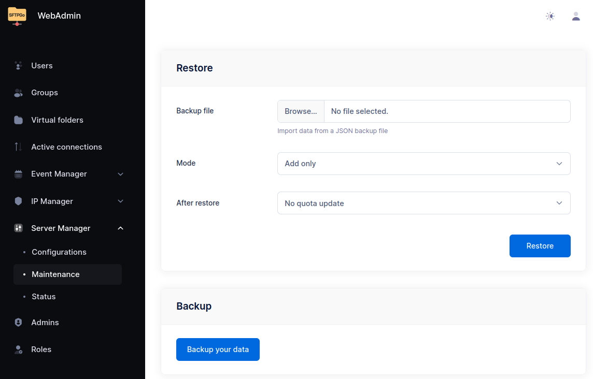

# Migrating from SFTPGo Open-Source to Enterprise Edition

Migration to the **SFTPGo Enterprise Edition** is supported starting from **open-source version 2.6.x**.
The Enterprise Edition updates the database schema, but it remains fully compatible with databases from open-source 2.6.x releases.

If you're using an earlier open-source version, you must first upgrade to **2.6.x** before migrating to the Enterprise Edition.

There are **two main migration paths**, depending on your preferences and environment setup:

## Option 1: In-Place Upgrade

If you're already running SFTPGo open-source (version 2.6.x or later), you can **upgrade directly** to the Enterprise Edition by installing the appropriate [Enterprise package](../installation.md) (e.g., yum or apt repositories, Windows installer) or by switching to the Enterprise Docker image.

## Option 2: Backup and Restore

Alternatively, you can choose to:

1. Install the Enterprise Edition in a new environment.
2. From the open-source instance, perform a data backup.
3. Restore the backup into the Enterprise instance using the WebAdmin UI.

This process can be completed from the "Maintenance" page in the WebAdmin interface.

{data-gallery="maintenance"}

After upgrading, you may need to migrate your existing actions to the new Event Manager format (see link above).

## Post-Upgrade

After upgrading, you may need to migrate your existing actions to the new Event Manager format.

For detailed instructions, refer to the documentation for action migration:
[Event Manager - Migration from previous versions or the open-source edition](../eventmanager.md#migration-from-previous-versions-or-the-open-source-edition)

## Notes

Both methods preserve your users, folders, groups and other configuration data.

However, when using **Option 2** (installing the Enterprise Edition in a new environment), keep in mind that the backup includes configuration data only: it **does not include files stored on disk**.

- If you are using the local filesystem as a storage backend, you must manually copy the user files to the new installation, ensuring they are placed in the same paths and have the correct ownership and permissions.
- If you are using a remote storage backend such as S3, Google Cloud Storage, Azure Blob, your files remain accessible without needing to move them, as the configuration will continue to point to the existing storage.

If you have any questions or encounter issues during the migration, feel free to contact our support team.
