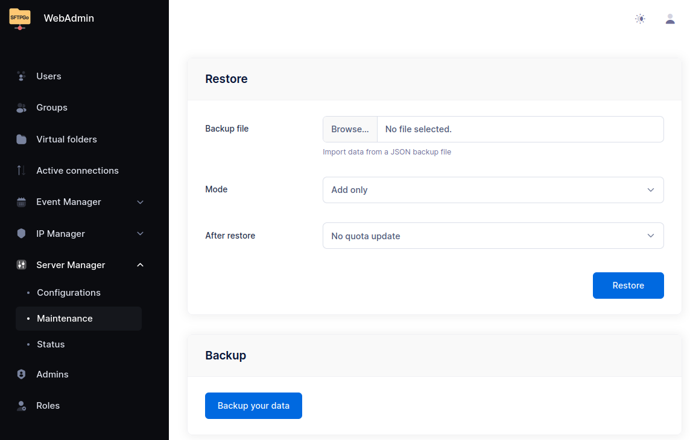

# Migrating from SFTPGo Open-Source to Enterprise Edition

Migration to the **SFTPGo Enterprise Edition** is supported starting from **open-source version 2.6.x or later**.
The Enterprise Edition updates the database schema, but it remains fully compatible with databases from open-source 2.6.x and later releases.

If you're using an earlier open-source version, you must first upgrade to **2.6.x or later** before migrating to the Enterprise Edition.

There are **two main migration paths**, depending on your preferences and environment setup:

## Option 1: In-Place Upgrade

If you're already running SFTPGo open-source (version 2.6.x or later) on Linux or Docker, you can **upgrade directly** to the Enterprise Edition by installing the appropriate [Enterprise package](../installation.md) (e.g., yum or apt repositories) or by switching to the Enterprise Docker image. The Enterprise package replaces the open-source one at the same paths, and on Docker your data lives on mounted volumes, so your data is preserved in both cases.

:warning: On **Windows** the Enterprise Edition installs alongside the open-source edition rather than replacing it, so the in-place upgrade does not apply. Follow one of the procedures described in [Migrating on Windows](#migrating-on-windows).

## Option 2: Backup and Restore

Alternatively, you can choose to:

1. Install the Enterprise Edition in a new environment.
2. From the open-source instance, perform a data backup.
3. Restore the backup into the Enterprise instance using the WebAdmin UI.

This process can be completed from the "Maintenance" page in the WebAdmin interface.

{data-gallery="maintenance"}

## Migrating on Windows

On Windows the Enterprise Edition installs in its own location, side by side with the open-source edition:

- Open-source: program files in `C:\Program Files\SFTPGo`, data in `C:\ProgramData\SFTPGo`
- Enterprise: program files in `C:\Program Files\SFTPGo Enterprise`, data in `C:\ProgramData\SFTPGo Enterprise`

The installer also leaves an existing "SFTPGo" Windows service unchanged, so that customizations such as the account the service runs under are preserved. As a result, after installing the Enterprise Edition next to an open-source instance the open-source service keeps running, and the Enterprise Edition stays idle until you migrate your data.

The migration follows three steps: back up the open-source installation, install the Enterprise Edition, then move your data into it. For the last step you choose how to transfer the data provider content (users, groups, folders, admins, …): copy the database file or restore a WebAdmin backup. **Copying the database is the simplest option on the same machine and preserves everything as-is**; the WebAdmin backup is mainly useful when moving to a different machine or changing the database backend.

### Step 1: Back up the open-source installation

Stop the open-source SFTPGo service, then make a copy of `C:\ProgramData\SFTPGo`. Everything you need is in this directory:

- `sftpgo.db` (and, if present, `sftpgo.db-shm` and `sftpgo.db-wal`): users, groups, folders and the rest of the data provider content
- `sftpgo.json` and the `env.d` directory: configuration
- `id_ecdsa`, `id_ed25519`, `id_rsa` and the matching `id_ecdsa.pub`, `id_ed25519.pub`, `id_rsa.pub`: SSH host keys

If you plan to transfer the data with a WebAdmin backup (Step 3), first start the open-source WebAdmin, open the **Maintenance** page and export a backup, then stop the service and copy the directory.

### Step 2: Install the Enterprise Edition

Uninstall the open-source Edition (and the Enterprise Edition, if you already installed it), then install the Enterprise Edition. Uninstalling does not remove the data in `C:\ProgramData`, so the backup from Step 1 is an extra safety net.

### Step 3: Move your data into the Enterprise Edition

First restore the SSH host keys and the configuration, which is the same for both methods. With the Enterprise SFTPGo service stopped:

- copy the SSH host keys from your backup into `C:\ProgramData\SFTPGo Enterprise`;
- copy the `env.d` directory from your backup;
- for `sftpgo.json`: if you kept the default file and set your configuration through `env.d` (the recommended approach), keep the new Enterprise `sftpgo.json` as is. If you edited `sftpgo.json` directly, merge your changes into the new file instead of overwriting it, since the new version may add settings and defaults. You can compare your file against `sftpgo_default.json`, which the installer keeps up to date with the shipped defaults in the same directory.

Then transfer the data provider content with one of these methods.

**Copy the database (recommended).** With the service still stopped, copy the backed-up `sftpgo.db` into `C:\ProgramData\SFTPGo Enterprise`, replacing the existing one. Keep the `sftpgo.db-shm` and `sftpgo.db-wal` files consistent with the database you copied:

- if your backup includes them, copy them as well, replacing the existing files;
- if your backup does not include them, remove the `sftpgo.db-shm` and `sftpgo.db-wal` files already present in the directory.

Then start the SFTPGo service.

**Restore a WebAdmin backup.** Start the SFTPGo service, open the Enterprise WebAdmin, create the first admin account, then restore the backup you exported in Step 1 from the **Maintenance** page.

## Post-Upgrade

After migrating, apply your Enterprise license as described in [Adding a license key](../installation.md#adding-a-license-key).

You may also need to migrate your existing actions to the new Event Manager format.

For detailed instructions, refer to the documentation for action migration:
[Event Manager - Migration from previous versions or the open-source edition](../migration.md)

## Notes

All the migration methods preserve your users, folders, groups and the other data managed by the data provider.

When you migrate by restoring a WebAdmin backup (**Option 2**, or the WebAdmin backup option in [Migrating on Windows](#migrating-on-windows)), keep in mind that the backup covers the data provider content only. It does not include:

- the files stored on disk;
- the `sftpgo.json` configuration file and the environment files in the `env.d` directory;
- the SSH host keys: SFTP clients will report a host key change unless you copy the existing host keys to the new installation.

For the files stored on disk:

- If you are using the local filesystem as a storage backend, you must manually copy the user files to the new installation, ensuring they are placed in the same paths and have the correct ownership and permissions.
- If you are using a remote storage backend such as S3, Google Cloud Storage, Azure Blob, your files remain accessible without needing to move them, as the configuration will continue to point to the existing storage.

If you have any questions or encounter issues during the migration, feel free to contact our support team.
