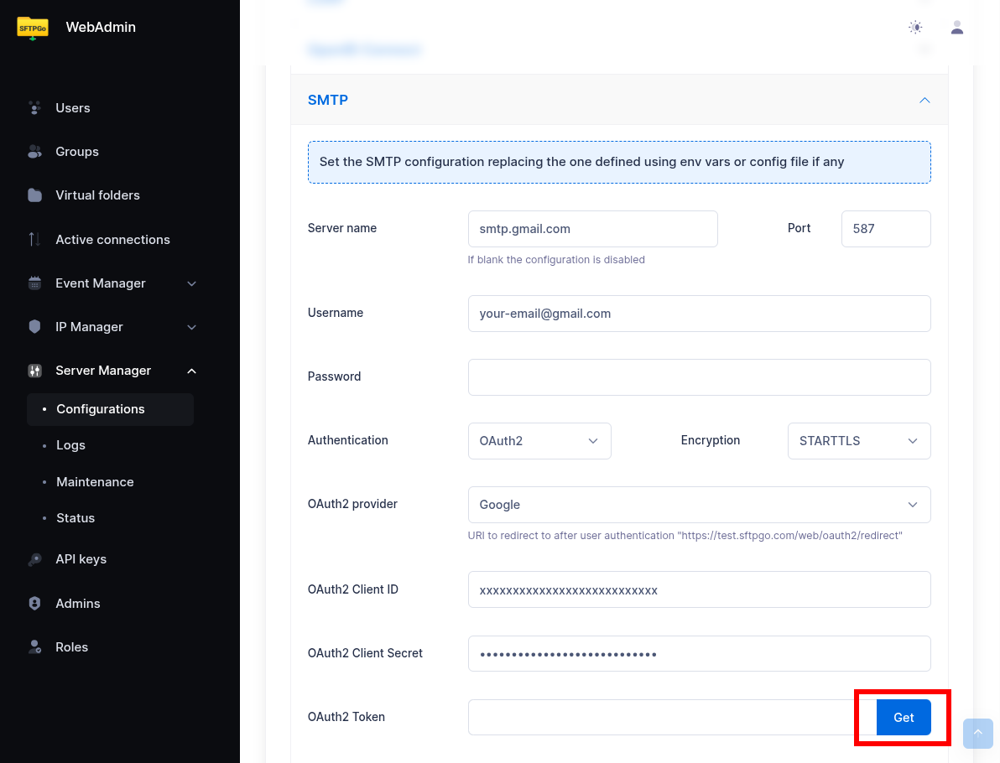
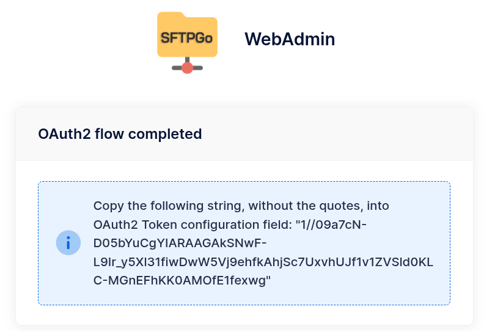
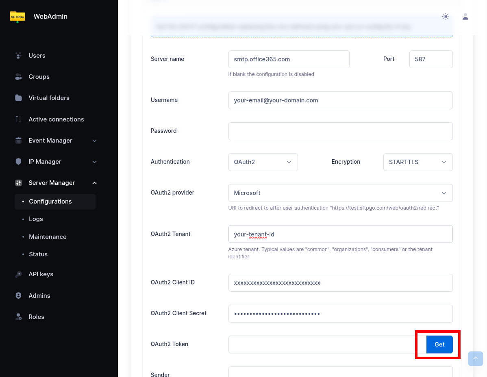
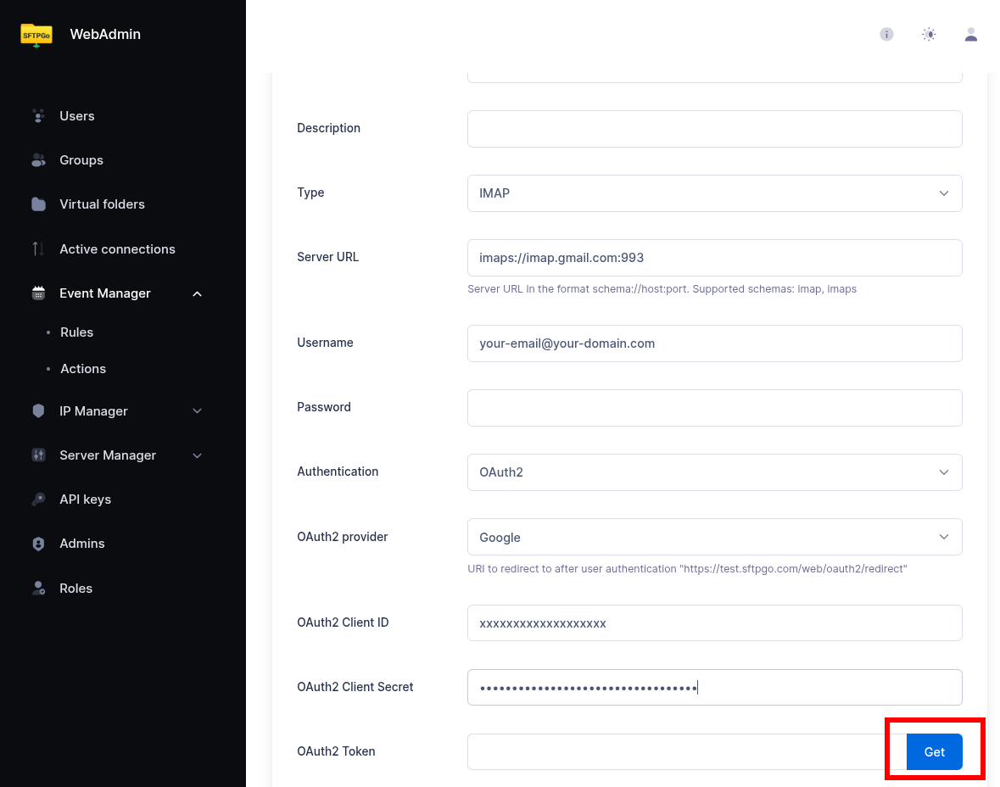

# OAuth2 for SMTP and IMAP

Modern email providers such as Google and Microsoft require OAuth2 authentication for SMTP and IMAP access. This tutorial explains how to configure OAuth2 for sending emails (SMTP) and for the Event Manager's IMAP action (fetching email attachments).

SFTPGo supports two OAuth2 providers:

| Provider | SMTP scopes | IMAP scopes |
| ---------- | ------------- | ------------- |
| **Google** | `https://mail.google.com/` | `https://mail.google.com/` |
| **Microsoft** | `offline_access`, `https://outlook.office.com/SMTP.Send` | `offline_access`, `https://outlook.office.com/IMAP.AccessAsUser.All` |

For Google, `https://mail.google.com/` grants full access to Gmail (both SMTP and IMAP), so the same scope works for both. For Microsoft, SFTPGo automatically requests the appropriate scope based on the context: `SMTP.Send` for sending emails and `IMAP.AccessAsUser.All` for IMAP access.

The `offline_access` scope (Microsoft) tells the provider to issue a **refresh token** alongside the access token. Access tokens are short-lived (typically 1 hour); the refresh token allows SFTPGo to obtain new access tokens without requiring the user to re-authorize. Google's `https://mail.google.com/` scope implicitly supports refresh tokens when requested with `access_type=offline` (which SFTPGo does automatically).

The scopes are managed automatically by SFTPGo — you only need to provide the Client ID, Client Secret, and authorize the connection.

## Part 1: SMTP with OAuth2

### Google (Gmail)

#### Step 1: Create OAuth2 Credentials in Google Cloud Console

1. Go to the [Google Cloud Console](https://console.cloud.google.com/){:target="_blank"}.
2. Create a new project (or select an existing one).
3. Navigate to **APIs & Services > OAuth consent screen**.
4. Configure the consent screen:
     - User Type: **Internal** (for Google Workspace) or **External** (for personal accounts).
     - App name, user support email, and developer contact email are required.
     - For external apps, add the email address you will use to send emails as a **test user** (until the app is published).
5. Navigate to **APIs & Services > Credentials**.
6. Click **Create Credentials > OAuth client ID**.
7. Application type: **Web application**.
8. Add an **Authorized redirect URI**: `https://<your-sftpgo-url>/web/admin/oauth2/redirect`. Replace `<your-sftpgo-url>` with your actual SFTPGo WebAdmin URL. If SFTPGo runs on `http://localhost:8080`, use `http://localhost:8080/web/admin/oauth2/redirect`.
9. Click **Create** and note the **Client ID** and **Client Secret**.

#### Step 2: Configure SMTP in SFTPGo

In the WebAdmin, navigate to **Server Manager > Configurations > SMTP**.

Fill in the following:

| Field | Value |
| ------- | ------- |
| Host | `smtp.gmail.com` |
| Port | `587` (or `465` for implicit TLS) |
| Username | `your-email@gmail.com` |
| Encryption | STARTTLS (for port 587) or Implicit TLS (for port 465) |
| Auth type | **OAuth2** |
| Provider | **Google** |
| Client ID | The Client ID from step 1 |
| Client Secret | The Client Secret from step 1 |

{data-gallery="oauth2-smtp-google"}

#### Step 3: Authorize the Connection

Click the **Get** button next to the OAuth2 Token field. SFTPGo will redirect you to Google's consent screen. Sign in with the email account you want to send from and grant the requested permissions.

After authorization, SFTPGo displays a page with the refresh token. Copy the token string (without quotes) and paste it into the **OAuth2 Token** field.

{data-gallery="oauth2-flow"}

#### Step 4: Save and Test

Click **Submit** to save the SMTP configuration. Use the **Send test email** feature to verify everything works.

### Microsoft (Outlook / Office 365)

#### Step 1: Register an Application in Azure AD

1. Go to the [Azure Portal](https://portal.azure.com/){:target="_blank"} and navigate to **Microsoft Entra ID > App registrations**.
2. Click **New registration**.
3. Name the application (e.g., `SFTPGo`).
4. Supported account types: choose based on your organization. For single-tenant setups, select **Accounts in this organizational directory only**.
5. Redirect URI: Platform **Web**, URI `https://<your-sftpgo-url>/web/admin/oauth2/redirect`.
6. Click **Register**.
7. Note the **Application (client) ID** and **Directory (tenant) ID**.

#### Step 2: Create a Client Secret

1. In the app registration, navigate to **Certificates & secrets > Client secrets**.
2. Click **New client secret**, add a description, and choose an expiration period.
3. Note the **Value** (this is your client secret — it is shown only once).

#### Step 3: Configure API Permissions

1. Navigate to **API permissions**.
2. Click **Add a permission > Microsoft Graph > Delegated permissions**.
3. Add: `SMTP.Send`, `offline_access`.
4. Click **Grant admin consent** (if you are an admin) or have an admin approve the permissions.

:information_source: If you also plan to use the IMAP action with Microsoft, add `IMAP.AccessAsUser.All` to the same app registration now. This way you can reuse the same app for both SMTP and IMAP.

#### Step 4: Configure SMTP in SFTPGo

In the WebAdmin, navigate to **Server Manager > Configurations > SMTP**.

| Field | Value |
| ------- | ------- |
| Host | `smtp.office365.com` |
| Port | `587` |
| Username | `your-email@your-domain.com` |
| Encryption | STARTTLS |
| Auth type | **OAuth2** |
| Provider | **Microsoft** |
| Tenant | Your Directory (tenant) ID (leave empty for `common`) |
| Client ID | The Application (client) ID |
| Client Secret | The client secret value |

{data-gallery="oauth2-smtp-microsoft"}

#### Step 5: Authorize and Test

Click the **Get** button next to the OAuth2 Token field. Sign in with the Microsoft account and grant consent. Copy the refresh token from the result page into the OAuth2 Token field. Click **Submit** and send a test email.

:information_source: If you are using a single-tenant configuration, enter the **tenant ID** in the Tenant field. For multi-tenant setups, leave it empty (SFTPGo will use `common`).

## Part 2: IMAP with OAuth2

The Event Manager's IMAP action supports OAuth2 authentication using the same provider configuration. This is essential for providers that have deprecated password-based IMAP access.

### Configuration

When creating or editing an IMAP action in the Event Manager, set the **Auth type** to **OAuth2** and fill in the provider credentials.

| Field | Value (Google) | Value (Microsoft) |
| ------- | ---------------- | ------------------- |
| Endpoint | `imaps://imap.gmail.com:993` | `imaps://outlook.office365.com:993` |
| Username | `your-email@gmail.com` | `your-email@your-domain.com` |
| Auth type | OAuth2 | OAuth2 |
| Provider | Google | Microsoft |
| Tenant | — | Your tenant ID |
| Client ID | Same as SMTP or a separate app | Same as SMTP or a separate app |
| Client Secret | The client secret | The client secret |
| Refresh Token | Obtained via the Get button | Obtained via the Get button |

{data-gallery="oauth2-imap"}

:information_source: For Microsoft, SFTPGo automatically requests the `IMAP.AccessAsUser.All` scope instead of `SMTP.Send`. If you are using the same Azure app registration for both SMTP and IMAP, make sure to add both `SMTP.Send` and `IMAP.AccessAsUser.All` to the API permissions and grant admin consent.

### Obtaining the Refresh Token

The IMAP action form includes a **Get** button next to the OAuth2 Token field. Fill in the provider, client ID, and client secret, then click **Get**. SFTPGo redirects to the provider's consent screen. After granting access, a page is displayed with the refresh token — copy it (without quotes) and paste it into the **OAuth2 Token** field in the action form.

:warning: For Microsoft, sign in as the user that owns the mailbox configured in the action's **Username** field, or as a delegate with Full Access on a shared mailbox — see [Shared mailboxes (Microsoft)](#shared-mailboxes-microsoft). The access token is bound to the signing-in identity; if that user has no access to the configured mailbox, IMAP returns `AUTHENTICATE failed` at runtime.

{data-gallery="oauth2-flow-imap"}

### Shared mailboxes (Microsoft)

A common pattern is a dedicated service mailbox (e.g., `inbound@yourdomain.com`) that receives files from external partners. Shared mailboxes have no password and cannot sign in directly, so OAuth2 authorization is performed by a delegate user that has Full Access on the shared mailbox.

To configure IMAP OAuth2 against a shared mailbox:

1. Set the IMAP action's **Username** field to the shared mailbox's email address (e.g., `inbound@yourdomain.com`). This is the address that goes into the SASL XOAUTH2 string the IMAP server validates.
2. Grant a delegate user Full Access on the shared mailbox via Exchange Online PowerShell:

    ```powershell
    Add-MailboxPermission -Identity inbound@yourdomain.com -User delegate@yourdomain.com -AccessRights FullAccess
    ```

3. When clicking **Get** to obtain the refresh token, sign in with the **delegate** user — not with the shared mailbox account.
4. If you change the delegate user later, the existing refresh token is bound to the previous identity and must be regenerated. Revoke the previous consent from [My Apps](https://myapps.microsoft.com/) (or have the admin remove the application from the user's permissions) and re-run **Get** signing in with the new delegate.

### Google Example: IMAP Action for Automatic Email Ingestion

A common use case is to automatically fetch email attachments and make them available as files in SFTPGo.

1. Create an IMAP action with OAuth2 authentication configured for Google.
2. Set the endpoint to `imaps://imap.gmail.com:993`.
3. Set the path template for where attachments should be saved (e.g., `/inbound/{{.ObjectName}}`).
4. Create a scheduled rule to run the IMAP action periodically (e.g., every 5 minutes). If you leave the IMAP action's target folder empty, attachments land in a user's home directory and you must add a name filter that identifies a single destination user. Set a target folder (a virtual folder) to write attachments to a shared destination instead, and the user filter becomes unnecessary.

### Refresh Token Rotation

OAuth2 providers may rotate refresh tokens. SFTPGo handles this automatically:

- **SMTP**: When a new refresh token is received during token renewal, SFTPGo updates it in the database automatically.
- **IMAP**: When a new refresh token is received, SFTPGo updates the action configuration automatically.

No manual intervention is required after the initial setup.

## Troubleshooting

- **"Access denied" or "Insufficient scope" errors**: Verify that the correct API permissions/scopes are configured in the provider's developer console and that admin consent has been granted (Microsoft).
- **"Invalid redirect URI"**: The redirect URI in the provider must exactly match `https://<your-sftpgo-url>/web/admin/oauth2/redirect`. Check for trailing slashes and protocol (http vs https).
- **Google "App not verified" warning**: For external apps in testing mode, only test users added to the OAuth consent screen can authorize. Publish the app to remove this restriction.
- **Microsoft tenant errors**: Ensure the tenant ID matches your Azure AD directory. For personal Microsoft accounts, use `consumers` as the tenant.
- **Microsoft `AUTHENTICATE failed` (IMAP) or `535 5.7.3 Authentication unsuccessful` (SMTP) despite a successful token refresh**: the token was issued correctly but Exchange Online rejected it because the signing-in user that authorized the OAuth flow has no access to the mailbox configured in the action's **Username** field. Revoke the previous consent from [My Apps](https://myapps.microsoft.com/) and re-run **Get**, signing in as the mailbox owner — or as a delegate with Full Access (IMAP) or Send As (SMTP) on the shared mailbox. The previous refresh token is bound to the wrong identity and must be replaced.
- **Token expiration**: Client secrets in Azure AD expire. When they do, create a new secret and update it in SFTPGo. The refresh token itself is renewed automatically.
