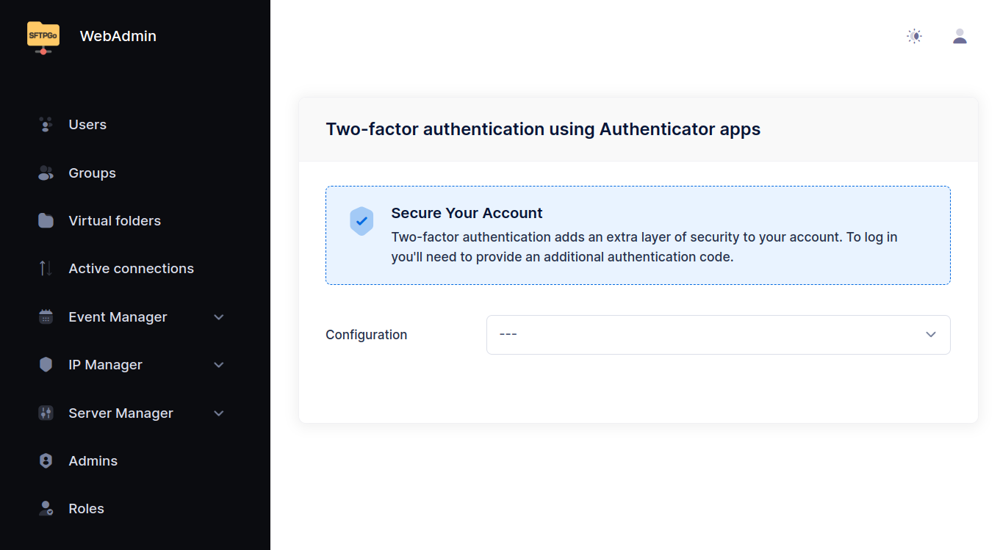

# SFTPGo on Google Cloud Platform

SFTPGo is available on [Google Cloud Platform](https://console.cloud.google.com/marketplace/browse?filter=partner:SFTPGo%20Authors){:target="_blank"} as a virtual machine image. The following editions are available:

- SFTPGo Standard
- SFTPGo Professional

The Professional edition provides the following additional features:

- Search and export audit logs from the WebAdmin UI.
- LDAP/Active Directory authentication.
- Geo-IP filtering.
- Publish events to Google Cloud Pub/Sub topics and other publish/subscribe systems such as Amazon SNS/SQS, Azure Service Bus, RabbitMQ, NATS, Kafka.

## Deploy from Marketplace

Access the SFTPGo offering of your choice in Google Cloud Marketplace and click the **Launch** button.

{data-gallery="launch"}

You may be asked to enable the required API, please enable them.

{data-gallery="API"}

Specify your deployment options such as the zone, machine type, disk type.
A firewall configuration is proposed.

{data-gallery="firewall"}

Add network traffic restrictions and enable rules based on your specific security requirements.
Here what the proposed ports are used for:

- TCP port 8080 is the default port for the SFTPGo WebAdmin and WebClient user interfaces. It will be used for the initial configuration.
- TCP port 2022 is the default port for the SFTP service.
- TCP port 80 (HTTP traffic from the Internet) is required to obtain and renew Let's Encrypt TLS certificates.
- TCP port 443 (HTTPS traffic from the Internet) is useful if you want enable HTTPS for the SFTPGo WebAdmin and WebClient and reconfigure SFTPGo to use the standard HTTPS port.
- TCP port 22 is the port used for the SSH service (OpenSSH), which is useful for remote access and management of your virtual machine.

:warning: If you want to use SFTP on port 22 you need to reconfigure OpenSSH to use a different port.

After configuring your virtual machine, click **Deploy**, after few minutes your SFTPGo installation will be ready to use.

{data-gallery="deployment"}

By clicking on the deployed **Compute Engine**, you can view the IP address of your new SFTPGo installation.

## Create the initial administrator account

Before you can use SFTPGo you need to create an admin account, so open **http://your_instance_IP:8080/web/admin** in your web browser, replacing `your instance IP` with the IP address of your instance.

{data-gallery="setup"}

After creating the admin account you will be automatically logged in and redirected to the page to set up two-factor authentication. Setting up two-factor authentication is optional.

{data-gallery="initial-screen"}

## Enable HTTPS and obtain a Let's Encrypt TLS certificate

In order to obtain a Let's Encrypt TLS certificate for HTTPS access you must create a DNS entry under a custom domain that you own which resolves to your SFTPGo public IP address and the port 80 must be publicly reachable.
Also make sure your Compute instance has a static IP address.

From the SFTPGo WebAdmin UI go to the "Server Manager" section, select "Configurations" and then "ACME".
Specify the domain name associated with the IP address of the virtual machine, set an email address, and the protocols for which you want to use the certificate. Leave the port at `80`.

{data-gallery="acme"}

Click **Save**.

To apply the change you need to restart the SFTPGo service, so login via SSH to your virtual machine and execute the following command.

```shell
sudo systemctl restart sftpgo
```

You can now access your installation using **https://your_domain_name:8080/**.

## Reconfigure SFTPGo to use the standard HTTPS port

Login to your virtual machine via SSH change the port by creating a file named `/etc/sftpgo/env.d/custom.env` with the following content.

```shell
SFTPGO_HTTPD__BINDINGS__0__PORT=443
```

Restart the service to apply the changes.

```shell
sudo systemctl restart sftpgo
```

You can now access your installation using **https://your_domain_name/**.

## Reconfigure SFTPGo to use the port 22 for SFTP

To make the SFTP service provided by SFTPGo available on port 22,0 the OpenSSH service must to be re-configured to use a different port.

Stop the SFTPGo service.

```shell
sudo systemctl stop sftpgo
```

Create the file `/etc/ssh/sshd_config.d/10-port.conf` with the following content.

```shell
Port 2022
```

Restart OpenSSH to apply the change.

```shell
sudo systemctl restart sshd
```

Verify that OpenSSH was able to start correctly.

```shell
systemctl status sshd
```

You should see something like this.

```shell
Mar 05 09:48:30 sftpgo-2-vm systemd[1]: Starting ssh.service - OpenBSD Secure Shell server...
Mar 05 09:48:30 sftpgo-2-vm sshd[1196]: Server listening on 0.0.0.0 port 2022.
Mar 05 09:48:30 sftpgo-2-vm sshd[1196]: Server listening on :: port 2022.
```

To reconfigure SFTPGo to use port `22` for SFTP create or update the file `/etc/sftpgo/env.d/custom.env` and add the following content.

```shell
SFTPGO_SFTPD__BINDINGS__0__PORT=22
```

Restart the SFTPGo service to apply the changes.

```shell
sudo systemctl restart sftpgo
```

:warning: Make sure OpenSSH is running properly and can accept new SSH connections before disconnecting your current SSH session to avoid becoming locked out of the system.
