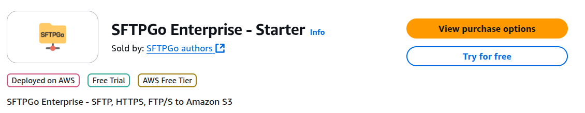
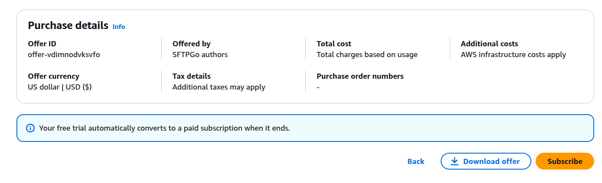
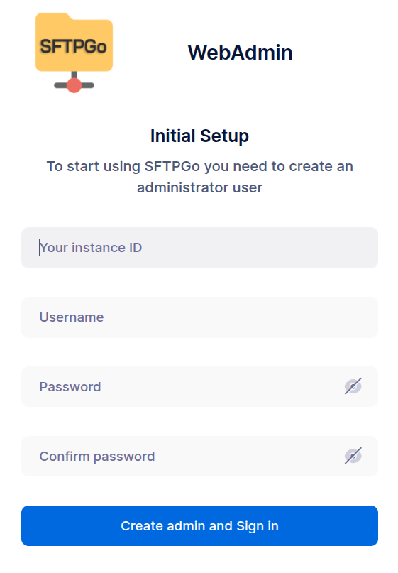
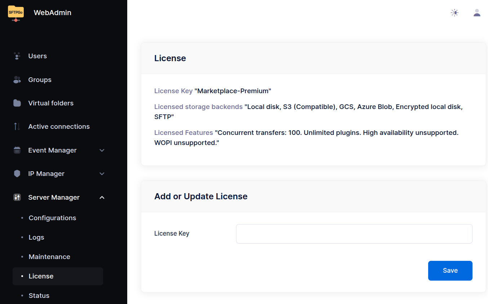

# SFTPGo on AWS

SFTPGo is available on AWS Marketplace:

- [SFTPGo Enterprise - Starter](https://aws.amazon.com/marketplace/pp/prodview-6pasgeptfjjf6){:target="_blank"}
- [SFTPGo Enterprise - Premium](https://aws.amazon.com/marketplace/pp/prodview-ocwppyuudgbz2){:target="_blank"}
- [SFTPGo Enterprise - Starter (arm64)](https://aws.amazon.com/marketplace/pp/prodview-ukjjbuggrxrlw){:target="_blank"}
- [SFTPGo Enterprise - Premium (arm64)](https://aws.amazon.com/marketplace/pp/prodview-6fcfsxgzfx3yu){:target="_blank"}

The Starter tier is a cost-effective solution for small to medium-scale file transfer environments. It supports unlimited users and connections, with up to 20 concurrent uploads and downloads. Storage options include local filesystem or Google Cloud buckets. Detailed audit logs are also available directly within the WebAdmin UI.

The Premium tier is designed for deployments that require advanced features and greater flexibility. It includes all capabilities of the Starter tier, plus the following features:

- Unlimited users and connections, with up to 100 concurrent uploads and downloads.
- Additional storage backends: Amazon S3 (Compatible), Azure Blob Storage, other SFTP servers.
- PGP encryption/decryption.
- Advanced automation through the EventManager.
- Plugin for Geo-IP filtering via plugins.
- Plugin for event publishing to systems like Amazon SNS, RabbitMQ, NATS, Kafka, and other publish/subscribe platforms.

:information_source: We also offer the open-source version of SFTPGo on AWS Marketplaces. These offers were introduced before the availability of SFTPGo Enterprise and remain fully supported. However, we recommend transitioning to the Starter or Premium tiers to take full advantage of the enhanced features and improved performance provided by SFTPGo Enterprise.

## Deploy from Marketplace

Access the SFTPGo offering of your choice in AWS Marketplace and click the **Try for free** button.

{data-gallery="launch"}

You will be redirected to the AWS subscription screen, where you can select the pricing model. SFTPGo offers use a usage-based pricing model, with the option to save by selecting an annual contract.

After selecting your preferred pricing model, click “Subscribe” to complete the subscription.

{data-gallery="subscribe"}

Select your preferred AWS region and launch the SFTPGo offer from the EC2 console.
The suggested security rules will allow the following ports:

- TCP port 8080 is the default port for the SFTPGo WebAdmin and WebClient user interfaces. It will be used for the initial configuration.
- TCP port 2022 is the default port for the SFTP service.
- TCP port 22 is the port used for the SSH service (OpenSSH), which is useful for remote access and management of your virtual machine.

Additionally you may consider to add:

- TCP port 80 (HTTP traffic from the Internet) is required to obtain and renew Let's Encrypt TLS certificates.
- TCP port 443 (HTTPS traffic from the Internet) is useful if you want enable HTTPS for the SFTPGo WebAdmin and WebClient and reconfigure SFTPGo to use the standard HTTPS port.

After deploying the virtual machine make note of its IP address and instance ID.

{data-gallery="instance"}

## Create the initial administrator account

Before you can use SFTPGo you need to create an admin account, so open **http://your_instance_IP:8080/web/admin** in your web browser, replacing `Your instance ID` with the ID of your instance, which you can find in the AWS Console.

{data-gallery="setup"}

The instance ID is required to validate your installation.

After creating the admin account you will be automatically logged in and redirected to the page to set up two-factor authentication. Setting up two-factor authentication is optional.

{data-gallery="initial-screen"}

## Licensed Features

You can view the enabled licensed features by navigating to the "License" section under "Server Manager".

{data-gallery="license"}
