# Public Shares

Public shares are a quick and secure way to share files directly from the WebClient UI without creating user accounts, making collaboration with external contacts simple and efficient.

Each public share generates a unique, web-accessible URL, and users can configure access controls such as:

- Read-only or upload permissions
- Optional password protection
- Expiration date
- Download/upload limits
- Email-based access for extra security

Public shares are managed by the users themselves, not by administrators. This makes it easy for users with access to files to securely collaborate with clients, partners, or external collaborators — without requiring administrator intervention.

## Preliminary Note

To enable email-based access to public shares and email notifications, you need to configure an SMTP server.

To configure and test your SMTP settings, open the WebAdmin UI, then go to the "Configurations" page under the "Server Manager" section. There, you can enter the required SMTP configuration parameters.

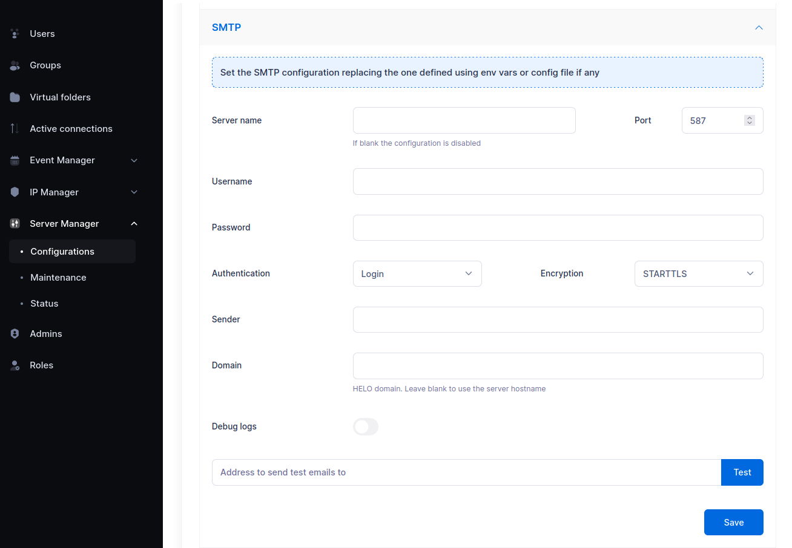{data-gallery="smtp"}

## Create a Share with Email Authentication

To share a file or folder, open the WebClient, click the three-dot menu next to the item, and select "Share".

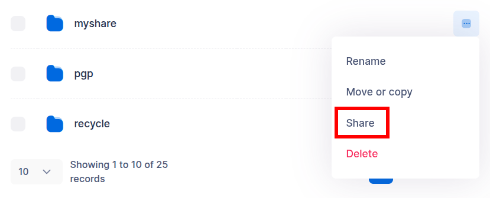{data-gallery="webclient-share"}

Next, configure the sharing options. You can define the access level—read, write, or read/write—to control what actions recipients are allowed to perform.

To enable email-based authentication, enter one or more email addresses and check the "Email authentication" option.

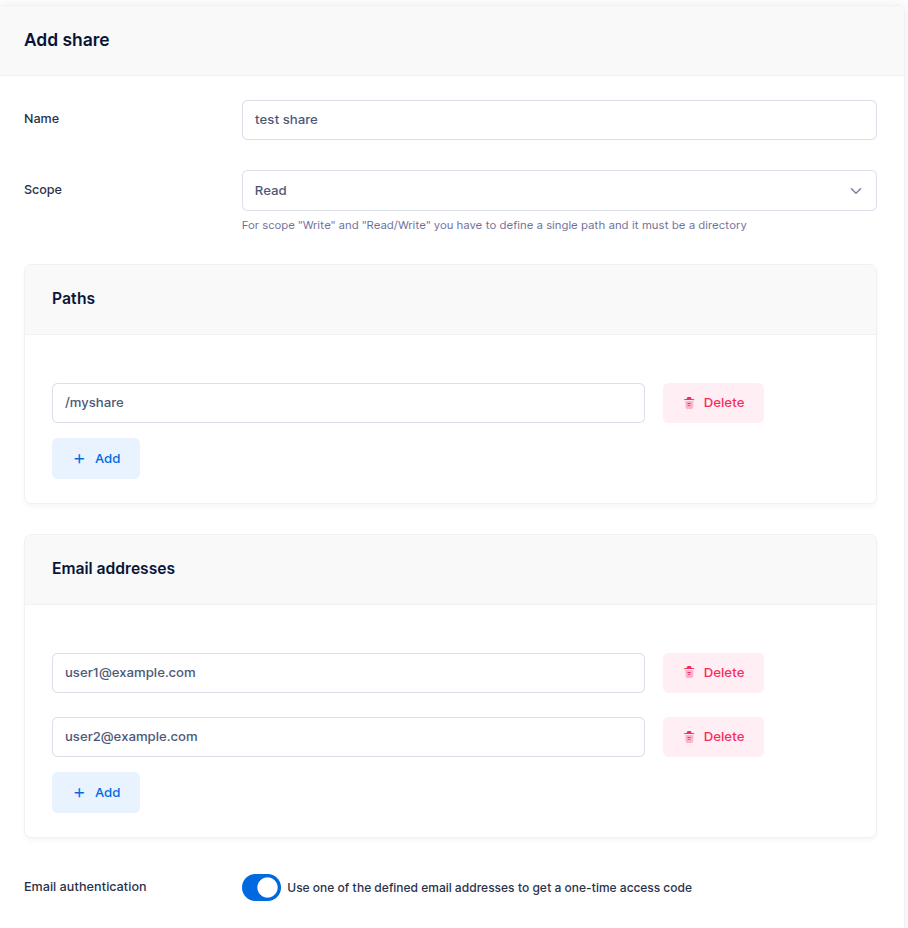{data-gallery="webclient-config-share"}

You can also require recipients to accept a (customizable) legal agreement before accessing the share. Additionally, you can set an expiration date, limit the maximum number of accesses, and restrict access to specific IP addresses or networks.

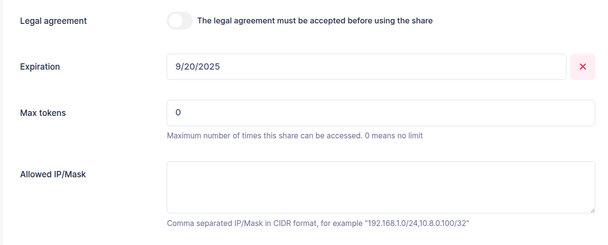{data-gallery="webclient-config-share"}

To share content with external users, go to the "Shares" page, click the "Link" icon next to the desired share, and copy the access URL. In most cases, a single directory will be shared.

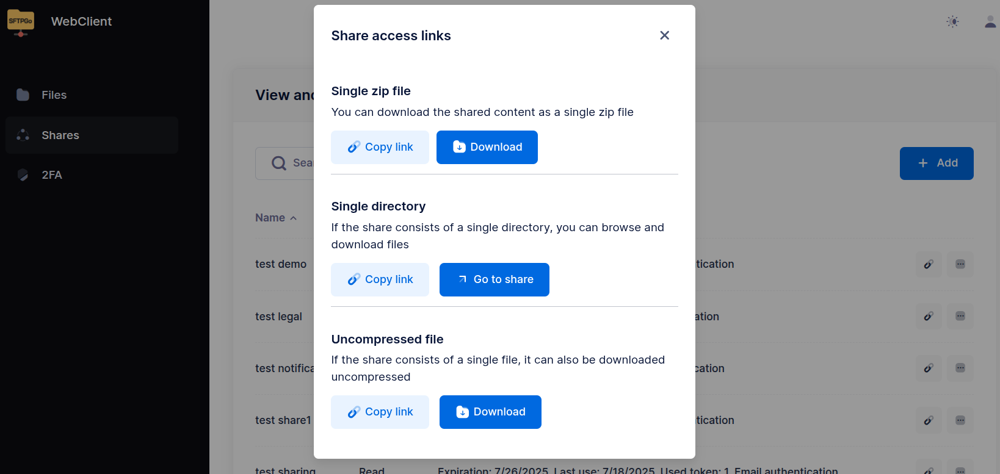{data-gallery="webclient-share-link"}

## How External Users Access the Share

External users can access the share link by entering their email address, after which they receive a one-time login code via email, valid for 10 minutes.

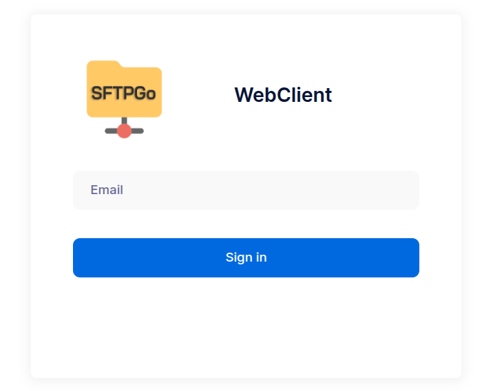{data-gallery="webclient-share-login"}

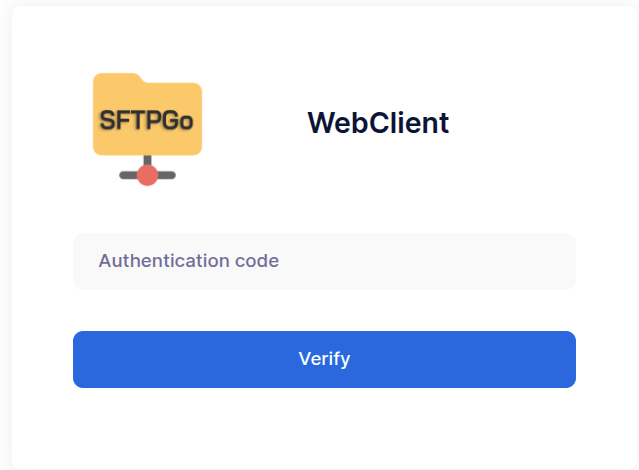{data-gallery="webclient-share-login"}

The content visible to the user depends on the type of share they’ve been granted access to.

### Read-Only Shares

Read-only shares allow external users to browse the shared directories and files. Users can view file names, structure, and metadata (such as file size and modification date), but cannot upload, modify, or delete any content.

Users can:

- Download individual files directly.
- Download all shared files and folders as a single compressed .zip archive for convenience.

This share type is ideal for securely distributing documents, reports, or any other files where write access is not required.

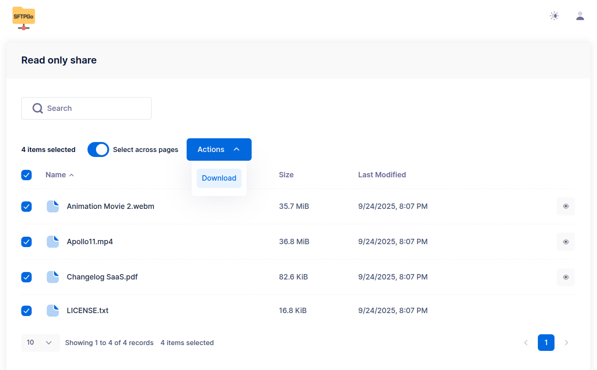{data-gallery="webclient-ro-share"}

### Write-Only shares

Write-only shares allow external users to upload files to a shared location, but they cannot view, browse, or download any existing content.

Upon accessing the share, users see a simple upload interface that displays:

- The name of the share, to provide context.
- Options to select files manually or use drag and drop for quick uploads.

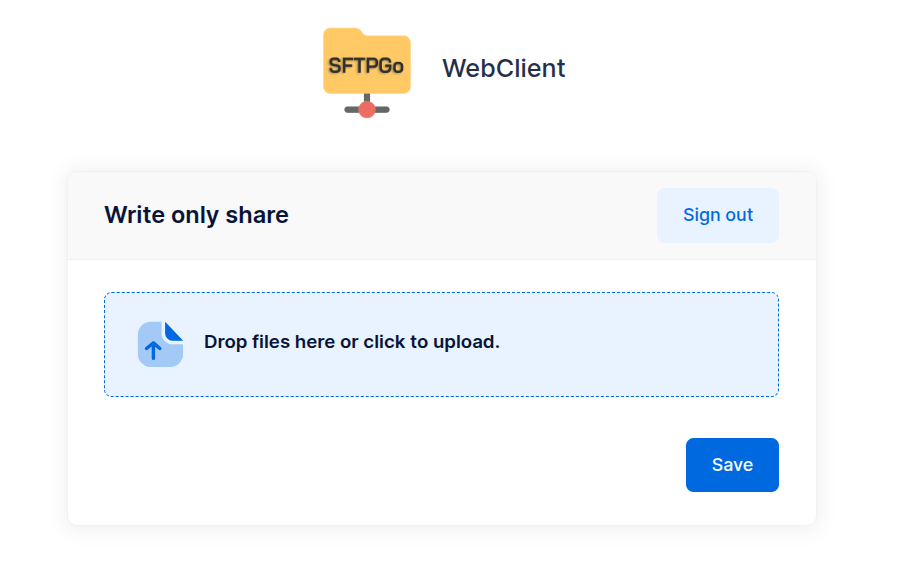{data-gallery="webclient-w-share"}

### Read/write Shares

Read/write shares provide external users with full access to the shared content, allowing them to:

- Browse files and folders within the share.
- Download individual files or the entire shared content as a .zip archive.
- Upload new files via manual selection or drag and drop.
- Create new folders within the shared structure.

This type of share combines the capabilities of both read-only and write-only shares, making it ideal for collaborative scenarios where external users need to both access and contribute files to a shared workspace.

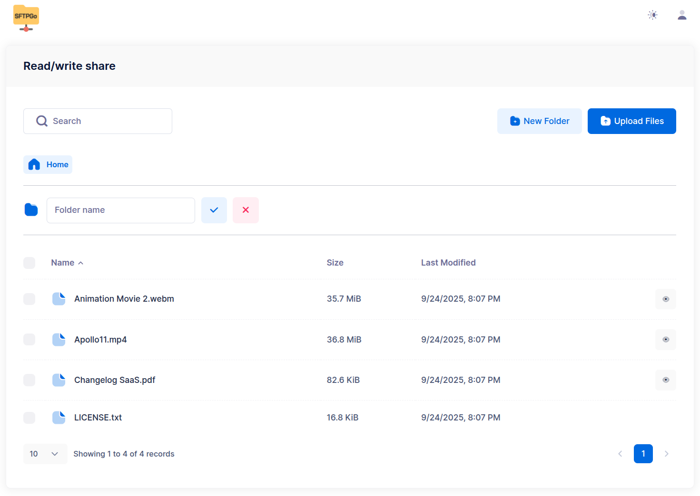{data-gallery="webclient-rw-share"}

## Delegating Share Management

By default, a public share is managed only by the user who created it. However, in collaborative environments, you may need to allow colleagues to manage your shares for example, to extend an expiration date or revoke access while you are on vacation.

SFTPGo allows you to associate one or more groups with a share. When a share is assigned to a group, other users within that group (who have the necessary permissions) can view and manage the share, with specific limitations to ensure security and data consistency.

This feature ensures business continuity and allows teams to collaboratively manage external data exchange without relying on a single account.

Only the owner can modify shared paths (files and folders), access scope (read/write), and group associations. File paths are tied to the specific context of the user who created the share (e.g., a virtual path like `/docs` may map to different storage backends, or to different locations within the same backend, depending on the user).

To enable share delegation, a specific configuration is required on the server side (WebAdmin), which then enables the feature for users in the WebClient.

### Administrator Configuration (WebAdmin)

Administrators can define the Share Policy within the "Advanced settings" section of a group's configuration. The policy controls how shares created by group members are automatically associated with the group.

The policy consists of the Permissions granted to other group members (Read, Edit, Delete) and the Mode:

- **Enforced**: The share policy is mandatory. Every share created by a user in this group is automatically associated with the group using the defined permissions. The user cannot remove this association.
- **Suggested**: The share policy is pre-selected by default when creating a share, but the user is free to modify the permissions or remove the group association entirely.

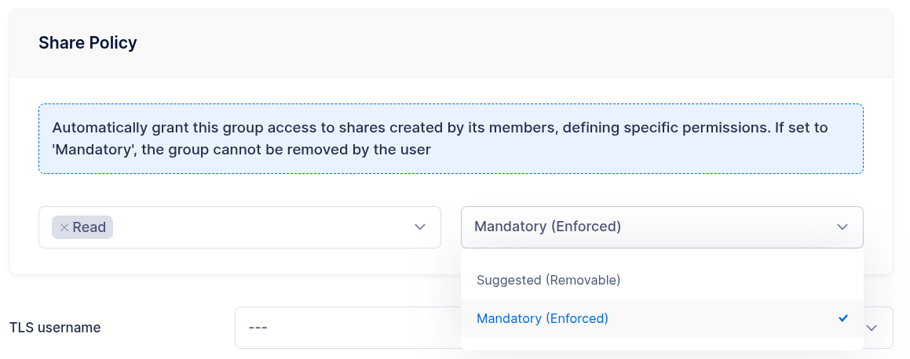{data-gallery="webadmin-share-policy"}

### User Experience (WebClient)

When users create or edit a share in the WebClient UI, they can control the group access based on the policy configured by the administrator.

{data-gallery="webclient-group-access"}

In the example above, the "Read" permission was granted for "group1". This results in the following behavior:

- Visibility: All members of "group1" will see this share in their list, in addition to the shares they created themselves.
- Access: Because only "Read" was granted, they can view the share details (e.g., the link) but cannot modify its settings or delete it.

If "Edit" or "Delete" permissions were granted, members of "group1" would also be able to modify the share's settings (such as the expiration date) or revoke the share entirely.

## Automatically Send Share Links

Administrators can configure an Event Manager rule and corresponding action from the WebAdmin UI to automatically send an email notification to all email addresses associated with a share whenever a new share is created.
The email includes the access link, ensuring that recipients are promptly notified without requiring any manual steps.

From the WebAdmin UI, create an email action similar to the example below.

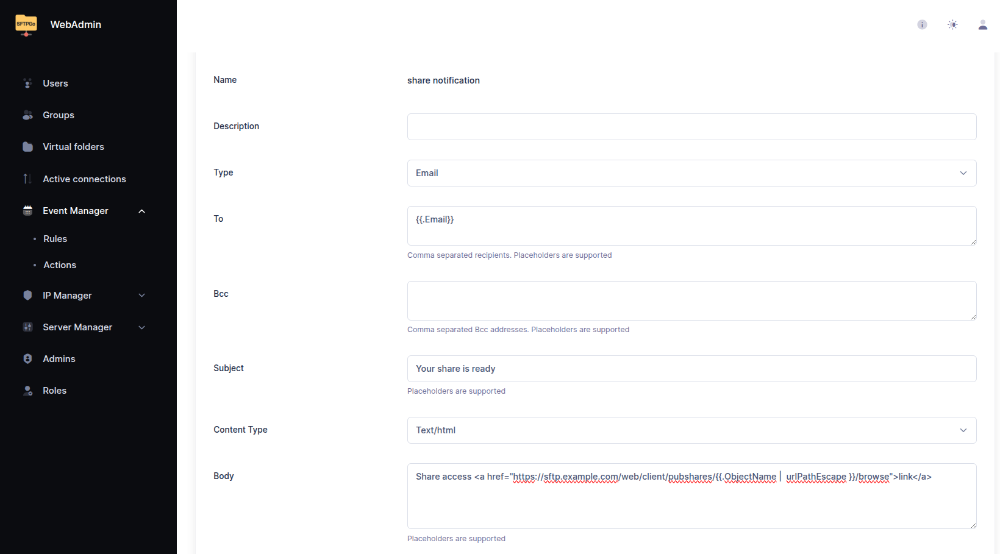{data-gallery="webadmin-add-share-notify"}

Use the `{{.Email}}` placeholder to automatically insert the email addresses associated with the share—these are the recipients who can authenticate to access it.

The share access URL follows this format:

```shell
https://sftp.example.com/web/client/pubshares/{{.ObjectName | urlPathEscape }}/browse
```

Where:

- `https://sftp.example.com` is the externally accessible base URL of your SFTPGo installation.
- `{{.ObjectName}}` expands to the ID of the share.
- The `urlPathEscape` helper function ensures the share ID is properly URL-encoded.

Finally, create an Event Manager rule that triggers this action whenever a new share is created.

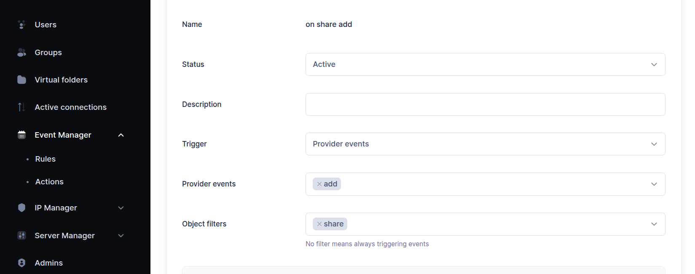{data-gallery="webadmin-add-share-notify"}
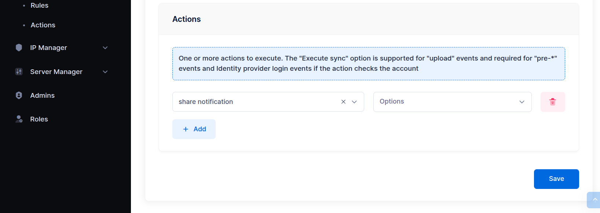{data-gallery="webadmin-add-share-notify"}

## Enable Upload/Download Notifications

SFTPGo allows administrators to configure notifications when an external user uploads or downloads a file through a share.

For example, you can set up an Event Manager rule and action to automatically send an email notification to the SFTPGo user who created the share.
The notification can include:

- The name and details of the file uploaded or downloaded.
- The email address of the external user who accessed the share and performed the action.

Here is an example action.

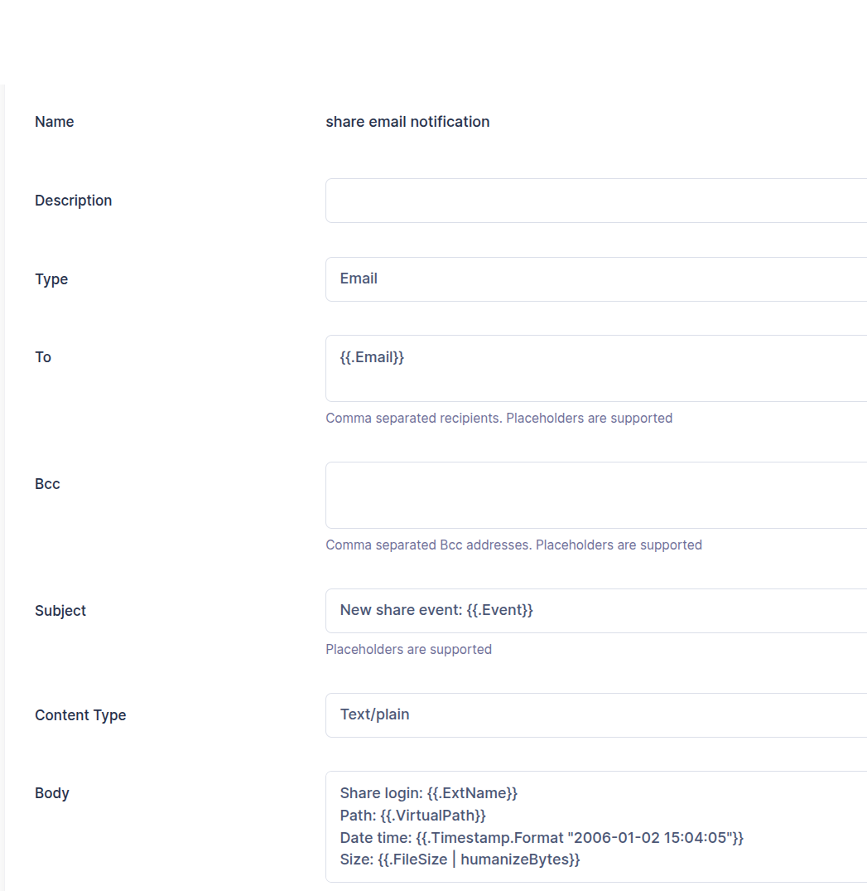{data-gallery="webadmin-share-event-notify"}

In this case, the action is triggered by a file system event (such as an upload or download), so:

- The `{{.Email}}` placeholder expands to the email address of the SFTPGo user who created the share.
- The `{{.ExtName}}` placeholder expands to the email address used by the external user to access the share.

Here is an example rule to execute the above action.

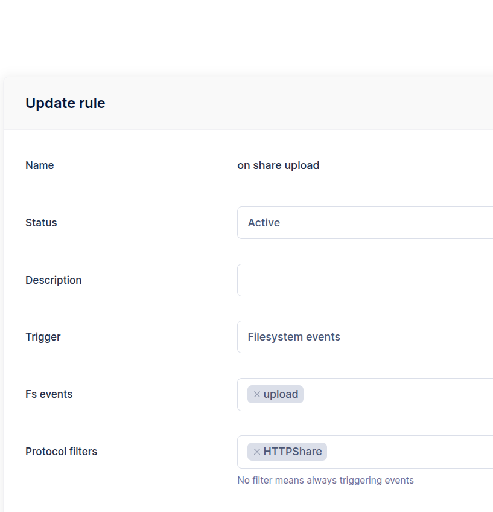{data-gallery="webadmin-share-event-notify"}

Naturally, all operations performed on shares, including uploads and downloads, also recorded in the audit logs.

## Automating Share Lifecycle Management

SFTPGo can automatically manage the lifecycle of public shares to ensure security and compliance. By using the Event Manager, administrators can configure rules to detect shares that are inactive, about to expire, or have exhausted their allowed tokens, and take appropriate actions (such as sending a notification or deleting the share).

### Step 1: Create the Expiration Check Action

First, you need to define the criteria for what constitutes an "expired" or "inactive" share.

1. Go to **EventManager** -> **Actions** and click **Add**.
2. Select **Share expiration check** as the action type.
3. Configure the following parameters:
   - **Inactivity threshold**: Defines the validity period (in days) for shares **without an explicit expiration date**. The expiration is calculated based on the last usage time (or the creation time if the share has never been used). If set to 0, automatic expiration based on inactivity is disabled.
   - **Advance notice**: How many days before the actual expiration (or the calculated inactivity expiration) to trigger a "notification" event.
   - **Grace period**: How many days to keep an expired share in the database before permanently deleting it (Soft Delete).
   - **Split events**:
     - If **enabled**: The action triggers a separate event for every single share/user found. This populates the `{{.ShareExpirationResult}}` placeholder, making it ideal for **Email notifications** where you need the context of a specific share owner.
     - If **disabled**: The action generates a single event containing the results of all checks. The `{{.ShareExpirationChecks}}` list is always available in both modes, but this mode is ideal for **HTTP webhooks** or admin reports where you want to process all data in bulk.

### Step 2: Configure the Notification (Email or HTTP)

Once the check is performed, you usually want to do something with the results. You can chain a second action to handle this.

#### Scenario A: Email Notification to Share Owners

If you enabled **Split events** in the previous step, you can send a personalized email to the user who created the share (and all group members if the share is in "warning" state).

Create an **Email** action with the following template:

**Subject:**

```text
Update regarding your shared files
```

**Body:**

```text
Hello {{.Name}},

The following share requires your attention:

Share Name: {{.ShareExpirationResult.Share.Name}}
ID: {{.ShareExpirationResult.Share.ShareID}}
Expiration Date: {{.ShareExpirationResult.Expiration.Format "2006-01-02"}}

Status: {{ if eq .ShareExpirationResult.Action 1}}Expiring soon{{else}}Expired and deleted{{end}}
Reason: {{.ShareExpirationResult.Reason}}

{{if eq .ShareExpirationResult.Action 1 -}}
Please extend the expiration date if you wish to keep this share active.
{{- else -}}
This share has been removed permanently.
{{- end}}
```

#### Scenario B: HTTP Report to an External System

If you **disabled** "Split events", you receive a list of all checks in a single payload. You can send this to an external webhook for auditing.

Create an **HTTP** action with a JSON body like this:

```json
{
  "timestamp": "{{.Timestamp.Format "2006-01-02T15:04:05Z07:00"}}",
  "report": {{ toJson .ShareExpirationChecks }}
}
```

The `{{.ShareExpirationChecks}}` placeholder will expand to a JSON array containing the users and their respective share results.

### Step 3: Define the Rule

Finally, create a Rule to execute these actions periodically.

1. Go to **Event Manager** -> **Rules** and click **Add**.
2. **Trigger**: Select **Schedule**.
3. **Schedule**: Define how often to run the check (e.g., daily at 02:00 AM).
4. **Actions**: Add the actions created in the previous steps in the following order:
   1. The **Share expiration check** action.
   2. The **Notification** action (Email or HTTP).

### How it works

When the rule executes:

1. SFTPGo scans all shares that meet the rules' conditions.
2. If a share is within the **Advance notice** window, it is flagged with `Action: 1` (Notify).
3. If a share has passed its expiration (plus the **Grace period**), it is flagged with `Action: 2` (Delete) and removed from the database.
4. If **Split events** is active:
   - **Individual** actions are executed for the notification step.
   - **Group Shares**: If a share belongs to a group and is in the "Notify" state, the event is expanded to **all group members** so everyone is aware. If the share is in the "Delete" state, the event is executed **only for the owner** to avoid redundant notifications.
