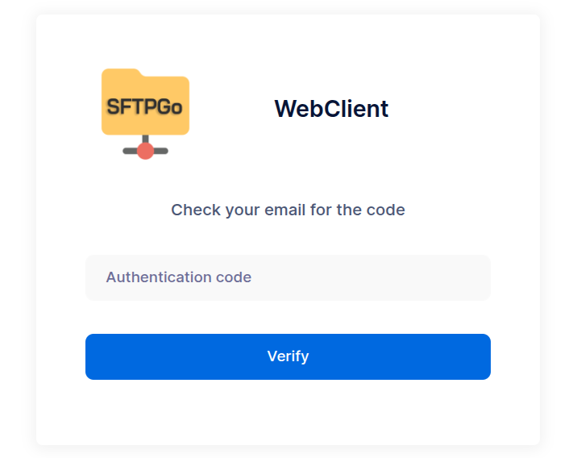

# Public Shares

Public shares are a quick and secure way to share files directly from the WebClient UI without creating user accounts, making collaboration with external contacts simple and efficient.

Each public share generates a unique, web-accessible URL, and users can configure access controls such as:

- Read-only or upload permissions
- Optional password protection
- Expiration date
- Download/upload limits
- Email-based access for extra security

Public shares are managed by the users themselves, not by administrators. This makes it easy for users with access to files to securely collaborate with clients, partners, or external collaborators — without requiring administrator intervention.

## Preliminary Note

To enable email-based access to public shares and email notifications, you need to configure an SMTP server.

To configure and test your SMTP settings, open the WebAdmin UI, then go to the "Configurations" page under the "Server Manager" section. There, you can enter the required SMTP configuration parameters.

{data-gallery="smtp"}

## Create a Share with Email Authentication

To share a file or folder, open the WebClient, click the three-dot menu next to the item, and select "Share".

{data-gallery="webclient-share"}

Next, configure the sharing options. You can define the access level—read, write, or read/write—to control what actions recipients are allowed to perform.

To enable email-based authentication, enter one or more email addresses and check the "Email authentication" option.

{data-gallery="webclient-config-share"}

You can also require recipients to accept a (customizable) legal agreement before accessing the share. Additionally, you can set an expiration date, limit the maximum number of accesses, and restrict access to specific IP addresses or networks.

{data-gallery="webclient-config-share"}

To share content with external users, go to the "Shares" page, click the "Link" icon next to the desired share, and copy the access URL. In most cases, a single directory will be shared.

{data-gallery="webclient-share-link"}

## How External Users Access the Share

External users can access the share link by entering their email address, after which they receive a one-time login code via email, valid for 10 minutes.

{data-gallery="webclient-share-login"}

{data-gallery="webclient-share-login"}

The content visible to the user depends on the type of share they’ve been granted access to.

### Read-Only Shares

Read-only shares allow external users to browse the shared directories and files. Users can view file names, structure, and metadata (such as file size and modification date), but cannot upload, modify, or delete any content.

Users can:

- Download individual files directly.
- Download all shared files and folders as a single compressed .zip archive for convenience.

This share type is ideal for securely distributing documents, reports, or any other files where write access is not required.

{data-gallery="webclient-ro-share"}

### Write-Only shares

Write-only shares allow external users to upload files to a shared location, but they cannot view, browse, or download any existing content.

Upon accessing the share, users see a simple upload interface that displays:

- The name of the share, to provide context.
- Options to select files manually or use drag and drop for quick uploads.

{data-gallery="webclient-w-share"}

### Read/write Shares

Read/write shares provide external users with full access to the shared content, allowing them to:

- Browse files and folders within the share.
- Download individual files or the entire shared content as a .zip archive.
- Upload new files via manual selection or drag and drop.
- Create new folders within the shared structure.

This type of share combines the capabilities of both read-only and write-only shares, making it ideal for collaborative scenarios where external users need to both access and contribute files to a shared workspace.

{data-gallery="webclient-rw-share"}

## Automatically Send Share Links

Administrators can configure an EventManager rule and corresponding action from the WebAdmin UI to automatically send an email notification to all email addresses associated with a share whenever a new share is created.
The email includes the access link, ensuring that recipients are promptly notified without requiring any manual steps.

From the WebAdmin UI, create an email action similar to the example below.

{data-gallery="webadmin-add-share-notify"}

Use the `{{.Email}}` placeholder to automatically insert the email addresses associated with the share—these are the recipients who can authenticate to access it.

The share access URL follows this format:

```shell
https://sftp.example.com/web/client/pubshares/{{.ObjectName | urlPathEscape }}/browse
```

Where:

- `https://sftp.example.com` is the externally accessible base URL of your SFTPGo installation.
- `{{.ObjectName}}` expands to the ID of the share.
- The `urlPathEscape` helper function ensures the share ID is properly URL-encoded.

Finally, create an EventManager rule that triggers this action whenever a new share is created.

{data-gallery="webadmin-add-share-notify"}
{data-gallery="webadmin-add-share-notify"}

## Enable Upload/Download Notifications

SFTPGo allows administrators to configure notifications when an external user uploads or downloads a file through a share.

For example, you can set up an EventManager rule and action to automatically send an email notification to the SFTPGo user who created the share.
The notification can include:

- The name and details of the file uploaded or downloaded.
- The email address of the external user who accessed the share and performed the action.

Here is an example action.

{data-gallery="webadmin-share-event-notify"}

In this case, the action is triggered by a file system event (such as an upload or download), so:

- The `{{.Email}}` placeholder expands to the email address of the SFTPGo user who created the share.
- The `{{.ExtName}}` placeholder expands to the email address used by the external user to access the share.

Here is an example rule to execute the above action.

{data-gallery="webadmin-share-event-notify"}

Naturally, all operations performed on shares, including uploads and downloads, also recorded in the audit logs.
