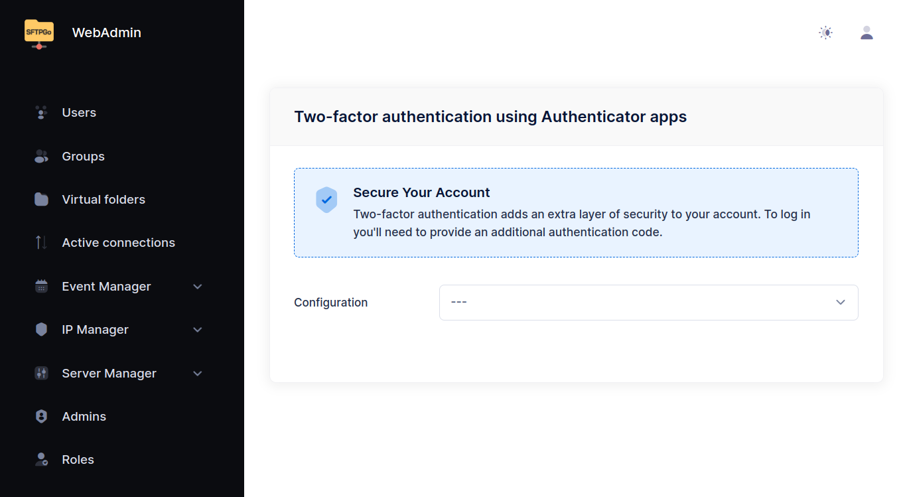
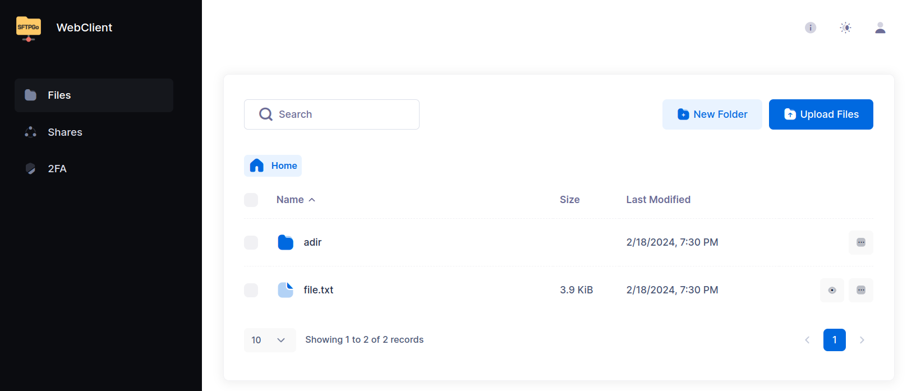

# Web User Interfaces

SFTPGo provides two web interfaces, both available with dark and light themes.

## WebAdmin

The WebAdmin UI allows administrators to create and manage users, groups, virtual folders, event rules, and other server resources.

{data-gallery="initial screen"}

With the default configuration it is served on port `8080`: [http://127.0.0.1:8080/web/admin](http://127.0.0.1:8080/web/admin){:target="_blank"} from a browser running on the server itself, `http://<server_address>:8080/web/admin` from anywhere else, because the binding listens on all network interfaces. [Network access](#network-access) covers ports, interfaces and reverse proxies.

On first access (when no admin exists in the data provider), SFTPGo presents a setup screen to create the initial admin account. You can also pre-create an admin by loading initial data or by setting the environment variables `SFTPGO_DEFAULT_ADMIN_USERNAME` and `SFTPGO_DEFAULT_ADMIN_PASSWORD` (with `create_default_admin` enabled in the data provider configuration).

Until an admin account exists, the setup screen is available to anyone who can reach the WebAdmin. Set an `installation_code` in the [`setup`](config-file.md#setup) configuration to require a shared code before the first account can be created.

## WebClient

The WebClient UI gives end users a browser-based file manager. Users can browse and manage their files, change credentials, and configure two-factor authentication.

{data-gallery="client-files"}

It is served by the same binding as the WebAdmin, at [http://127.0.0.1:8080/web/client](http://127.0.0.1:8080/web/client){:target="_blank"} with the default configuration.

Key capabilities:

- **File management** — Upload, download, rename, delete, and create directories. Multiple files or folders can be downloaded as a single ZIP archive (non-regular files such as symlinks are silently skipped).
- **File integrity** — Compute the SHA-256 hash of a file on demand, copy it, or download a checksum list verifiable with standard tools. See [File integrity](#file-integrity) below.
- **Sharing** — Create HTTP/S links to share files and folders externally, with optional password or email-based authentication, IP restrictions, download/upload limits, and automatic expiration.
- **Credentials** — Change password and manage public keys (public key management can be disabled per-user via permissions).
- **Two-factor authentication** — Set up TOTP-based 2FA, compatible with Microsoft Authenticator, Google Authenticator, Authy, and similar apps.

### Disabling the WebClient

The WebClient can be disabled:

- **Globally** — Set `enable_web_client` to `false` in the `httpd` binding configuration.
- **Per-user** — Add `HTTP` to the user's denied protocols list.

### File integrity

Compute the SHA-256 hash of stored files on demand, on any storage backend. For encrypted storage the hash is taken on the file content as the user sees it.

- **Single file** — Choose **Compute hash** from the file actions menu. The dialog shows the hash; copy it or download it as `SHA256SUMS.txt`.
- **Multiple files** — Select files and choose **Compute hash** from the bulk actions menu to download one `SHA256SUMS.txt` covering the selection.

`SHA256SUMS.txt` is in the standard GNU coreutils format and verifies with common tools:

```shell
sha256sum -c SHA256SUMS.txt
```

`shasum -c` and `rclone --checkfile` accept it as well. The single-file **Copy** button copies the same `hash  filename` line (hash, two spaces, name), so the clipboard value is directly checkable. Use it to confirm a file after an upload or download, to give a recipient a checksum, or to check a set of files against a local manifest.

:information_source: Computing a hash reads the whole file, so it counts as a download: it uses the user's download quota and bandwidth limits, requires the `download` permission, is written to the transfer log, and triggers `download` event rules — once per file in a multi-file selection.

:warning: On cloud storage the read is billable egress. Cancelling a running computation stops the server-side read; bytes already read are still billed.

## Network access

The WebAdmin, the WebClient and the REST API are served by the `httpd` service. Each of its bindings defines a port, the network interfaces to listen on, and which of the three it serves. With the default configuration a single binding serves all three on port `8080` on every interface; set `address` to listen on one interface only, for example `127.0.0.1` to accept local connections. See the `bindings` section of [HTTP server](config-file.md#http-server) for the full parameter list.

### Serving the interfaces on separate bindings

Because each binding enables the WebAdmin, the WebClient and the REST API independently, the administrative interface and the end-user interface can be published on different ports and restricted differently. To serve the WebClient on every interface while keeping administration reachable from the server itself only:

```bash
# Binding 0: WebClient and REST API, all interfaces
SFTPGO_HTTPD__BINDINGS__0__PORT=8080
SFTPGO_HTTPD__BINDINGS__0__ENABLE_WEB_ADMIN=false
# Binding 1: WebAdmin, local connections only
SFTPGO_HTTPD__BINDINGS__1__PORT=8081
SFTPGO_HTTPD__BINDINGS__1__ADDRESS=127.0.0.1
SFTPGO_HTTPD__BINDINGS__1__ENABLE_WEB_CLIENT=false
```

Administrators then open `http://127.0.0.1:8081/web/admin` through an SSH tunnel, a VPN, or a jump host, and the WebAdmin has no presence on the binding exposed to end users.

Environment variables cover up to ten bindings and the configuration file has no limit; see [Environment variables](env-vars.md) for how the `SFTPGO_HTTPD__BINDINGS__<n>__*` names map to the configuration file.

The example leaves the REST API enabled on both bindings: `enable_rest_api` covers the admin and the user API together, and admin endpoints require an admin token. Set it to `false` on the binding serving end users when no client needs the user API.

`hide_login_url` removes the link to the client login page from the admin login page and the other way round, so a binding does not point at an interface it does not serve.

### Reverse proxies and load balancers

The web interfaces run behind a reverse proxy, a CDN, or an HTTP load balancer. The items below make SFTPGo aware of how the proxy forwards requests, so that the features depending on the client address and on the external URL keep working. The client address applies to every deployment; the others depend on how the proxy is configured.

This section covers the `httpd` service. SFTP and FTP are not HTTP: they reach SFTPGo directly or through a TCP-level proxy, configured in the `common` section (see [`proxy_protocol` modes](config-file.md#proxy_protocol-modes)).

**Client addresses.** The proxy is the client SFTPGo sees on every request. Declare the addresses it connects from and the header that carries the original one:

```bash
SFTPGO_HTTPD__BINDINGS__0__PROXY_ALLOWED="10.0.0.0/24"
SFTPGO_HTTPD__BINDINGS__0__CLIENT_IP_PROXY_HEADER="X-Forwarded-For"
```

The header is read only from the listed addresses, so a client connecting to SFTPGo directly cannot choose the address SFTPGo records. When several proxies are in the path, `X-Forwarded-For` carries a chain of addresses and `client_ip_header_depth` selects which one to trust, counting from the right. The client address is what [brute force protection](defender.md), [rate limiting](rate-limiting.md), [IP lists](ip-lists.md), per-user IP filters and the audit log all work on, so it is worth configuring before publishing an instance.

**TLS terminated at the proxy.** When the proxy serves HTTPS to clients and plain HTTP to SFTPGo, declare the header it adds so that generated absolute URLs use `https://` and cookies carry the `Secure` flag:

```bash
SFTPGO_HTTPD__BINDINGS__0__SECURITY__ENABLED=true
SFTPGO_HTTPD__BINDINGS__0__SECURITY__HTTPS_PROXY_HEADERS__0__KEY="X-Forwarded-Proto"
SFTPGO_HTTPD__BINDINGS__0__SECURITY__HTTPS_PROXY_HEADERS__0__VALUE="https"
```

Skip this when the binding has its own certificate and the proxy connects to it over HTTPS.

**Host name.** Have the proxy forward the original `Host` header, or list the header that carries it in `hosts_proxy_headers`, typically `X-Forwarded-Host`. `allowed_hosts` restricts the host names a binding answers on. WebDAV `COPY` and `MOVE` need the original host name: see [Reverse proxy](webdav.md#reverse-proxy). Both settings live in the [`security`](config-file.md#security) block of the binding.

**Public links.** Share links are built from the URL the browser used. Set `base_url` on the binding to the external URL when the proxy rewrites it.

**Sub-path.** To serve the interfaces under a path prefix instead of at the root, set `web_root` to it, for example `/sftpgo`, and have the proxy forward the prefix unchanged.

**Large uploads.** Proxies often cap the request body size and buffer the whole body before forwarding it. Raise the cap and turn off request buffering, or set `upload_chunk_size` to enable [TUS](tutorials/cloudflare.md#enabling-tus-uploads-on-the-binding) so that the WebClient splits each file into chunks that fit under the cap. With several instances behind a load balancer, chunked uploads require session affinity.

**Health checks.** Every HTTP binding answers `GET /healthz` with `ok` and without authentication, which suits load balancer health checks. Requests to it go through the connection limits, the rate limiters and the [IP lists](ip-lists.md) like any other request, so include the address the checks come from when an allow list is enabled. The [telemetry](metrics.md) server exposes the same endpoint without those checks.

**TCP-level proxies.** A proxy that forwards the TCP connection instead of the HTTP request cannot add headers. Enable `proxy_protocol` in the `common` section and set `proxy_mode` to `1` on the binding to take the client address from the PROXY protocol rather than from a header.

[Running SFTPGo behind Cloudflare](tutorials/cloudflare.md) is a worked example of this configuration.

## Security

### Authentication

Both interfaces support:

- **Username and password** login.
- **OpenID Connect (SSO)** — Integrate with external identity providers (Microsoft Entra ID, Google, Keycloak, Okta, etc.). See [OpenID Connect](oidc.md).
- **Two-factor authentication** — TOTP-based, configurable for both admin and user accounts.

Login methods can be selectively enabled or disabled per binding via the `disabled_login_methods` configuration parameter.

### HTTPS and mutual TLS

The web interfaces can be served over HTTPS. For each binding, you can:

- Enable HTTPS by providing a certificate and key file.
- Require mutual TLS (client certificate authentication) in addition to standard credentials.
- Configure the minimum TLS version and allowed cipher suites.

Certificates can be automatically managed via the built-in [ACME protocol](tutorials/lets-encrypt-certificate.md) (Let's Encrypt).

### Content Security Policy

SFTPGo supports strict Content Security Policies — neither `unsafe-eval` nor `unsafe-inline` are required. Configure CSP and other security headers in the `security` section of the `httpd` configuration.

## Internationalization

SFTPGo uses the [i18next](https://www.i18next.com/){:target="_blank"} framework for internationalization. The following languages are supported: English, Italian, German, French, Spanish, Hungarian, and Chinese (Simplified).
