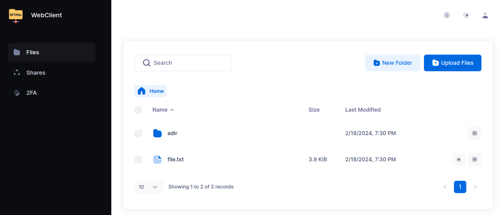

# Web User Interfaces

SFTPGo provides two distinct web interfaces:

- WebAdmin UI.
- WebClient UI.

Both Web UIs can be configured to require two-factor authentication, compatible with Microsoft Authenticator, Google Authenticator, Authy, and other similar apps.

Single Sign-On (SSO) is supported through OpenID Connect, enabling seamless and secure authentication. Additionally, strict Content Security Policies (CSP) can be enforced—excluding the use of `unsafe-eval` and `unsafe-inline`—to enhance protection against cross-site scripting and other web-based attacks.

## WebAdmin

The WebAdmin UI allows administrators to easily create and manage users, folders, groups, and other resources. Available with dark and light themes.

{data-gallery="initial screen"}

With the default `httpd` configuration, the web admin is available at the following URL:

[http://127.0.0.1:8080/web/admin](http://127.0.0.1:8080/web/admin){:target="_blank"}

If no admin user is found within the data provider, typically after the initial installation, SFTPGo will ask you to create the first admin. You can also pre-create an admin user by loading initial data or by configuration/environment variables.

The web interface can be configured over HTTPS and to require mutual TLS authentication in addition to administrator credentials.

## WebClient

The WebClient UI allows end users to change their credentials, browse and manage their files in the browser, and set up two-factor authentication.

{data-gallery="client-files"}

From the WebClient each authorized user can also create HTTP/S links to externally share files and folders securely, by setting limits to the number of downloads/uploads, protecting the share with a password or email authentication, limiting access by source IP address, setting an automatic expiration date.
Available with dark and light themes.

The web interface can be globally disabled within the `httpd` configuration via the `enable_web_client` key or on a per-user basis by adding `HTTP` to the denied protocols.
Public keys management can be disabled, per-user, using a specific permission.
The WebClient allows you to download multiple files or folders as a single zip file, any non regular files (for example symlinks) will be silently ignored.

With the default `httpd` configuration, the WebClient is available at the following URL:

[http://127.0.0.1:8080/web/client](http://127.0.0.1:8080/web/client){:target="_blank"}

## Internationalization

SFTPGo uses the [i18next](https://www.i18next.com/){:target="_blank"} framework for managing translating phrases in WebAdmin and WebClient.

Support for internationalization is experimental. We currently support English, German, French and Italian.

The translations are available via [Crowdin](https://crowdin.com/project/sftpgo){:target="_blank"}, who have granted us an open source license.
